# Maggie AI Assistant: Application Logic Flow Analysis

## Table of Contents

1. [Introduction](#introduction)
   - [Application Architecture Overview](#application-architecture-overview)
   - [System Communication Architecture](#system-communication-architecture)
2. [Application Initialization Process](#application-initialization-process)
   - [Entry Point Analysis](#entry-point-analysis)
     - [Argument Parsing](#argument-parsing)
     - [Application Setup](#application-setup)
     - [Application Startup](#application-startup)
     - [Signal Handling](#signal-handling)
   - [Component Initialization Flow](#component-initialization-flow)
     - [Dependency Injection Approach](#dependency-injection-approach)
     - [Initialization Sequence](#initialization-sequence)
     - [Lazy Loading and Import Strategy](#lazy-loading-and-import-strategy)
   - [State Transitions to READY](#state-transitions-to-ready)
     - [State Transition Sequence](#state-transition-sequence)
     - [Resources and State Lifecycle](#resources-and-state-lifecycle)
3. [Core Module Analysis](#core-module-analysis)
   - [State Management System](#state-management-system)
     - [Application Concepts](#application-concepts)
     - [Implementation Analysis](#implementation-analysis)
     - [Advanced Usage Patterns](#advanced-usage-patterns)
   - [Event Bus System](#event-bus-system)
     - [Application Concepts](#event-bus-application-concepts)
     - [Implementation Analysis](#event-bus-implementation-analysis)
     - [Event Flow Visualization](#event-flow-visualization)
     - [Advanced Usage Patterns](#event-bus-advanced-usage-patterns)
   - [Main Application Class](#main-application-class)
     - [Application Concepts](#main-application-concepts)
     - [Implementation Analysis](#main-application-implementation-analysis)
     - [Application Core Component Initialization Flow](#application-core-component-initialization-flow)
     - [Advanced Usage Scenarios](#advanced-usage-scenarios)
   - [Initialization Module](#initialization-module)
     - [Application Concepts](#initialization-module-application-concepts)
     - [Implementation Analysis](#initialization-module-implementation-analysis)
     - [Composition Root Pattern](#composition-root-pattern)
     - [Advanced Usage Patterns](#initialization-module-advanced-usage-patterns)
4. [Utility Modules Analysis](#utility-modules-analysis)
   - [Abstractions and Adapters](#abstractions-and-adapters)
     - [Application Concepts](#abstractions-application-concepts)
     - [Implementation Analysis](#abstractions-implementation-analysis)
     - [Abstraction and Adapter Architecture](#abstraction-and-adapter-architecture)
     - [Advanced Usage Patterns](#abstractions-advanced-usage-patterns)
   - [Configuration Management](#configuration-management)
     - [Application Concepts](#configuration-application-concepts)
     - [Implementation Analysis](#configuration-implementation-analysis)
     - [Configuration Validation](#configuration-validation)
     - [Hardware-Aware Configuration](#hardware-aware-configuration)
   - [Logging System](#logging-system)
     - [Application Concepts](#logging-application-concepts)
     - [Implementation Analysis](#logging-implementation-analysis)
     - [Logging Levels and Categories](#logging-levels-and-categories)
     - [Integration with Event System](#integration-with-event-system)
   - [Error Handling System](#error-handling-system)
     - [Application Concepts](#error-handling-application-concepts)
     - [Implementation Analysis](#error-handling-implementation-analysis)
     - [Error Categorization](#error-categorization)
     - [Recovery Strategies](#recovery-strategies)
   - [Resource Management](#resource-management)
     - [Implementation Analysis](#resource-management-implementation-analysis)
     - [Resource Management Visualization](#resource-management-visualization)
     - [Resource Optimization for Specific Hardware](#resource-optimization-for-specific-hardware)
     - [Advanced Usage Patterns](#resource-management-advanced-usage-patterns)
5. [GUI Implementation](#gui-implementation)
   - [Application Concepts](#gui-application-concepts)
   - [Implementation Analysis](#gui-implementation-analysis)
   - [GUI Layout and Component Structure](#gui-layout-and-component-structure)
   - [Advanced UI Features](#advanced-ui-features)
   - [GUI and Application Integration](#gui-and-application-integration)
6. [Hardware Optimization Strategies](#hardware-optimization-strategies)
   - [Target Hardware Specifications](#target-hardware-specifications)
   - [CPU Optimization Strategies](#cpu-optimization-strategies)
   - [GPU Optimization Strategies](#gpu-optimization-strategies)
   - [Memory Optimization Strategies](#memory-optimization-strategies)
   - [State-Specific Optimization](#state-specific-optimization)
   - [Hardware Detection and Adaptation](#hardware-detection-and-adaptation)
7. [Reference Section for Future Development](#reference-section-for-future-development)
   - [Extending the State Machine](#extending-the-state-machine)
     - [Adding New States](#adding-new-states)
     - [Defining Valid Transitions](#defining-valid-transitions)
     - [Implementing State Handlers](#implementing-state-handlers)
     - [Resource Policy Configuration](#resource-policy-configuration)
   - [Adding Custom Events](#adding-custom-events)
     - [Defining Event Constants](#defining-event-constants)
     - [Publishing Events](#publishing-events)
     - [Subscribing to Events](#subscribing-to-events)
     - [Event Filtering](#event-filtering)
   - [Creating New Extensions](#creating-new-extensions)
     - [Extension Class Implementation](#extension-class-implementation)
     - [Extension Registration](#extension-registration)
     - [Extension Configuration](#extension-configuration)
     - [Extension Service Access](#extension-service-access)
   - [Hardware-Specific Optimizations](#hardware-specific-optimizations)
     - [Hardware Detection Implementation](#hardware-detection-implementation)
     - [Optimization Method Implementation](#optimization-method-implementation)
     - [Integration with Resource Management](#integration-with-resource-management)
   - [Performance Tuning Guidelines](#performance-tuning-guidelines)
     - [CPU Optimization Guidelines](#cpu-optimization-guidelines)
     - [GPU Optimization Guidelines](#gpu-optimization-guidelines)
     - [Memory Optimization Guidelines](#memory-optimization-guidelines)
     - [State Management Guidelines](#state-management-guidelines)
     - [Event System Guidelines](#event-system-guidelines)
8. [Critical Analysis and Improvement Opportunities](#critical-analysis-and-improvement-opportunities)
   - [Architectural Concerns](#architectural-concerns)
     - [Service Locator Pattern Issues](#service-locator-pattern-issues)
     - [Error Handling Consistency](#error-handling-consistency)
     - [Circular Dependencies](#circular-dependencies)
     - [Configuration Complexity](#configuration-complexity)
     - [Extension System Limitations](#extension-system-limitations)
   - [Implementation Issues](#implementation-issues)
     - [Exception Handling in Background Threads](#exception-handling-in-background-threads)
     - [Resource Cleanup Concerns](#resource-cleanup-concerns)
     - [Thread Safety Considerations](#thread-safety-considerations)
     - [Hardcoded Values](#hardcoded-values)
     - [Error Message Quality](#error-message-quality)
   - [Performance Considerations](#performance-considerations)
     - [Cold Start Time](#cold-start-time)
     - [Memory Usage Optimization](#memory-usage-optimization)
     - [GPU Memory Management](#gpu-memory-management)
     - [Polling Loop Efficiency](#polling-loop-efficiency)
     - [Python GIL Limitations](#python-gil-limitations)
   - [Maintenance and Evolution Challenges](#maintenance-and-evolution-challenges)
     - [Documentation Gaps](#documentation-gaps)
     - [Testing Coverage](#testing-coverage)
     - [Dependency Management](#dependency-management)
     - [Code Duplication](#code-duplication)
     - [Python Version Compatibility](#python-version-compatibility)
   - [Prioritized Improvement Recommendations](#prioritized-improvement-recommendations)
     - [Critical Improvements](#critical-improvements)
     - [Important Improvements](#important-improvements)
     - [Nice-to-Have Improvements](#nice-to-have-improvements)

## Introduction
[<sub>(contents)</sub>](#table-of-contents)

The Maggie AI Assistant is a comprehensive, modular Python application designed 
with an event-driven, finite state machine architecture. The system is 
specifically optimized for high-performance hardware, particularly AMD Ryzen 9 
5900X CPUs and NVIDIA RTX 3080 GPUs, leveraging the unique capabilities of these 
components for AI processing tasks.

The application implements a sophisticated architecture with the following key 
characteristics:

1. **Finite State Machine (FSM)**: Core application flow is governed by a state 
machine with well-defined states and transitions
2. **Event-Driven Architecture**: Components communicate through events rather 
than direct method calls
3. **Hardware-Aware Resource Management**: Dynamic resource allocation based on 
application state and hardware capabilities
4. **Modular Component System**: Loosely coupled components interacting through 
abstract interfaces
5. **GPU-Accelerated Processing**: Specialized optimizations for NVIDIA RTX 3080 
GPUs
6. **Multi-Core Processing**: Thread affinity and workload distribution optimized 
for Ryzen 9 5900X

The application demonstrates adherence to advanced software engineering paradigms 
including:
- **Dependency Injection**: Service locator pattern for managing component 
dependencies
- **Interface Segregation**: Abstract base classes enforcing clear capability 
boundaries
- **Comprehensive Error Handling**: Categorized error tracking with context 
preservation
- **Configuration Management**: Validation, defaults, and hardware-aware 
optimization
- **Hardware Detection and Optimization**: Runtime adaptation based on available 
hardware

This analysis provides a detailed examination of the application's architectural 
patterns, implementation techniques, internal component interactions, and 
optimization strategies, with a focus on the technical implementation details 
that would be valuable for advanced graduate-level understanding of complex 
application design.

### Application Architecture Overview
[<sub>(contents)</sub>](#table-of-contents)

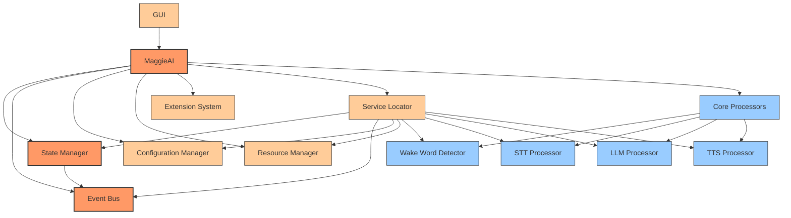

The architecture follows a modular design with clear separation of concerns. The 
central `MaggieAI` class orchestrates interactions between various components, 
while the `ServiceLocator` provides a registry for accessing these components 
throughout the application. This design enables loose coupling between 
components, facilitating maintenance and testing.

### System Communication Architecture
[<sub>(contents)</sub>](#table-of-contents)

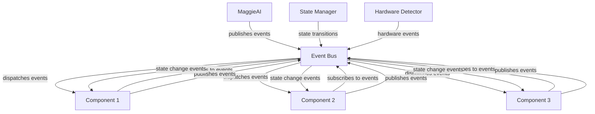

The communication architecture illustrates how the Event Bus facilitates 
decoupled interaction between components, allowing them to communicate without 
direct dependencies. This publish-subscribe pattern is a key aspect of the 
application's modular design.

## Application Initialization Process
[<sub>(contents)</sub>](#table-of-contents)

### Entry Point Analysis
[<sub>(contents)</sub>](#table-of-contents)

The application's execution begins in `main.py`, which serves as the primary 
entry point. The initialization sequence exemplifies a structured approach to 
complex application startup with distinct phases for argument parsing, component 
initialization, and application execution.

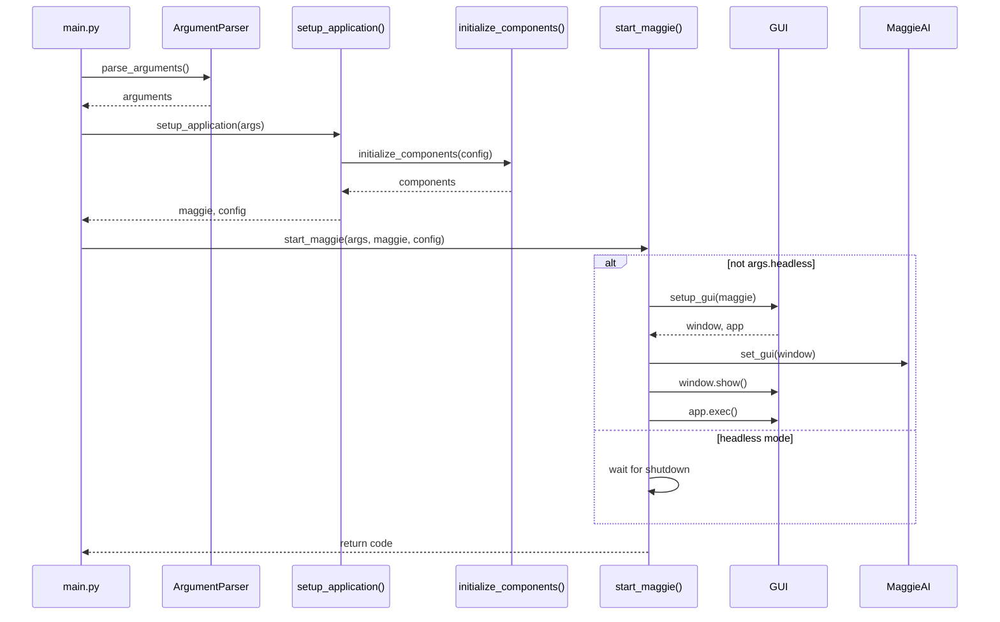

The `main()` function orchestrates three meticulously defined phases:

#### Argument Parsing
[<sub>(contents)</sub>](#table-of-contents)

Utilizes Python's [`argparse`](https://docs.python.org/3/library/argparse.html) 
library to process command-line arguments with type validation:

```python
def parse_arguments() -> argparse.Namespace:
    parser = argparse.ArgumentParser(description='Maggie AI Assistant')
    parser.add_argument('--config', type=str, default='config.yaml', 
                      help='Path to configuration file')
    parser.add_argument('--debug', action='store_true', 
                      help='Enable debug logging')
    parser.add_argument('--verify', action='store_true', 
                      help='Verify system configuration without starting')
    parser.add_argument('--create-template', action='store_true', 
                      help="Create the recipe template if needed")
    parser.add_argument('--headless', action='store_true', 
                      help='Run in headless mode without GUI')
    return parser.parse_args()
```

#### Application Setup
[<sub>(contents)</sub>](#table-of-contents)

The `setup_application()` function initializes core components with error 
handling:

```python
def setup_application(args: argparse.Namespace) -> Tuple[Optional[Any], 
                                                      Dict[str, Any]]:
    config = {
        'config_path': args.config,
        'debug': args.debug,
        'headless': args.headless,
        'create_template': args.create_template,
        'verify': args.verify
    }
```

2. **Configuration Loading**:
```python
def load(self) -> Dict[str, Any]:
    """Load configuration from file with fallback to default."""
    try:
        # Attempt to load from file
        self.logger.info(f"Loading configuration from {self.config_path}")
        if os.path.exists(self.config_path):
            with open(self.config_path, 'r') as f:
                self.config = yaml.safe_load(f) or {}
            
            # Create backup after successful load
            self._backup_config()
        else:
            self.logger.warning(f"Configuration file not found: {self.config_path}")
            self.config = {}
        
        # Merge with defaults for missing values
        self._merge_with_defaults()
        
        # Detect hardware if not already done
        if not self.hardware_info:
            self.hardware_info = self.hardware_detector.detect_system()
        
        # Validate the configuration
        self._validate_config()
        
        return self.config
    except Exception as e:
        self.logger.error(f"Error loading configuration: {e}")
        self.logger.info("Using default configuration")
        
        # Try to restore from backup if available
        restored = self._restore_from_backup()
        if not restored:
            self.config = self.default_config.copy()
        
        return self.config
```

3. **Configuration Backup and Recovery**:
```python
def _backup_config(self) -> None:
    """Create a timestamped backup of the current configuration."""
    try:
        timestamp = time.strftime("%Y%m%d-%H%M%S")
        backup_path = os.path.join(
            self.backup_dir, 
            f"config-{timestamp}.yaml"
        )
        
        with open(self.config_path, 'r') as src, open(backup_path, 'w') as dest:
            dest.write(src.read())
            
        # Remove old backups, keeping only the last 5
        backups = sorted([
            os.path.join(self.backup_dir, f) for f in os.listdir(self.backup_dir)
            if f.startswith('config-') and f.endswith('.yaml')
        ])
        
        if len(backups) > 5:
            for old_backup in backups[:-5]:
                os.remove(old_backup)
                
        self.logger.debug(f"Created configuration backup: {backup_path}")
    except Exception as e:
        self.logger.warning(f"Failed to backup configuration: {e}")

def _restore_from_backup(self) -> bool:
    """Attempt to restore configuration from the latest backup."""
    try:
        backups = sorted([
            os.path.join(self.backup_dir, f) for f in os.listdir(self.backup_dir)
            if f.startswith('config-') and f.endswith('.yaml')
        ])
        
        if not backups:
            return False
            
        latest_backup = backups[-1]
        self.logger.warning(f"Attempting to restore from backup: {latest_backup}")
        
        with open(latest_backup, 'r') as f:
            self.config = yaml.safe_load(f) or {}
            
        # Save the restored config
        with open(self.config_path, 'w') as f:
            yaml.dump(self.config, f, default_flow_style=False)
            
        self.logger.info(f"Successfully restored configuration from backup")
        return True
    except Exception as e:
        self.logger.error(f"Failed to restore from backup: {e}")
        return False
```
    initialize_multiprocessing()
    components = initialize_components(config, args.debug)
    if not components:
        print('Failed to initialize components')
        return None, config
    maggie = components.get('maggie_ai')
    if not maggie:
        print('Failed to create MaggieAI instance')
        return None, config
    register_signal_handlers(maggie)
    # System information logging...
    return maggie, config
```

This function demonstrates defensive programming practices with explicit failure 
paths and early returns for error conditions.

#### Application Startup
[<sub>(contents)</sub>](#table-of-contents)

The `start_maggie()` function activates core services and UI:

```python
def start_maggie(args: argparse.Namespace, maggie: Any, 
               config: Dict[str, Any]) -> int:
    logger.info('Starting Maggie AI core services')
    success = maggie.start()
    if not success:
        logger.error('Failed to start Maggie AI core services')
        return 1
    if not args.headless:
        # GUI setup with error handling
        gui_result = setup_gui(maggie)
        if gui_result is None:
            logger.error('GUI setup failed')
            maggie.shutdown()
            return 1
        window, app = gui_result
        if hasattr(maggie, 'set_gui') and callable(getattr(maggie, 'set_gui')):
            maggie.set_gui(window)
        window.show()
        return app.exec()
    else:
        # Headless mode with polling
        from maggie.core.state import State
        while maggie.state != State.SHUTDOWN:
            time.sleep(1)
        return 0
```

This entry point design follows the 
[Separation of Concerns](https://en.wikipedia.org/wiki/Separation_of_concerns) 
principle, isolating argument parsing, component initialization, and application 
execution into discrete phases. It also demonstrates thoughtful error handling 
with appropriate logging and graceful degradation.

#### Signal Handling
[<sub>(contents)</sub>](#table-of-contents)

The initialization sequence also includes signal handling to ensure graceful 
shutdown on system signals:

```python
def register_signal_handlers(maggie: Any) -> None:
    try:
        def signal_handler(sig, frame):
            print(f"Received signal {sig}, shutting down gracefully")
            maggie.shutdown()
            sys.exit(0)
        signal.signal(signal.SIGINT, signal_handler)
        signal.signal(signal.SIGTERM, signal_handler)
        if 'logging' in sys.modules:
            import logging
            logging.getLogger('Main').info('Registered signal handlers')
    except Exception as e:
        print(f"Failed to register signal handlers: {e}")
```

This function applies the 
[Observer Pattern](https://en.wikipedia.org/wiki/Observer_pattern) to system 
signals, ensuring the application can respond appropriately to external 
termination requests.

### Component Initialization Flow
[<sub>(contents)</sub>](#table-of-contents)

The heart of the initialization process occurs in the `initialize_components()` 
function defined in `maggie/core/initialization.py`. This function implements a 
sophisticated dependency injection approach following the 
[Inversion of Control](https://en.wikipedia.org/wiki/Inversion_of_control) 
principle:

#### Dependency Injection Approach
[<sub>(contents)</sub>](#table-of-contents)

```python
def initialize_components(config: Dict[str, Any], 
                         debug: bool = False) -> Dict[str, Any]:
    components = {}
    logger = logging.getLogger('maggie.initialization')
    try:
        # 1. Initialize the capability registry
        registry = CapabilityRegistry.get_instance()
        components['registry'] = registry
        
        # 2. Set up the logging system
        from maggie.utils.logging import LoggingManager
        logging_mgr = LoggingManager.initialize(config)
        components['logging_manager'] = logging_mgr
        
        # 3. Set up error handling
        error_handler = ErrorHandlerAdapter()
        components['error_handler'] = error_handler
        
        # 4. Initialize the event bus
        from maggie.core.event import EventBus
        event_bus = EventBus()
        components['event_bus'] = event_bus
        
        # 5. Initialize the state manager
        from maggie.core.state import StateManager, State
        state_manager = StateManager(State.INIT, event_bus)
        components['state_manager'] = state_manager
        
        # 6. Create adapters for cross-cutting concerns
        logging_adapter = LoggingManagerAdapter(logging_mgr)
        components['logging_adapter'] = logging_adapter
        event_bus_adapter = EventBusAdapter(event_bus)
        components['event_bus_adapter'] = event_bus_adapter
        state_manager_adapter = StateManagerAdapter(state_manager)
        components['state_manager_adapter'] = state_manager_adapter
        
        # 7. Enhance logging with event publishing and state information
        logging_mgr.enhance_with_event_publisher(event_bus_adapter)
        logging_mgr.enhance_with_state_provider(state_manager_adapter)
        
        # 8. Initialize the core application
        from maggie.core.app import MaggieAI
        config_path = config.get('config_path', 'config.yaml')
        maggie_ai = MaggieAI(config_path)
        components['maggie_ai'] = maggie_ai
        
        # 9. Start the event bus
        event_bus.start()
        
        logger.info('All components initialized successfully')
        return components
    except Exception as e:
        logger.error(f"Error initializing components: {e}")
        return {}
```

#### Initialization Sequence
[<sub>(contents)</sub>](#table-of-contents)

The initialization sequence is carefully ordered to ensure dependencies are 
available when needed:

1. **Core Registry**: First establishes the capability registry that will hold 
references to all fundamental system capabilities
2. **Logging Infrastructure**: Creates the logging system early to enable 
detailed tracing of the initialization process
3. **Error Handling**: Establishes the error handling infrastructure to properly 
capture and report initialization failures
4. **Event System**: Initializes the event bus that will facilitate loose 
coupling between components
5. **State Management**: Creates the state manager to track and control 
application state transitions
6. **Capability Adapters**: Wraps core capabilities in adapters implementing 
standard interfaces
7. **Component Enhancement**: Adds capabilities to the logging system via 
dependency injection
8. **Main Application**: Creates the primary application controller with all 
dependencies available
9. **Event Bus Activation**: Starts the event processing thread to handle event 
publishing

This implementation exemplifies the 
[Composition Root](https://blog.ploeh.dk/2011/07/28/CompositionRoot/) pattern, 
where all dependencies are composed at a single location during application 
startup. The error handling with a complete catch-all and empty dictionary return 
ensures that initialization failures are gracefully handled.

The initialization sequence can be visualized as a dependency graph:

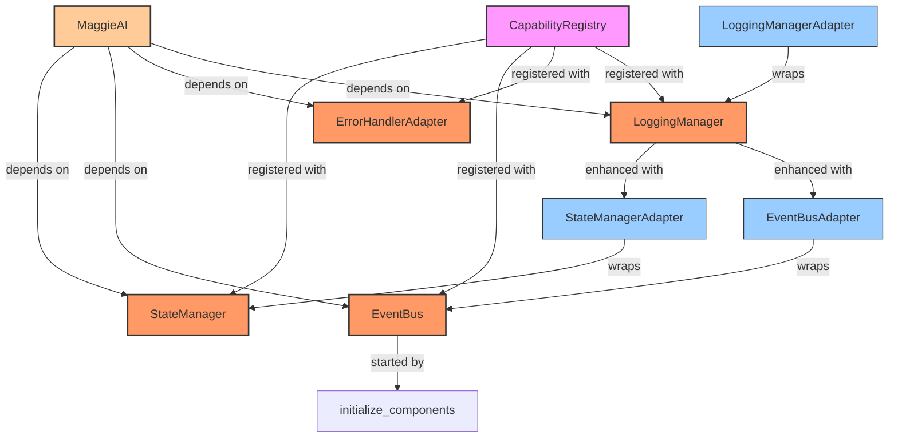

The dependency graph illustrates the complex relationships between components, 
with the CapabilityRegistry at the top of the hierarchy and components being 
enhanced and wrapped through adapter classes.

#### Lazy Loading and Import Strategy
[<sub>(contents)</sub>](#table-of-contents)

The application employs a sophisticated approach to managing imports that 
prevents circular dependencies and optimizes startup performance:

```python
# Use lazy imports for modules that may create circular dependencies
def get_hardware_optimizer():
    from maggie.utils.resource.optimizer import HardwareOptimizer
    return HardwareOptimizer

def get_resource_monitor():
    from maggie.utils.resource.monitor import ResourceMonitor
    return ResourceMonitor

def get_resource_manager():
    from maggie.utils.resource.manager import ResourceManager
    return ResourceManager
```

This pattern, known as 
[lazy loading](https://en.wikipedia.org/wiki/Lazy_loading), defers the import of 
modules until they are actually needed, breaking potential circular dependencies 
and reducing startup time. It's particularly important in a complex application 
with many interdependent modules.

### State Transitions to READY
[<sub>(contents)</sub>](#table-of-contents)

Once the application components are initialized, the system undergoes a carefully 
orchestrated sequence of state transitions to reach the READY state, where it can 
begin accepting user input:

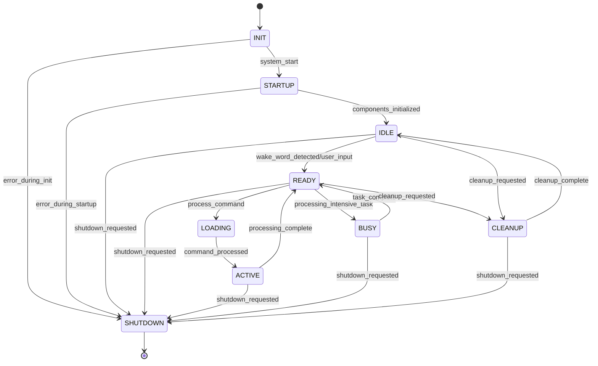

#### State Transition Sequence
[<sub>(contents)</sub>](#table-of-contents)

The state transition sequence follows this pattern:

1. **Initial State**: The application begins in the `INIT` state as defined 
during StateManager initialization.

2. **INIT → STARTUP Transition**: When `maggie.start()` is called from 
`start_maggie()`, it transitions to STARTUP:
   ```python
   def start(self) -> bool:
       self.logger.info('Starting MaggieAI')
       self._register_event_handlers()
       success = self.initialize_components()
       if not success:
           self.logger.error('Failed to initialize components')
           return False
       if self.state_manager.get_current_state() == State.INIT:
           self.state_manager.transition_to(State.STARTUP, "system_start")
       # Resource monitoring startup
       return True
   ```

3. **STARTUP → IDLE Transition**: After startup tasks complete, the system 
transitions to IDLE:
   ```python
   # This transition occurs during component initialization
   # State handlers registered during _register_state_handlers() are executed
   def _on_transition_startup_to_idle(self, transition: StateTransition) -> None:
       if self.resource_manager:
           self.resource_manager.preallocate_for_state(State.IDLE)
   ```

4. **IDLE → READY Transition**: When the GUI starts or a component triggers 
readiness, it transitions to READY:
   ```python
   # In GUI initialization or wake word handling
   if current_state == State.IDLE:
       state_manager.transition_to(State.READY, "components_initialized")
   ```

Each state transition triggers registered handlers that:
1. **Resource Allocation**: Execute state-specific resource allocation policies
2. **Configuration Application**: Apply state-specific configuration settings
3. **UI Updates**: Modify the UI to reflect the current state
4. **Event Publishing**: Broadcast state change events on the event bus

#### Resources and State Lifecycle
[<sub>(contents)</sub>](#table-of-contents)

A key aspect of the state machine is how it manages resources differently at each 
state:

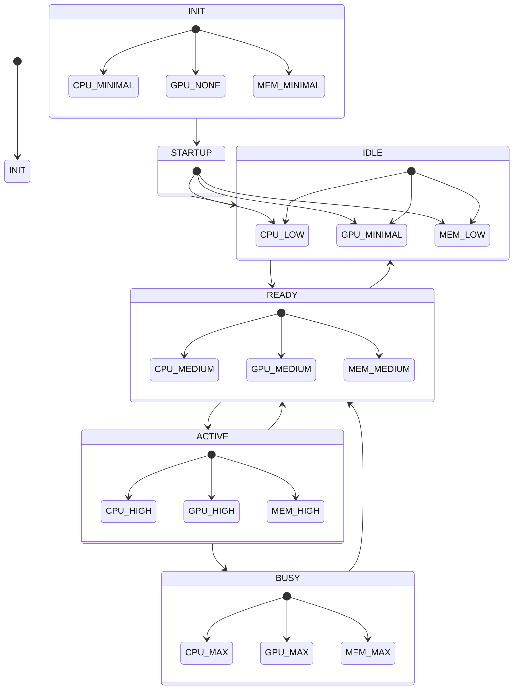

The application reaches the READY state when:
- All core components are successfully initialized
- Required resources are allocated according to the READY state requirements
- The UI is updated to show the system is ready for input
- Event handlers for the READY state have completed execution

This state machine approach provides a robust mechanism for managing application 
lifecycle and ensuring proper sequence of operations during initialization. It 
exemplifies the [State Pattern](https://en.wikipedia.org/wiki/State_pattern) as 
described in the Gang of Four design patterns, enabling clean separation of 
state-specific behaviors.

## Core Module Analysis
[<sub>(contents)</sub>](#table-of-contents)

### State Management System
[<sub>(contents)</sub>](#table-of-contents)

#### Application Concepts
[<sub>(contents)</sub>](#table-of-contents)

The state management system in `maggie/core/state.py` implements a comprehensive 
Finite State Machine (FSM) that governs the application's behavior. The 
implementation demonstrates an advanced application of the 
[State Pattern](https://en.wikipedia.org/wiki/State_pattern) with the following 
key features:

1. **Enumerated State Definition**: States are defined as an enumeration with 
associated metadata
2. **Transition Validation**: State transitions are validated against a 
predefined transition matrix
3. **Transition History**: Historical record of state transitions with triggers 
and timestamps
4. **Event Integration**: State changes publish events for system-wide awareness
5. **Handler Registration**: Callbacks for state entry, exit, and transition 
events
6. **Animation Properties**: Visual transition information for the UI layer
7. **Component Awareness**: Base class for components that need state awareness

This system implements a formal 
[Finite State Machine](https://en.wikipedia.org/wiki/Finite-state_machine) with 
deterministic transitions and well-defined behaviors for each state.

#### Configuration Implementation Analysis
[<sub>(contents)</sub>](#table-of-contents)

The `state.py` file defines several key classes that work together to provide a 
robust state management system:

1. **State Enumeration**: Defines the possible states with associated visual 
styling
```python
class State(Enum):
    INIT = auto()
    STARTUP = auto()
    IDLE = auto()
    LOADING = auto()
    READY = auto()
    ACTIVE = auto()
    BUSY = auto()
    CLEANUP = auto()
    SHUTDOWN = auto()
    
    @property
    def bg_color(self) -> str:
        colors = {
            State.INIT: '#E0E0E0',
            State.STARTUP: '#B3E5FC',
            State.IDLE: '#C8E6C9',
            State.LOADING: '#FFE0B2',
            State.READY: '#A5D6A7',
            State.ACTIVE: '#FFCC80',
            State.BUSY: '#FFAB91',
            State.CLEANUP: '#E1BEE7',
            State.SHUTDOWN: '#EF9A9A'
        }
        return colors.get(self, '#FFFFFF')
    
    @property
    def font_color(self) -> str:
        dark_text_states = {State.INIT, State.STARTUP, State.IDLE, 
                           State.LOADING, State.READY}
        return '#212121' if self in dark_text_states else '#FFFFFF'
    
    @property
    def display_name(self) -> str:
        return self.name.capitalize()
    
    def get_style(self) -> Dict[str, str]:
        return {
            'background': self.bg_color,
            'color': self.font_color,
            'border': '1px solid #424242',
            'font-weight': 'bold',
            'padding': '4px 8px',
            'border-radius': '4px'
        }
```

This implementation enriches the standard enum with properties that define visual 
styling, demonstrating the 
[Decorator Pattern](https://en.wikipedia.org/wiki/Decorator_pattern) applied to 
enums. It leverages Python's 
[`Enum`](https://docs.python.org/3/library/enum.html) class with property 
decorators to provide a rich interface for each state.

2. **StateTransition Dataclass**: Captures complete information about a state 
transition
```python
@dataclass
class StateTransition:
    from_state: State
    to_state: State
    trigger: str
    timestamp: float
    metadata: Dict[str, Any] = field(default_factory=dict)
    
    def __lt__(self, other: 'StateTransition') -> bool:
        return self.timestamp < other.timestamp
    
    @property
    def animation_type(self) -> str:
        if self.to_state == State.SHUTDOWN:
            return 'fade'
        elif self.to_state == State.BUSY:
            return 'bounce'
        else:
            return 'slide'
    
    @property
    def animation_duration(self) -> int:
        if self.to_state in {State.SHUTDOWN, State.CLEANUP}:
            return 800
        elif self.to_state in {State.BUSY, State.LOADING}:
            return 400
        else:
            return 300
    
    def get_animation_properties(self) -> Dict[str, Any]:
        return {
            'type': self.animation_type,
            'duration': self.animation_duration,
            'easing': 'ease-in-out'
        }
    
    def to_dict(self) -> Dict[str, Any]:
        return {
            'from_state': self.from_state.name,
            'to_state': self.to_state.name,
            'trigger': self.trigger,
            'timestamp': self.timestamp,
            'metadata': self.metadata
        }
```

This dataclass implements Python's 
[`dataclasses`](https://docs.python.org/3/library/dataclasses.html) module for 
creating immutable value objects with auto-generated methods. The rich 
capabilities added through properties demonstrate how dataclasses can be extended 
with domain-specific functionality. The implementation of `__lt__` enables 
sorting transitions by timestamp, useful for maintaining a chronological history.

3. **StateManager Class**: Controls state transitions and maintains state history
```python
class StateManager(IStateProvider):
    def __init__(self, initial_state: State = State.INIT, 
                event_bus: Any = None):
        self.current_state = initial_state
        self.event_bus = event_bus
        self.state_handlers: Dict[State, List[Tuple[Callable, bool]]] = {
            state: [] for state in State
        }
        self.transition_handlers: Dict[Tuple[State, State], List[Callable]] = {}
        self.logger = logging.getLogger('maggie.core.state.StateManager')
        self._lock = threading.RLock()
        
        # Define valid state transitions
        self.valid_transitions = {
            State.INIT: [State.STARTUP, State.IDLE, State.SHUTDOWN],
            State.STARTUP: [State.IDLE, State.READY, State.CLEANUP, 
                          State.SHUTDOWN],
            State.IDLE: [State.STARTUP, State.READY, State.CLEANUP, 
                        State.SHUTDOWN],
            State.LOADING: [State.ACTIVE, State.READY, State.CLEANUP, 
                          State.SHUTDOWN],
            State.READY: [State.LOADING, State.ACTIVE, State.BUSY, State.CLEANUP, 
                         State.SHUTDOWN],
            State.ACTIVE: [State.READY, State.BUSY, State.CLEANUP, 
                          State.SHUTDOWN],
            State.BUSY: [State.READY, State.ACTIVE, State.CLEANUP, 
                        State.SHUTDOWN],
            State.CLEANUP: [State.IDLE, State.SHUTDOWN],
            State.SHUTDOWN: []
        }
        
        self.transition_history: List[StateTransition] = []
        self.max_history_size = 100
        self.logger.info(f"StateManager initialized with state: "
                        f"{initial_state.name}")
```

This implementation demonstrates several advanced threading and design patterns:
- Thread safety via 
[`threading.RLock`](https://docs.python.org/3/library/threading.html#threading.RLock) 
for concurrent access
- Observer pattern through state handlers and event publishing
- Command pattern for encapsulating state transitions
- Iterator pattern for transition history

The core of the state management functionality is in the `transition_to` method:

```python
def transition_to(self, new_state: State, trigger: str, 
                 metadata: Dict[str, Any] = None) -> bool:
    with self._lock:
        if new_state == self.current_state:
            self.logger.debug(f"Already in state {new_state.name}")
            return True
        
        if not self.is_valid_transition(self.current_state, new_state):
            error_message = (f"Invalid transition from {self.current_state.name} "
                            f"to {new_state.name} (trigger: {trigger})")
            self.logger.warning(error_message)
            try:
                from maggie.utils.abstractions import get_error_handler
                error_handler = get_error_handler()
                if error_handler:
                    error_handler.record_error(
                        message=error_message,
                        category='STATE',
                        severity='ERROR',
                        source='StateManager.transition_to'
                    )
            except ImportError:
                pass
            except Exception:
                pass
            return False
        
        old_state = self.current_state
        self.current_state = new_state
        self.logger.info(f"State transition: {old_state.name} -> "
                       f"{new_state.name} (trigger: {trigger})")
        
        transition = StateTransition(
            from_state=old_state,
            to_state=new_state,
            trigger=trigger,
            timestamp=time.time(),
            metadata=metadata or {}
        )
        
        self.transition_history.append(transition)
        if len(self.transition_history) > self.max_history_size:
            self.transition_history = self.transition_history[-self.max_history_size:]
        
        try:
            self._execute_state_handlers(old_state, 'exit', transition)
            self._execute_transition_handlers(old_state, new_state, transition)
            self._execute_state_handlers(new_state, 'entry', transition)
            
            if self.event_bus:
                self.event_bus.publish('state_changed', transition)
            
            return True
        except Exception as e:
            self.logger.error(f"Error during state transition: {e}")
            return False
```

This method enforces transition rules, maintains history, executes appropriate 
handlers, and broadcasts transition events, all while maintaining thread safety.

4. **StateAwareComponent Base Class**: Simplifies state handling for components
```python
class StateAwareComponent:
    def __init__(self, state_manager: StateManager):
        self.state_manager = state_manager
        self.logger = logging.getLogger(self.__class__.__name__)
        self._registered_handlers = []
        self._register_state_handlers()
    
    def _register_state_handlers(self) -> None:
        for state in State:
            # Register entry handlers (on_enter_state methods)
            method_name = f"on_enter_{state.name.lower()}"
            if hasattr(self, method_name) and callable(getattr(self, method_name)):
                handler = getattr(self, method_name)
                self.state_manager.register_state_handler(state, handler, True)
                self._registered_handlers.append((state, handler, True))
            
            # Register exit handlers (on_exit_state methods)
            method_name = f"on_exit_{state.name.lower()}"
            if hasattr(self, method_name) and callable(getattr(self, method_name)):
                handler = getattr(self, method_name)
                self.state_manager.register_state_handler(state, handler, False)
                self._registered_handlers.append((state, handler, False))
```

This base class applies the 
[Template Method Pattern](https://en.wikipedia.org/wiki/Template_method_pattern) 
for automatic handler registration, combined with introspection to find and 
register state handlers based on naming conventions. This approach significantly 
reduces boilerplate code for components that need to respond to state changes.

#### Advanced Usage Patterns
[<sub>(contents)</sub>](#table-of-contents)

The state management system supports sophisticated patterns for handling 
application state, as demonstrated in these examples:

1. **Declarative State Transition Handling**:
```python
class AudioProcessor(StateAwareComponent):
    def __init__(self, state_manager):
        super().__init__(state_manager)
        self.current_task = None
        
    def on_enter_active(self, transition: StateTransition) -> None:
        """Called automatically when entering ACTIVE state."""
        self.logger.info("Audio processor activating")
        self._allocate_resources()
        self._start_processing()
        
    def on_exit_active(self, transition: StateTransition) -> None:
        """Called automatically when exiting ACTIVE state."""
        self.logger.info("Audio processor deactivating")
        self._cleanup_resources()
        
    def on_enter_idle(self, transition: StateTransition) -> None:
        """Called automatically when entering IDLE state."""
        self.logger.info("Audio processor entering idle mode")
        self._suspend_processing()
        self._reduce_resource_usage()
```

This example demonstrates how components can implement state-specific behaviors 
through method naming conventions, following the 
[Hollywood Principle](https://en.wikipedia.org/wiki/Hollywood_principle) of 
"Don't call us, we'll call you."

2. **Specific Transition Handling**:
```python
class ResourceCoordinator:
    def __init__(self, state_manager: StateManager):
        self.state_manager = state_manager
        self.logger = logging.getLogger("ResourceCoordinator")
        
        # Register specific transition handler
        self.state_manager.register_transition_handler(
            State.IDLE, State.READY, self._handle_idle_to_ready)
        self.state_manager.register_transition_handler(
            State.READY, State.ACTIVE, self._handle_ready_to_active)
    
    def _handle_idle_to_ready(self, transition: StateTransition) -> None:
        """Handle transition from IDLE to READY states."""
        self.logger.info("Preparing resources for READY state")
        self._preload_necessary_models()
        self._allocate_background_workers()
    
    def _handle_ready_to_active(self, transition: StateTransition) -> None:
        """Handle transition from READY to ACTIVE states."""
        self.logger.info("Optimizing resources for ACTIVE state")
        self._increase_thread_priority()
        self._expand_gpu_allocation()
```

This example shows direct handling of specific transitions rather than state 
entry/exit, enabling behaviors that are specific to the transition itself rather 
than the states involved.

3. **Event-Based State Changes**:
```python
class WakeWordManager(EventListener):
    def __init__(self, event_bus: EventBus, state_manager: StateManager):
        super().__init__(event_bus)
        self.state_manager = state_manager
        self.listen("wake_word_detected", self._handle_wake_word)
    
    def _handle_wake_word(self, data: Any = None) -> None:
        """Respond to wake word by changing system state if appropriate."""
        current_state = self.state_manager.get_current_state()
        
        if current_state == State.IDLE:
            # Wake word activates the system from IDLE
            self.state_manager.transition_to(State.READY, "wake_word_detected")
        elif current_state == State.READY:
            # Already ready, move to ACTIVE
            self.state_manager.transition_to(State.ACTIVE, "wake_word_detected")
```

This example combines the state management system with the event system to create 
a responsive application that adjusts its state based on external triggers.

The state management system provides a robust foundation for coordinating 
application behavior across different operational states, ensuring proper 
resource allocation and consistent behavior throughout the application lifecycle. 
It demonstrates an advanced implementation of the State Pattern with threading 
considerations, history tracking, and event integration.

For more information on state pattern implementation in Python, refer to:
- [Python's enum module documentation](https://docs.python.org/3/library/enum.html)
- [Python's dataclasses module documentation](https://docs.python.org/3/library/dataclasses.html)
- [Design Patterns in Python: State Pattern](https://refactoring.guru/design-patterns/state/python/example)

### Event Bus System
[<sub>(contents)</sub>](#table-of-contents)

#### Event Bus Application Concepts
[<sub>(contents)</sub>](#table-of-contents)

The event bus system in `maggie/core/event.py` implements a comprehensive 
event-driven architecture that enables loose coupling between components. This 
implementation demonstrates the 
[Publish-Subscribe](https://en.wikipedia.org/wiki/Publish%E2%80%93subscribe_pattern) 
(Pub/Sub) pattern with several advanced features:

1. **Topic-Based Communication**: Components publish and subscribe to named event 
types
2. **Priority-Based Processing**: Events are handled according to subscriber 
priority
3. **Asynchronous Event Dispatch**: Events are processed in a dedicated thread
4. **Batched Processing**: Multiple events are processed in batches for 
efficiency
5. **Correlation Tracking**: Related events are linked with correlation IDs
6. **Event Filtering**: Pre-dispatch filtering based on event content
7. **Error Isolation**: Handler exceptions are contained to prevent cascade 
failures

This system creates a flexible communication backbone that allows components to 
interact without direct dependencies, significantly enhancing the system's 
modularity and testability.

#### Event Bus Implementation Analysis
[<sub>(contents)</sub>](#table-of-contents)

The `event.py` file contains several core classes and constants that work 
together to create a robust event system:

1. **Event Constants**: Pre-defined events for system-wide use
```python
STATE_CHANGED_EVENT = 'state_changed'
STATE_ENTRY_EVENT = 'state_entry'
STATE_EXIT_EVENT = 'state_exit'
TRANSITION_COMPLETED_EVENT = 'transition_completed'
TRANSITION_FAILED_EVENT = 'transition_failed'
UI_STATE_UPDATE_EVENT = 'ui_state_update'
INPUT_ACTIVATION_EVENT = 'input_activation'
INPUT_DEACTIVATION_EVENT = 'input_deactivation'
```

2. **EventPriority Class**: Defines priority levels for event handling
```python
class EventPriority:
    HIGH = 0     # Critical events that need immediate attention
    NORMAL = 10  # Standard events
    LOW = 20     # Low-priority events that can be delayed
    BACKGROUND = 30  # Background events with lowest priority
```

This priority system enables the application to handle critical events (like 
error conditions) before less important ones, ensuring responsiveness for 
time-sensitive operations.

3. **EventBus Class**: The core event dispatch system
```python
class EventBus(IEventPublisher):
    def __init__(self):
        self.subscribers: Dict[str, List[Tuple[int, Callable]]] = {}
        self.queue = queue.PriorityQueue()
        self.running = False
        self._worker_thread = None
        self._lock = threading.RLock()
        self.logger = logging.getLogger('maggie.core.event.EventBus')
        self._correlation_id = None
        self._event_filters = {}
    
    def subscribe(self, event_type: str, callback: Callable, 
                 priority: int = EventPriority.NORMAL) -> None:
        with self._lock:
            if event_type not in self.subscribers:
                self.subscribers[event_type] = []
            self.subscribers[event_type].append((priority, callback))
            self.subscribers[event_type].sort(key=lambda x: x[0])
            self.logger.debug(f"Subscription added for event type: {event_type}")
    
    def publish(self, event_type: str, data: Any = None, **kwargs) -> None:
        if isinstance(data, dict) and self._correlation_id:
            data = data.copy()
            if 'correlation_id' not in data:
                data['correlation_id'] = self._correlation_id
        priority = kwargs.get('priority', EventPriority.NORMAL)
        self.queue.put((priority, (event_type, data)))
        self.logger.debug(f"Event published: {event_type}")
```

The `EventBus` class uses a thread-safe design with a 
[`PriorityQueue`](https://docs.python.org/3/library/queue.html#queue.PriorityQueue) 
for storing pending events and a separate worker thread for dispatch. This 
approach ensures that event publishing is non-blocking and that events are 
processed according to their priority.

4. **Event Processing Loop**: Asynchronous event dispatch in a dedicated thread
```python
def _process_events(self) -> None:
    while self.running:
        try:
            events_batch = []
            try:
                priority, event = self.queue.get(timeout=.05)
                if event is None:
                    break
                events_batch.append((priority, event))
                self.queue.task_done()
            except queue.Empty:
                time.sleep(.001)
                continue
            
            # Process more events in batch if available
            batch_size = 10
            while len(events_batch) < batch_size:
                try:
                    priority, event = self.queue.get(block=False)
                    if event is None:
                        break
                    events_batch.append((priority, event))
                    self.queue.task_done()
                except queue.Empty:
                    break
            
            # Dispatch events
            for (priority, event) in events_batch:
                if event is None:
                    continue
                event_type, data = event
                self._dispatch_event(event_type, data)
        except Exception as e:
            error_msg = f"Error processing events: {e}"
            self.logger.error(error_msg)
            # Error handling and reporting
```

This implementation demonstrates several advanced patterns:
- [Producer-Consumer](https://en.wikipedia.org/wiki/Producer%E2%80%93consumer_problem) 
pattern using a priority queue
- [Thread-Safe](https://en.wikipedia.org/wiki/Thread_safety) queue operations 
with proper locking
- [Batch Processing](https://en.wikipedia.org/wiki/Batch_processing) for 
efficiency
- [Error Isolation](https://en.wikipedia.org/wiki/Fault_isolation) to prevent 
catastrophic failures

The event dispatch itself is handled by a private method that includes filtering 
and error handling:

```python
def _dispatch_event(self, event_type: str, data: Any) -> None:
    with self._lock:
        if event_type in self._event_filters:
            should_process = True
            for filter_func in self._event_filters[event_type].values():
                try:
                    if not filter_func(data):
                        should_process = False
                        break
                except Exception as e:
                    self.logger.error(f"Error in event filter: {e}")
            if not should_process:
                return
        
        if event_type in self.subscribers:
            for (_, callback) in self.subscribers[event_type]:
                try:
                    callback(data)
                except Exception as e:
                    error_msg = f"Error in event handler for {event_type}: {e}"
                    self.logger.error(error_msg)
                    self.publish('error_logged', {
                        'message': error_msg,
                        'event_type': event_type,
                        'source': 'event_bus'
                    }, priority=EventPriority.HIGH)
```

This method ensures that handler exceptions are contained and reported without 
affecting other handlers or the event processing loop itself.

5. **EventEmitter and EventListener Base Classes**: Simplified interfaces for 
event interaction
```python
class EventEmitter:
    def __init__(self, event_bus: EventBus):
        self.event_bus = event_bus
        self.logger = logging.getLogger(self.__class__.__name__)
        self._correlation_id = None
    
    def emit(self, event_type: str, data: Any = None, 
            priority: int = EventPriority.NORMAL) -> None:
        # Handle correlation ID propagation
        if self._correlation_id and self.event_bus:
            old_correlation_id = self.event_bus.get_correlation_id()
            self.event_bus.set_correlation_id(self._correlation_id)
            try:
                self.event_bus.publish(event_type, data, priority=priority)
            finally:
                self.event_bus.set_correlation_id(old_correlation_id)
        else:
            self.event_bus.publish(event_type, data, priority=priority)

class EventListener:
    def __init__(self, event_bus: EventBus):
        self.event_bus = event_bus
        self.logger = logging.getLogger(self.__class__.__name__)
        self.subscriptions: Set[Tuple[str, Callable]] = set()
    
    def listen(self, event_type: str, callback: Callable, 
              priority: int = EventPriority.NORMAL) -> None:
        self.event_bus.subscribe(event_type, callback, priority)
        self.subscriptions.add((event_type, callback))
```

These base classes implement the 
[Facade Pattern](https://en.wikipedia.org/wiki/Facade_pattern), providing 
simplified interfaces for components to interact with the event system, and the 
[Strategy Pattern](https://en.wikipedia.org/wiki/Strategy_pattern) for callbacks.

#### Event Flow Visualization
[<sub>(contents)</sub>](#table-of-contents)

The event system's asynchronous flow can be visualized as follows:

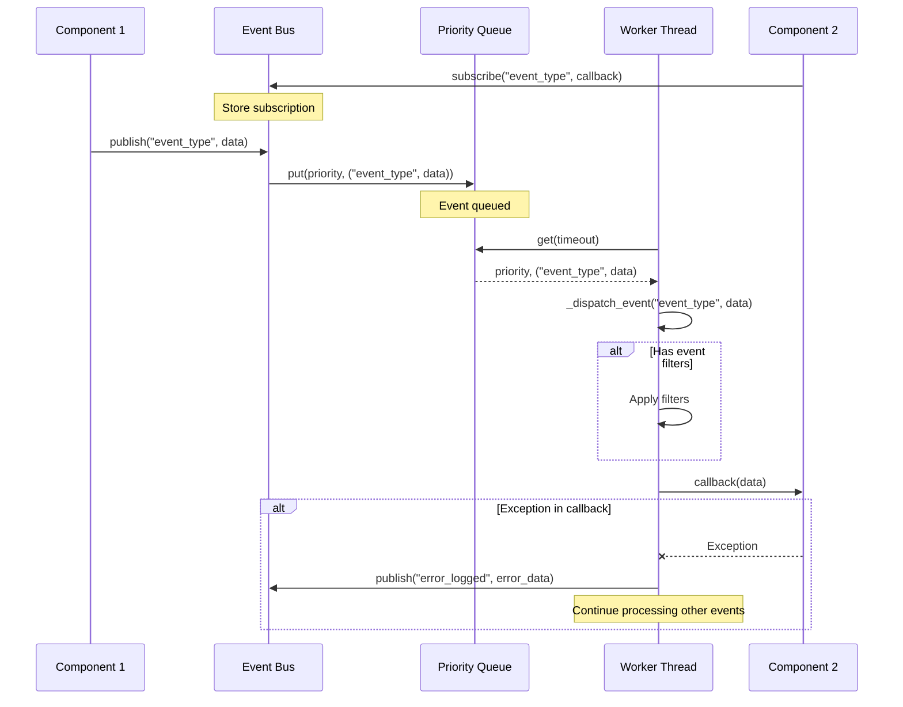

#### Event Bus Advanced Usage Patterns
[<sub>(contents)</sub>](#table-of-contents)

The event system supports sophisticated usage patterns for component 
communication:

1. **Prioritized Event Handling**:
```python
class SecurityMonitor(EventListener):
    def __init__(self, event_bus):
        super().__init__(event_bus)
        
        # Critical security events handled at HIGH priority
        self.listen('authentication_failure', self._handle_auth_failure, 
                   EventPriority.HIGH)
        self.listen('permission_violation', self._handle_permission_violation, 
                   EventPriority.HIGH)
        
        # Informational events at NORMAL priority
        self.listen('user_login', self._handle_user_login, 
                   EventPriority.NORMAL)
        
        # Audit events at LOW priority
        self.listen('resource_access', self._handle_resource_access, 
                   EventPriority.LOW)
        
    def _handle_auth_failure(self, data):
        # Handle HIGH priority event - immediate response needed
        username = data.get('username', 'unknown')
        self.logger.warning(f"Authentication failure for user: {username}")
        self._increment_failure_counter(username)
        if self._check_lockout_threshold(username):
            self.emit('account_locked', {'username': username, 
                                        'reason': 'auth_failure_threshold'})
```

This example demonstrates how events can be handled at different priorities to 
ensure critical security events are processed before less important audit events.

2. **Request-Response Pattern via Events**:
```python
class QueryService(EventEmitter, EventListener):
    def __init__(self, event_bus):
        EventEmitter.__init__(self, event_bus)
        EventListener.__init__(self, event_bus)
        self.pending_requests = {}
        
        # Listen for query requests
        self.listen('query_request', self._handle_query_request)
        
    def _handle_query_request(self, data):
        request_id = data.get('request_id')
        query = data.get('query')
        
        # Set correlation ID for all related events
        self.set_correlation_id(request_id)
        
        try:
            # Execute query
            self.emit('query_started', {'request_id': request_id, 'query': query})
            result = self._execute_query(query)
            self.emit('query_result', {
                'request_id': request_id,
                'query': query,
                'result': result,
                'status': 'success'
            })
        except Exception as e:
            self.emit('query_result', {
                'request_id': request_id,
                'query': query,
                'error': str(e),
                'status': 'error'
            })
        finally:
            # Clear correlation ID when done
            self.set_correlation_id(None)
```

This implementation demonstrates a request-response pattern using events, with 
correlation IDs to link related events together.

3. **Event Filtering**:
```python
class UserInterface(EventListener):
    def __init__(self, event_bus):
        super().__init__(event_bus)
        
        # Only show notifications for the current user
        self.current_user = None
        self.notification_filter_id = self.add_filter(
            'user_notification',
            lambda data: (data.get('user_id') == self.current_user 
                          or data.get('all_users', False))
        )
        
        # Listen for notifications, but they'll be filtered before delivery
        self.listen('user_notification', self._display_notification)
        
    def set_current_user(self, user_id):
        self.current_user = user_id
        
    def _display_notification(self, data):
        # This will only be called for notifications passing the filter
        message = data.get('message', '')
        level = data.get('level', 'info')
        self._show_notification(message, level)
```

This example demonstrates how event filters can be used to selectively process 
events based on their content, reducing unnecessary handling.

4. **Composite Event Handling**:
```python
class CompositeEventListener(EventListener):
    def __init__(self, event_bus: EventBus):
        super().__init__(event_bus)
        self.children: List[EventListener] = []
    
    def add_listener(self, listener: EventListener) -> None:
        if listener not in self.children:
            self.children.append(listener)
    
    def _forward_event(self, event_type: str, data: Any) -> None:
        for child in self.children:
            if hasattr(child, 'handle_event') and callable(getattr(child, 
                                                                  'handle_event')):
                try:
                    child.handle_event(event_type, data)
                except Exception as e:
                    self.logger.error(f"Error forwarding event to child: {e}")
    
    def listen_and_forward(self, event_type: str, 
                          priority: int = EventPriority.NORMAL) -> None:
        self.listen(event_type, lambda data: self._forward_event(event_type, data), 
                   priority)
```

This implementation applies the 
[Composite Pattern](https://en.wikipedia.org/wiki/Composite_pattern) to event 
listeners, allowing hierarchical event handling structures.

The event bus system provides a powerful mechanism for decoupled, event-driven 
communication between components, enhancing modularity, testability, and 
responsiveness of the application. It demonstrates sophisticated concurrency 
handling, prioritization, and error isolation.

For more information on event systems in Python, refer to:
- [Python's queue module documentation](https://docs.python.org/3/library/queue.html)
- [Python's threading module documentation](https://docs.python.org/3/library/threading.html)
- [Event-Driven Programming in Python](https://realpython.com/python-events-driven-programming/)

### Main Application Class
[<sub>(contents)</sub>](#table-of-contents)

#### Main Application Concepts
[<sub>(contents)</sub>](#table-of-contents)

The `MaggieAI` class in `maggie/core/app.py` serves as the central coordinator 
for the entire application, implementing the 
[Mediator Pattern](https://en.wikipedia.org/wiki/Mediator_pattern) to orchestrate 
interactions between various subsystems. This class embodies several advanced 
software engineering concepts:

1. **Component Lifecycle Management**: Controls initialization, startup, and 
shutdown sequences
2. **Extension System**: Dynamically loads and coordinates extension modules
3. **Event Coordination**: Processes system events and triggers appropriate 
actions
4. **State Transitions**: Manages application state through a finite state 
machine
5. **Resource Management**: Coordinates resource allocation based on application 
state
6. **Error Recovery**: Implements strategies for handling component failures

This class functions as the central nervous system of the application, bringing 
together all specialized subsystems into a cohesive whole while maintaining clean 
separation of concerns.

#### Main Application Implementation Analysis
[<sub>(contents)</sub>](#table-of-contents)

The `app.py` file defines the `MaggieAI` class, which inherits from both 
`EventEmitter` and `EventListener` to provide bidirectional event communication:

```python
class MaggieAI(EventEmitter, EventListener):
    def __init__(self, config_path: str = 'config.yaml'):
        self.config_manager = ConfigManager(config_path)
        self.config = self.config_manager.load()
        self.event_bus = EventBus()
        EventEmitter.__init__(self, self.event_bus)
        EventListener.__init__(self, self.event_bus)
        self.logger = ComponentLogger('MaggieAI')
        self.state_manager = StateManager(State.INIT, self.event_bus)
        self._register_core_services()
        
        self.extensions = {}
        self.inactivity_timer = None
        self.inactivity_timeout = self.config.get('inactivity_timeout', 300)
        
        # Component references
        self.wake_word_detector = None
        self.stt_processor = None
        self.llm_processor = None
        self.tts_processor = None
        self.gui = None
        
        # Thread pool for parallel execution
        cpu_config = self.config.get('cpu', {})
        max_threads = cpu_config.get('max_threads', 10)
        self.thread_pool = ThreadPoolExecutor(
            max_workers=max_threads,
            thread_name_prefix='maggie_thread_'
        )
        
        self._register_state_handlers()
        self._setup_resource_management()
        self.logger.info('MaggieAI instance created')
```

The initialization sequence demonstrates careful ordering of dependency creation 
and setup, with core services registered first, followed by state handlers and 
resource management.

Several key methods provide critical functionality:

1. **State Handler Registration**:
```python
def _register_state_handlers(self) -> None:
    self.state_manager.register_state_handler(State.INIT, self._on_enter_init, True)
    self.state_manager.register_state_handler(State.STARTUP, 
                                             self._on_enter_startup, True)
    # Additional state handlers...
    self.state_manager.register_transition_handler(
        State.INIT, State.STARTUP, self._on_transition_init_to_startup)
    # Additional transition handlers...
```

This method establishes handlers for all application states and key transitions, 
demonstrating the [Observer Pattern](https://en.wikipedia.org/wiki/Observer_pattern) 
where the application responds to state changes.

2. **Event Handler Registration**:
```python
def _register_event_handlers(self) -> None:
    event_handlers = [
        ('wake_word_detected', self._handle_wake_word, EventPriority.HIGH),
        ('error_logged', self._handle_error, EventPriority.HIGH),
        ('command_detected', self._handle_command, EventPriority.NORMAL),
        # Additional event handlers...
    ]
    for (event_type, handler, priority) in event_handlers:
        self.listen(event_type, handler, priority=priority)
```

This method sets up listeners for system events with appropriate prioritization, 
enabling the application to respond to various triggers from different 
components.

3. **Component Initialization**:
```python
def initialize_components(self) -> bool:
    with logging_context(component='MaggieAI', 
                        operation='initialize_components') as ctx:
        try:
            if not self._register_core_services():
                return False
            
            init_success = (
                self._initialize_wake_word_detector() and
                self._initialize_tts_processor() and
                self._initialize_stt_processor() and
                self._initialize_llm_processor()
            )
            
            if not init_success:
                self.logger.error('Failed to initialize core components')
                return False
            
            self._initialize_extensions()
            self.event_bus.start()
            
            if self.resource_manager:
                self.resource_manager.apply_hardware_specific_optimizations()
            
            self.logger.info('All components initialized successfully')
            return True
        except ImportError as import_error:
            self.logger.error(f"Failed to import required module: {import_error}")
            return False
        except Exception as e:
            self.logger.error(f"Error initializing components: {e}")
            return False
```

This method implements a robust initialization sequence with comprehensive error 
handling, providing early returns for failures and detailed logging of the 
initialization process.

4. **Application Startup**:
```python
def start(self) -> bool:
    self.logger.info('Starting MaggieAI')
    self._register_event_handlers()
    success = self.initialize_components()
    
    if not success:
        self.logger.error('Failed to initialize components')
        return False
    
    if self.state_manager.get_current_state() == State.INIT:
        self.state_manager.transition_to(State.STARTUP, "system_start")
    
    if self.resource_manager and hasattr(self.resource_manager, 'start_monitoring'):
        self.resource_manager.start_monitoring()
    
    self.logger.info('MaggieAI started successfully')
    return True
```

This method coordinates the full startup sequence, ensuring that components are 
initialized and the application transitions to the STARTUP state.

5. **Shutdown Handling**:
```python
def shutdown(self) -> None:
    self.logger.info('Shutting down MaggieAI')
    
    if self.resource_manager and hasattr(self.resource_manager, 'stop_monitoring'):
        self.resource_manager.stop_monitoring()
    
    if self.state_manager.get_current_state() != State.SHUTDOWN:
        self.state_manager.transition_to(State.SHUTDOWN, "system_shutdown")
    
    if self.resource_manager and hasattr(self.resource_manager, 'release_resources'):
        self.resource_manager.release_resources()
    
    self.thread_pool.shutdown(wait=False)
    self.logger.info('MaggieAI shutdown complete')
```

This method provides graceful shutdown capabilities, ensuring resources are 
properly released and components are notified of the shutdown through the state 
transition.

#### Application Core Component Initialization Flow
[<sub>(contents)</sub>](#table-of-contents)

The component initialization is a critical part of the application startup, with 
each component being carefully initialized and registered with the service 
locator:

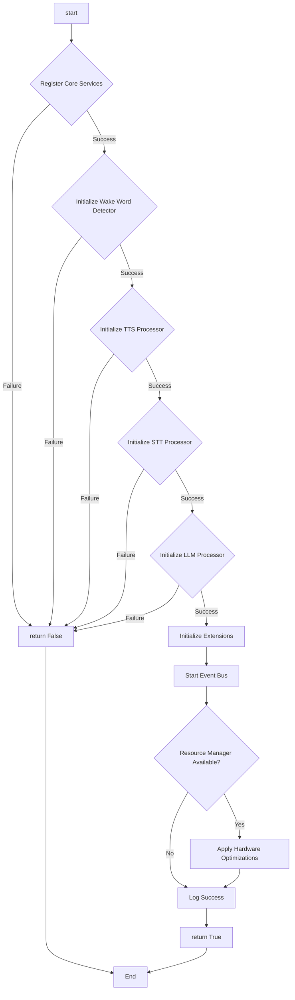

#### Advanced Usage Scenarios
[<sub>(contents)</sub>](#table-of-contents)

The `MaggieAI` class supports sophisticated application behaviors through its 
central coordination role:

1. **Hardware-Aware Resource Optimization**:
```python
def _setup_resource_management(self) -> None:
    ResourceManager = get_resource_manager()
    if ResourceManager is not None:
        self.resource_manager = ResourceManager(self.config)
        
        if ServiceLocator.has_service('resource_manager'):
            self.logger.debug('Resource manager already registered')
        else:
            ServiceLocator.register('resource_manager', self.resource_manager)
        
        # Apply hardware-specific optimizations
        self.resource_manager.setup_gpu()
        self.resource_manager.apply_hardware_specific_optimizations()
        self.logger.debug('Resource management setup complete')
    else:
        self.logger.error('Failed to get ResourceManager class')
        self.resource_manager = None
```

This method demonstrates lazy loading of the resource manager and application of 
hardware-specific optimizations, allowing the application to adapt to the 
specific capabilities of the hardware it's running on.

2. **Command Processing Workflow**:
```python
def process_command(self, command: str = None, extension: Any = None) -> None:
    current_state = self.state_manager.get_current_state()
    
    # Only process commands in appropriate states
    if current_state not in [State.READY, State.ACTIVE]:
        self.logger.warning(f"Cannot process command in {current_state.name} state")
        return
    
    # Transition to appropriate processing state
    self.state_manager.transition_to(State.LOADING, "processing_command")
    
    # Use specified extension or determine from command
    if extension:
        self._process_with_extension(extension, command)
    elif command:
        self._process_text_command(command)
    else:
        self.logger.error("No command or extension specified")
        self.state_manager.transition_to(State.READY, "processing_failed")
```

This method demonstrates state validation before command processing and 
appropriate state transitions during processing, ensuring the application is in a 
consistent state.

3. **Extension Management**:
```python
@log_operation(component='MaggieAI')
def _initialize_extensions(self) -> None:
    try:
        from maggie.extensions.registry import ExtensionRegistry
        extensions_config = self.config.get('extensions', {})
        registry = ExtensionRegistry()
        available_extensions = registry.discover_extensions()
        self.logger.info(f"Discovered {len(available_extensions)} extensions: "
                        f"{', '.join(available_extensions.keys())}")
        
        for (extension_name, extension_config) in extensions_config.items():
            if extension_config.get('enabled', True) is False:
                self.logger.info(f"Extension {extension_name} is disabled")
                continue
            
            extension = registry.instantiate_extension(
                extension_name, self.event_bus, extension_config)
            
            if extension is not None:
                self.extensions[extension_name] = extension
                self.logger.info(f"Initialized extension: {extension_name}")
            else:
                self.logger.warning(f"Failed to initialize extension: {extension_name}")
        
        self.logger.info(f"Initialized {len(self.extensions)} extension modules")
    except Exception as e:
        self.logger.error(f"Error initializing extensions: {e}")
```

This method implements a plugin system using dynamic discovery and loading, 
allowing the application to be extended with new capabilities without modifying 
the core code.

The `MaggieAI` class serves as the central coordinator for the entire 
application, managing the lifecycle of various components and orchestrating their 
interactions to provide a cohesive user experience. It demonstrates sophisticated 
design patterns including Mediator, Observer, and Strategy, along with thorough 
error handling and state management.

For more information on application architecture patterns in Python, refer to:
- [Python's concurrent.futures module documentation](https://docs.python.org/3/library/concurrent.futures.html)
- [Python Application Layouts: A Reference](https://realpython.com/python-application-layouts/)
- [Python Application Architecture Guide](https://pythoninthebox.com/python-app-architecture-guide/)

### Initialization Module
[<sub>(contents)</sub>](#table-of-contents)

#### Initialization Module Application Concepts
[<sub>(contents)</sub>](#table-of-contents)

The initialization module in `maggie/core/initialization.py` implements the 
application's bootstrapping process, setting up all core components and their 
dependencies. This module exemplifies several advanced software engineering 
principles:

1. **Dependency Inversion**: Components depend on abstractions rather than 
concrete implementations
2. **Separation of Concerns**: Each component has a well-defined responsibility
3. **Composition**: Components are composed together rather than inherited
4. **Error Isolation**: Initialization failures are contained and handled 
gracefully
5. **Logging Integration**: Comprehensive logging of the initialization process

This module serves as the application's "composition root," where all 
dependencies are created and wired together before the application starts 
running.

#### Initialization Module Implementation Analysis
[<sub>(contents)</sub>](#table-of-contents)

The `initialization.py` file contains the `initialize_components` function, which 
sets up the complete application framework:

```python
def initialize_components(config: Dict[str, Any], 
                         debug: bool = False) -> Dict[str, Any]:
    components = {}
    logger = logging.getLogger('maggie.initialization')
    try:
        # Initialize the capability registry
        registry = CapabilityRegistry.get_instance()
        components['registry'] = registry
        
        # Initialize the logging manager
        from maggie.utils.logging import LoggingManager
        logging_mgr = LoggingManager.initialize(config)
        components['logging_manager'] = logging_mgr
        
        # Set up error handling
        error_handler = ErrorHandlerAdapter()
        components['error_handler'] = error_handler
        
        # Initialize the event bus
        from maggie.core.event import EventBus
        event_bus = EventBus()
        components['event_bus'] = event_bus
        
        # Initialize the state manager
        from maggie.core.state import StateManager, State
        state_manager = StateManager(State.INIT, event_bus)
        components['state_manager'] = state_manager
        
        # Create adapters for core capabilities
        logging_adapter = LoggingManagerAdapter(logging_mgr)
        components['logging_adapter'] = logging_adapter
        
        event_bus_adapter = EventBusAdapter(event_bus)
        components['event_bus_adapter'] = event_bus_adapter
        
        state_manager_adapter = StateManagerAdapter(state_manager)
        components['state_manager_adapter'] = state_manager_adapter
        
        # Enhance logging with event publishing and state information
        logging_mgr.enhance_with_event_publisher(event_bus_adapter)
        logging_mgr.enhance_with_state_provider(state_manager_adapter)
        
        # Initialize the main application
        from maggie.core.app import MaggieAI
        config_path = config.get('config_path', 'config.yaml')
        maggie_ai = MaggieAI(config_path)
        components['maggie_ai'] = maggie_ai
        
        # Start the event bus
        event_bus.start()
        
        logger.info('All components initialized successfully')
        return components
    except Exception as e:
        logger.error(f"Error initializing components: {e}")
        return {}
```

This function demonstrates several advanced patterns:

1. **Late Imports**: Modules are imported where needed to prevent circular 
dependencies
2. **Defensive Programming**: Try-except block catches all exceptions to prevent 
crash
3. **Component Enhancement**: Components are enhanced with additional 
capabilities through dependency injection
4. **Adapter Pattern**: Core capabilities are wrapped in adapters implementing 
standard interfaces
5. **Registry Pattern**: Components are registered in a centralized registry for 
later access

The initialization sequence carefully orders component creation to ensure 
dependencies are available when needed:

1. **Core Registry**: First establishes the capability registry
2. **Logging Infrastructure**: Creates logging system early for detailed 
initialization tracing
3. **Error Handling**: Establishes error handling for capturing initialization 
failures
4. **Event System**: Initializes event bus for component communication
5. **State Management**: Creates state manager for application state control
6. **Capability Adapters**: Wraps core capabilities in standardized interfaces
7. **Component Enhancement**: Adds capabilities to components via dependency 
injection
8. **Main Application**: Creates the application controller with dependencies
9. **Event Bus Activation**: Starts event processing thread

#### Composition Root Pattern
[<sub>(contents)</sub>](#table-of-contents)

The initialization module implements the Composition Root pattern, which is a 
design pattern where all object compositions are centralized in a single 
location:

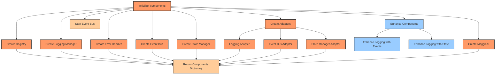

This pattern has several advantages:
1. **Single Responsibility**: Each component focuses on its core functionality 
without worrying about creating dependencies
2. **Testability**: Components can be easily mocked and replaced for testing
3. **Configuration**: Dependencies can be configured in a single place
4. **Visibility**: The dependency graph is clearly visible in one location

#### Initialization Module Advanced Usage Patterns
[<sub>(contents)</sub>](#table-of-contents)

The initialization module supports sophisticated application setup scenarios:

1. **Headless Mode Initialization**:
```python
def initialize_headless_mode(config_path: str) -> Dict[str, Any]:
    """Initialize application components for headless operation."""
    config = {
        'config_path': config_path,
        'headless': True,
        'debug': False
    }
    
    # Initialize with minimal logging
    config['logging'] = {
        'console_level': 'WARNING',
        'file_level': 'INFO'
    }
    
    components = initialize_components(config)
    
    # Validate essential components
    essential_components = ['event_bus', 'state_manager', 'maggie_ai']
    missing = [comp for comp in essential_components if comp not in components]
    
    if missing:
        logger = logging.getLogger('headless_init')
        logger.error(f"Missing essential components: {', '.join(missing)}")
        return {}
    
    # Disable GUI-dependent features
    maggie_ai = components['maggie_ai']
    maggie_ai.config['gui_enabled'] = False
    
    return components
```

This example demonstrates initializing the application in headless mode with 
custom configuration and validation of essential components.

2. **Testing Configuration**:
```python
def initialize_test_environment() -> Dict[str, Any]:
    """Initialize application components for testing."""
    config = {
        'config_path': 'test_config.yaml',
        'debug': True,
        'testing': True
    }
    
    # Use in-memory logging for tests
    config['logging'] = {
        'in_memory': True,
        'console_level': 'DEBUG'
    }
    
    # Initialize with mocked hardware detection
    original_detector = maggie.utils.resource.detector.HardwareDetector
    try:
        # Replace hardware detector with mock
        class MockHardwareDetector:
            def detect_system(self):
                return {
                    'cpu': {'is_ryzen_9_5900x': False, 'physical_cores': 4},
                    'gpu': {'is_rtx_3080': False, 'available': False},
                    'memory': {'is_xpg_d10': False, 'total_gb': 8}
                }
                
        maggie.utils.resource.detector.HardwareDetector = MockHardwareDetector
        
        # Initialize with mock detector
        components = initialize_components(config)
        return components
    finally:
        # Restore original detector
        maggie.utils.resource.detector.HardwareDetector = original_detector
```

This example shows how the initialization can be customized for testing with 
mocked hardware detection and in-memory logging.

3. **Progressive Enhancement**:
```python
def initialize_with_progressive_enhancement(config_path: str) -> Dict[str, Any]:
    """Initialize application with progressive enhancement based on hardware."""
    
    # Start with basic configuration
    config = {'config_path': config_path}
    
    # First pass: initialize minimal components to detect hardware
    basic_components = initialize_components(config)
    if not basic_components:
        return {}
    
    # Get hardware information
    hardware_info = None
    config_manager = basic_components.get('config_manager')
    if config_manager and hasattr(config_manager, 'hardware_info'):
        hardware_info = config_manager.hardware_info
    
    if not hardware_info:
        return basic_components
    
    # Second pass: enhance configuration based on hardware
    if hardware_info['gpu'].get('is_rtx_3080', False):
        config['gpu_acceleration'] = 'advanced'
    elif hardware_info['gpu'].get('available', False):
        config['gpu_acceleration'] = 'basic'
    else:
        config['gpu_acceleration'] = 'disabled'
    
    if hardware_info['cpu'].get('is_ryzen_9_5900x', False):
        config['threading'] = 'optimized'
        config['thread_count'] = 10
    
    # Initialize with enhanced configuration
    enhanced_components = initialize_components(config)
    return enhanced_components
```

This example demonstrates progressive enhancement where hardware is detected in 
an initial pass, followed by customized initialization based on available 
hardware.

The initialization module provides a robust foundation for application setup, 
with careful attention to dependency management, error handling, and component 
configuration. It exemplifies the 
[Composition Root](https://blog.ploeh.dk/2011/07/28/CompositionRoot/) pattern, 
where all dependencies are assembled in a single location.

For more information on application initialization patterns in Python, refer to:
- [Python's importlib module documentation](https://docs.python.org/3/library/importlib.html)
- [Dependency Injection in Python](https://python-dependency-injector.ets-labs.org/introduction/di_in_python.html)
- [Application Bootstrapping Patterns](https://martinfowler.com/articles/injection.html)


## Utility Modules Analysis

The Maggie AI Assistant includes a series of utility modules that provide essential cross-cutting functionality across the application. These modules implement critical infrastructure capabilities including configuration management, logging, error handling, and resource optimization. The utility modules are designed with modularity, flexibility, and hardware-specific optimization in mind, ensuring optimal performance on the target AMD Ryzen 9 5900X and NVIDIA RTX 3080 platform.

### Abstractions and Adapters

#### Application Concepts

The abstractions and adapters system implemented in `maggie/utils/abstractions.py` and `maggie/utils/adapters.py` represents a sophisticated implementation of several advanced design patterns:

1. **Interface-Based Design**: Core application capabilities are defined as abstract interfaces, creating a contract that implementations must fulfill
2. **Dependency Inversion Principle**: The system inverts traditional dependency relationships, making high-level modules independent of low-level module implementations
3. **Adapter Pattern**: Concrete implementations are wrapped in adapter classes that translate between specific implementations and abstract interfaces
4. **Service Registry Pattern**: A centralized registry provides dynamic discovery and access to capabilities throughout the application
5. **Thread-Safe Singleton**: The capability registry implements a thread-safe singleton pattern to ensure consistent access across multiple threads

This architecture creates a flexible foundation that enables:
- Loose coupling between components
- Runtime capability discovery
- Enhanced testability through mock implementations
- Consistent access to cross-cutting concerns

The system is particularly effective for capabilities that are used throughout the application, such as logging, error handling, event publishing, and state management.

#### Implementation Analysis

The abstractions module defines several key interfaces using Python's Abstract Base Class (ABC) mechanism:

```python
class ILoggerProvider(ABC):
    @abstractmethod
    def debug(self, message: str, **kwargs) -> None: pass
    
    @abstractmethod
    def info(self, message: str, **kwargs) -> None: pass
    
    @abstractmethod
    def warning(self, message: str, **kwargs) -> None: pass
    
    @abstractmethod
    def error(self, message: str, exception: Optional[Exception] = None, 
             **kwargs) -> None: pass
    
    @abstractmethod
    def critical(self, message: str, exception: Optional[Exception] = None, 
                **kwargs) -> None: pass
```

This interface defines a complete logging API with various severity levels and optional exception tracking. Similar interfaces are defined for error handling (`IErrorHandler`), event publishing (`IEventPublisher`), and state management (`IStateProvider`).

The capability registry implements a thread-safe singleton pattern using double-checked locking:

```python
class CapabilityRegistry:
    _instance = None
    _lock = threading.RLock()
    
    @classmethod
    def get_instance(cls):
        if cls._instance is None:
            with cls._lock:
                if cls._instance is None:
                    cls._instance = CapabilityRegistry()
        return cls._instance
    
    def __init__(self):
        self._registry = {}
    
    def register(self, capability_type: Type, instance: Any) -> None:
        self._registry[capability_type] = instance
    
    def get(self, capability_type: Type) -> Optional[Any]:
        return self._registry.get(capability_type)
```

This implementation ensures only one registry exists throughout the application while providing thread safety for concurrent registration and retrieval operations.

The adapter implementations bridge between concrete classes and abstract interfaces:

```python
class LoggingManagerAdapter(ILoggerProvider):
    def __init__(self, logging_manager):
        self.logging_manager = logging_manager
        registry = CapabilityRegistry.get_instance()
        registry.register(ILoggerProvider, self)
    
    def debug(self, message: str, **kwargs) -> None:
        from maggie.utils.logging import LogLevel
        self.logging_manager.log(LogLevel.DEBUG, message, **kwargs)
    
    # Additional methods implementing ILoggerProvider interface...
```

Each adapter registers itself with the registry during initialization, making it automatically available throughout the application. This self-registration pattern simplifies system configuration and reduces the need for external wiring.

The system provides convenience functions for accessing capabilities:

```python
def get_logger_provider() -> Optional[ILoggerProvider]:
    return CapabilityRegistry.get_instance().get(ILoggerProvider)

def get_error_handler() -> Optional[IErrorHandler]:
    return CapabilityRegistry.get_instance().get(IErrorHandler)

# Additional helper functions...
```

These functions encapsulate the registry access pattern, providing a clean API for capability retrieval.

#### Abstraction and Adapter Architecture

The architecture creates a clear separation between abstract interfaces, adapters, and concrete implementations:

```mermaid
classDiagram
    class ICapability {
        <<interface>>
    }
    
    class ILoggerProvider {
        <<interface>>
        +debug(message, **kwargs)
        +info(message, **kwargs)
        +warning(message, **kwargs)
        +error(message, exception, **kwargs)
        +critical(message, exception, **kwargs)
    }
    
    class IErrorHandler {
        <<interface>>
        +record_error(message, exception, **kwargs)
        +safe_execute(func, *args, **kwargs)
    }
    
    class IEventPublisher {
        <<interface>>
        +publish(event_type, data, **kwargs)
    }
    
    class IStateProvider {
        <<interface>>
        +get_current_state()
    }
    
    class CapabilityRegistry {
        -_instance: CapabilityRegistry
        -_registry: Dict
        -_lock: RLock
        +get_instance(): CapabilityRegistry
        +register(capability_type, instance)
        +get(capability_type): Any
    }
    
    class ComponentA {
        -logger: ILoggerProvider
        -error_handler: IErrorHandler
        +initialize()
        +process()
    }
    
    class ComponentB {
        -event_publisher: IEventPublisher
        -state_provider: IStateProvider
        +handle_event()
        +update_state()
    }
    
    class LoggingManagerAdapter {
        -logging_manager: LoggingManager
        +debug(message, **kwargs)
        +info(message, **kwargs)
        +warning(message, **kwargs)
        +error(message, exception, **kwargs)
        +critical(message, exception, **kwargs)
    }
    
    class ErrorHandlerAdapter {
        +record_error(message, exception, **kwargs)
        +safe_execute(func, *args, **kwargs)
    }
    
    class EventBusAdapter {
        -event_bus: EventBus
        +publish(event_type, data, **kwargs)
    }
    
    class StateManagerAdapter {
        -state_manager: StateManager
        +get_current_state()
    }
    
    class LoggingManager {
        +log(level, message, **kwargs)
    }
    
    class EventBus {
        +publish(event_type, data)
    }
    
    class StateManager {
        +get_current_state()
    }
    
    ICapability <|-- ILoggerProvider
    ICapability <|-- IErrorHandler
    ICapability <|-- IEventPublisher
    ICapability <|-- IStateProvider
    
    ILoggerProvider <|.. LoggingManagerAdapter
    IErrorHandler <|.. ErrorHandlerAdapter
    IEventPublisher <|.. EventBusAdapter
    IStateProvider <|.. StateManagerAdapter
    
    LoggingManagerAdapter --> LoggingManager
    ErrorHandlerAdapter --> "error_handling module"
    EventBusAdapter --> EventBus
    StateManagerAdapter --> StateManager
    
    ComponentA --> ILoggerProvider
    ComponentA --> IErrorHandler
    ComponentB --> IEventPublisher
    ComponentB --> IStateProvider
    
    CapabilityRegistry --> ICapability
```

This architecture demonstrates several key principles:

1. **Interface Segregation**: Each interface focuses on a specific capability
2. **Dependency Inversion**: Components depend on interfaces, not implementations
3. **Adapter Mediation**: Adapters bridge between concrete implementations and interfaces
4. **Registry Centralization**: The registry provides a single point of access
5. **Component Independence**: Components can operate with any implementation of their required interfaces

#### Advanced Usage Patterns

The abstractions and adapters system enables several advanced usage patterns:

1. **Component-Based Dependency Resolution**:
```python
class AudioProcessor:
    def __init__(self):
        # Retrieve capabilities from registry
        self.logger = get_logger_provider()
        self.error_handler = get_error_handler()
        self.event_publisher = get_event_publisher()
        
        if not all([self.logger, self.error_handler, self.event_publisher]):
            raise RuntimeError("Required capabilities not available")
    
    def process_audio(self, audio_data):
        self.logger.info("Processing audio data")
        
        # Use error handler for safe execution
        result = self.error_handler.safe_execute(
            self._internal_process,
            audio_data,
            error_message="Audio processing failed",
            error_category=ErrorCategory.PROCESSING
        )
        
        # Publish result event
        self.event_publisher.publish('audio_processed', {
            'success': result is not None,
            'duration': len(audio_data) / 16000  # Assuming 16kHz audio
        })
        
        return result
    
    def _internal_process(self, audio_data):
        # Implementation details...
        return processed_result
```

This pattern shows how components can retrieve their dependencies from the registry during initialization, providing clean separation from specific implementations.

2. **Testing with Mock Implementations**:
```python
def test_audio_processor():
    # Create mock implementations
    mock_logger = Mock(spec=ILoggerProvider)
    mock_error_handler = Mock(spec=IErrorHandler)
    mock_event_publisher = Mock(spec=IEventPublisher)
    
    # Configure mocks
    mock_error_handler.safe_execute.side_effect = lambda func, *args, **kwargs: func(*args)
    
    # Register mocks with registry
    registry = CapabilityRegistry.get_instance()
    registry.register(ILoggerProvider, mock_logger)
    registry.register(IErrorHandler, mock_error_handler)
    registry.register(IEventPublisher, mock_event_publisher)
    
    # Create component under test
    processor = AudioProcessor()
    
    # Test component
    test_audio = np.zeros(16000, dtype=np.float32)  # 1 second of silence
    result = processor.process_audio(test_audio)
    
    # Verify interactions
    mock_logger.info.assert_called_once_with("Processing audio data")
    mock_error_handler.safe_execute.assert_called_once()
    mock_event_publisher.publish.assert_called_once()
    assert mock_event_publisher.publish.call_args[0][0] == 'audio_processed'
```

This pattern demonstrates how the abstractions system facilitates testing by allowing mock implementations to be injected for testing purposes.

3. **Capability Enhancement**:
```python
def enhance_logging_with_performance_metrics():
    # Get existing logger
    base_logger = get_logger_provider()
    if not base_logger:
        return False
    
    # Create enhanced adapter
    class PerformanceEnhancedLogger(ILoggerProvider):
        def __init__(self, base_logger):
            self.base_logger = base_logger
            self.start_times = {}
            registry = CapabilityRegistry.get_instance()
            registry.register(ILoggerProvider, self)
        
        def start_operation(self, operation_name):
            self.start_times[operation_name] = time.time()
            self.debug(f"Starting operation: {operation_name}")
        
        def end_operation(self, operation_name):
            if operation_name in self.start_times:
                elapsed = time.time() - self.start_times[operation_name]
                self.info(f"Operation {operation_name} completed in {elapsed:.3f}s")
                del self.start_times[operation_name]
        
        # Delegate standard logging methods
        def debug(self, message, **kwargs):
            self.base_logger.debug(message, **kwargs)
        
        def info(self, message, **kwargs):
            self.base_logger.info(message, **kwargs)
        
        def warning(self, message, **kwargs):
            self.base_logger.warning(message, **kwargs)
        
        def error(self, message, exception=None, **kwargs):
            self.base_logger.error(message, exception, **kwargs)
        
        def critical(self, message, exception=None, **kwargs):
            self.base_logger.critical(message, exception, **kwargs)
    
    # Replace existing logger with enhanced version
    enhanced_logger = PerformanceEnhancedLogger(base_logger)
    return True
```

This pattern demonstrates how existing capabilities can be enhanced with additional functionality through the adapter pattern, without modifying the original implementations.

The abstractions and adapters system provides a flexible foundation for component interactions, promoting loose coupling, enhancing testability, and enabling runtime capability discovery and enhancement.

### Configuration Management

#### Application Concepts

The configuration management system implemented in `maggie/utils/config/manager.py` provides comprehensive configuration handling for the application. This system embodies several advanced concepts:

1. **Configuration Lifecycle Management**: Handles the complete lifecycle of configuration from loading to validation to optimization
2. **Hardware-Aware Configuration**: Automatically detects hardware capabilities and optimizes configuration accordingly
3. **Layered Configuration**: Applies configuration in layers from defaults to hardware-specific to user-defined
4. **Validation and Recovery**: Validates configuration integrity and recovers from configuration errors
5. **State-Specific Configuration**: Provides different configuration profiles based on application state

The system is designed to provide optimal settings for the target AMD Ryzen 9 5900X CPU and NVIDIA RTX 3080 GPU platform while maintaining flexibility for other hardware configurations. It uses a YAML-based configuration format with a comprehensive default configuration that can be overridden by user settings.

Key design goals of the configuration system include:
- Providing sensible defaults for all settings
- Automatically optimizing for available hardware
- Validating configuration to prevent runtime errors
- Creating backup/recovery mechanisms for configuration files
- Supporting state-specific configuration variations

#### Implementation Analysis

The `ConfigManager` class is responsible for managing the application's configuration:

```python
class ConfigManager:
    def __init__(self, config_path: str = 'config.yaml', 
                backup_dir: str = 'config_backups'):
        self.config_path = config_path
        self.backup_dir = backup_dir
        self.config = {}
        self.validation_errors = []
        self.validation_warnings = []
        self.logger = ComponentLogger('ConfigManager')
        self.default_config = self._create_default_config()
        self.hardware_detector = HardwareDetector()
        self.hardware_optimizer = None
        self.hardware_info = None
        os.makedirs(self.backup_dir, exist_ok=True)
```

The configuration system is initialized with a path to the configuration file and a directory for configuration backups, ensuring resilience to configuration errors.

The system provides a comprehensive default configuration that defines sensible values for all settings:

```python
def _create_default_config(self) -> Dict[str, Any]:
    return {
        'inactivity_timeout': 60,
        'fsm': {
            'state_styles': {
                'INIT': {'bg_color': '#E0E0E0', 'font_color': '#212121'},
                'STARTUP': {'bg_color': '#B3E5FC', 'font_color': '#212121'},
                # Additional state styles...
            },
            'transition_animations': {
                'default': {'type': 'slide', 'duration': 300},
                'to_shutdown': {'type': 'fade', 'duration': 800},
                'to_busy': {'type': 'bounce', 'duration': 400}
            },
            'valid_transitions': {
                'INIT': ['STARTUP', 'IDLE', 'SHUTDOWN'],
                'STARTUP': ['IDLE', 'READY', 'CLEANUP', 'SHUTDOWN'],
                # Additional transitions...
            },
            'input_field_states': {
                'IDLE': {'enabled': False, 'style': 'background-color: lightgray;'},
                'READY': {'enabled': True, 'style': 'background-color: white;'},
                'ACTIVE': {'enabled': True, 'style': 'background-color: white;'},
                'BUSY': {'enabled': False, 'style': 'background-color: #FFAB91;'}
            }
        },
        'stt': {
            'whisper': {
                'model_size': 'base',
                'compute_type': 'float16',
                'model_path': '\\maggie\\models\\stt\\whisper',
                'sample_rate': 16000,
                'tensor_cores_enabled': True,
                'flash_attention_enabled': True,
                'max_batch_size': 16,
                'memory_efficient': True,
                'parallel_processing': True,
                'chunk_size': 512,
                'simd_optimization': True,
                'cache_models': True
            },
            'whisper_streaming': {
                'enabled': True,
                'model_name': 'base',
                'language': 'en',
                'compute_type': 'float16',
                'cuda_streams': 2,
                'batch_processing': True,
                'low_latency_mode': True,
                'tensor_cores_enabled': True,
                'dedicated_threads': 2,
                'thread_affinity_enabled': True
            },
            # Additional STT configuration...
        },
        'tts': {
            'voice_model': 'af_heart.pt',
            'model_path': '\\maggie\\models\\tts',
            'sample_rate': 22050,
            'use_cache': True,
            'cache_dir': '\\maggie\\cache\\tts',
            'cache_size': 200,
            'gpu_device': 0,
            'gpu_acceleration': True,
            'gpu_precision': 'mixed_float16',
            'max_workers': 4,
            'voice_preprocessing': True,
            'tensor_cores_enabled': True,
            'cuda_graphs_enabled': True,
            'amp_optimization_level': 'O2',
            # Additional TTS configuration...
        },
        'llm': {
            'model_path': 'maggie\\models\\llm\\mistral-7b-instruct-v0.3-GPTQ-4bit',
            'model_type': 'mistral',
            'gpu_layers': 32,
            'gpu_layer_auto_adjust': True,
            'tensor_cores_enabled': True,
            'mixed_precision_enabled': True,
            'precision_type': 'float16',
            'kv_cache_optimization': True,
            'attention_optimization': True,
            'context_length': 8192,
            'batch_size': 16,
            'offload_strategy': 'auto',
            'vram_efficient_loading': True,
            'rtx_3080_optimized': True
        },
        'logging': {
            'path': 'logs',
            'console_level': 'INFO',
            'file_level': 'DEBUG'
        },
        'extensions': {
            'recipe_creator': {
                'enabled': True,
                'template_path': 'templates\\recipe_template.docx',
                'output_dir': 'recipes'
            }
        },
        'cpu': {
            'max_threads': 8,
            'thread_timeout': 30,
            'ryzen_9_5900x_optimized': True,
            'thread_affinity_enabled': True,
            'performance_cores': [0, 1, 2, 3, 4, 5, 6, 7],
            'background_cores': [8, 9, 10, 11],
            'high_performance_plan': True,
            'disable_core_parking': True,
            'precision_boost_overdrive': True,
            'simultaneous_multithreading': True
        },
        'memory': {
            'max_percent': 75,
            'model_unload_threshold': 85,
            'xpg_d10_memory': True,
            'large_pages_enabled': True,
            'numa_aware': True,
            'preload_models': True,
            'cache_size_mb': 6144,
            'min_free_gb': 4,
            'defragmentation_threshold': 70
        },
        'gpu': {
            'max_percent': 90,
            'model_unload_threshold': 95,
            'rtx_3080_optimized': True,
            'tensor_cores_enabled': True,
            'tensor_precision': 'tf32',
            'cuda_compute_type': 'float16',
            'cuda_streams': 3,
            'cuda_memory_pool': True,
            'cuda_graphs': True,
            'max_batch_size': 16,
            'reserved_memory_mb': 256,
            'dynamic_memory': True,
            'fragmentation_threshold': 15,
            'pre_allocation': True
        }
    }
```

This comprehensive default configuration demonstrates advanced system design with:
- Hierarchical organization reflecting system structure
- Hardware-specific optimization flags
- Detailed performance tuning parameters
- Memory management strategies
- GPU acceleration settings
- State-specific UI configurations

The configuration loading process includes validation, hardware detection, and optimization:

```python
@log_operation(component='ConfigManager')
@with_error_handling(error_category=ErrorCategory.CONFIGURATION)
def load(self) -> Dict[str, Any]:
    with logging_context(component='ConfigManager', operation='load') as ctx:
        self.hardware_info = self._detect_hardware()
        
        if os.path.exists(self.config_path):
            try:
                with open(self.config_path, 'r') as file:
                    self.config = yaml.safe_load(file) or {}
                self.logger.info(f"Configuration loaded from {self.config_path}")
                self._create_backup('loaded')
            except yaml.YAMLError as yaml_error:
                self.logger.error(f"YAML error in configuration: {yaml_error}")
                self._attempt_config_recovery(yaml_error)
            except IOError as io_error:
                self.logger.error(f"IO error reading configuration: {io_error}")
                self._attempt_config_recovery(io_error)
        else:
            self.logger.info(f"Configuration file {self.config_path} not found, "
                           f"creating with defaults")
            self.config = self.default_config
            self.save()
        
        self._merge_with_defaults()
        self.validate()
        
        if self.hardware_info:
            self.optimize_config_for_hardware()
        
        return self.config
```

This method demonstrates several advanced software engineering practices:
- Error handling with recovery mechanisms
- Automatic backup creation
- Merging user configuration with defaults
- Configuration validation
- Hardware-specific optimization

The hardware-specific optimization is particularly noteworthy:

```python
@log_operation(component='ConfigManager')
@with_error_handling(error_category=ErrorCategory.CONFIGURATION)
def optimize_config_for_hardware(self) -> Dict[str, Any]:
    with logging_context(component='ConfigManager', 
                        operation='optimize_for_hardware'):
        optimizations = {'cpu': {}, 'gpu': {}, 'memory': {}}
        
        if not self.hardware_optimizer and self.hardware_info:
            self.hardware_optimizer = HardwareOptimizer(self.hardware_info, self.config)
        
        if not self.hardware_info or not self.hardware_optimizer:
            self.logger.warning('Cannot optimize configuration: hardware information not available')
            return optimizations
        
        cpu_info = self.hardware_info.get('cpu', {})
        if cpu_info.get('is_ryzen_9_5900x', False):
            cpu_opts = self.hardware_optimizer.optimize_for_ryzen_9_5900x()
            if cpu_opts.get('applied', False):
                optimizations['cpu'] = cpu_opts.get('settings', {})
                self.logger.info('Applied Ryzen 9 5900X-specific optimizations')
                
                if 'cpu' not in self.config:
                    self.config['cpu'] = {}
                for (key, value) in optimizations['cpu'].items():
                    self.config['cpu'][key] = value
                
                if 'stt' in self.config:
                    stt_config = self.config['stt']
                    if 'whisper' in stt_config:
                        stt_config['whisper']['chunk_size'] = 512
                        stt_config['whisper']['simd_optimization'] = True
                        optimizations['stt']['chunk_size'] = 512
                        optimizations['stt']['simd_optimization'] = True
        
        gpu_info = self.hardware_info.get('gpu', {})
        if gpu_info.get('is_rtx_3080', False):
            gpu_opts = self.hardware_optimizer.optimize_for_rtx_3080()
            if gpu_opts.get('applied', False):
                optimizations['gpu'] = gpu_opts.get('settings', {})
                self.logger.info('Applied RTX 3080-specific optimizations')
                
                if 'gpu' not in self.config:
                    self.config['gpu'] = {}
                for (key, value) in optimizations['gpu'].items():
                    self.config['gpu'][key] = value
                
                if 'llm' in self.config:
                    self.config['llm']['gpu_layers'] = 32
                    self.config['llm']['tensor_cores_enabled'] = True
                    self.config['llm']['mixed_precision_enabled'] = True
                    self.config['llm']['precision_type'] = 'float16'
                    optimizations['llm']['gpu_layers'] = 32
                    optimizations['llm']['tensor_cores_enabled'] = True
                    optimizations['llm']['mixed_precision_enabled'] = True
                    optimizations['llm']['precision_type'] = 'float16'
                
                if 'stt' in self.config:
                    if 'whisper' in self.config['stt']:
                        self.config['stt']['whisper']['compute_type'] = 'float16'
                        self.config['stt']['whisper']['tensor_cores_enabled'] = True
                        self.config['stt']['whisper']['flash_attention_enabled'] = True
                        optimizations['stt']['compute_type'] = 'float16'
                        optimizations['stt']['tensor_cores_enabled'] = True
                    
                    if 'whisper_streaming' in self.config['stt']:
                        self.config['stt']['whisper_streaming']['compute_type'] = 'float16'
                        self.config['stt']['whisper_streaming']['tensor_cores_enabled'] = True
                        optimizations['stt']['streaming_compute_type'] = 'float16'
                
                if 'tts' in self.config:
                    self.config['tts']['gpu_acceleration'] = True
                    self.config['tts']['gpu_precision'] = 'mixed_float16'
                    self.config['tts']['tensor_cores_enabled'] = True
                    optimizations['tts']['gpu_acceleration'] = True
                    optimizations['tts']['gpu_precision'] = 'mixed_float16'
                    optimizations['tts']['tensor_cores_enabled'] = True
        
        memory_info = self.hardware_info.get('memory', {})
        if memory_info.get('is_xpg_d10', False) and memory_info.get('is_32gb', False):
            if 'memory' not in self.config:
                self.config['memory'] = {}
            self.config['memory']['large_pages_enabled'] = True
            self.config['memory']['numa_aware'] = True
            self.config['memory']['cache_size_mb'] = 6144
            optimizations['memory']['large_pages_enabled'] = True
            optimizations['memory']['numa_aware'] = True
            optimizations['memory']['cache_size_mb'] = 6144
            self.logger.info('Applied XPG D10 memory-specific optimizations')
        
        if any(settings for settings in optimizations.values()):
            self.save()
        
        return optimizations
```

This method demonstrates sophisticated hardware-specific optimization with:
- Detection of specific hardware models (Ryzen 9 5900X, RTX 3080, XPG D10 memory)
- Detailed optimization of parameters for each hardware component
- Cross-component optimization (GPU settings affecting LLM, STT, and TTS components)
- Fallbacks for unavailable hardware information

The configuration system also includes validation to ensure configuration integrity:

```python
def _validate_required_params(self) -> None:
    required_params = [
        ('stt.wake_word.access_key', 'Picovoice access key'),
        ('llm.model_path', 'LLM model path'),
        ('tts.voice_model', 'TTS voice model')
    ]
    
    for (param_path, param_name) in required_params:
        value = self._get_nested_value(self.config, param_path)
        if value is None:
            self.validation_errors.append(
                f"Missing required configuration: {param_name} ({param_path})"
            )
        elif isinstance(value, str) and not value:
            self.validation_errors.append(
                f"Empty required configuration: {param_name} ({param_path})"
            )

def _validate_fsm_config(self) -> None:
    fsm_config = self.config.get('fsm', {})
    state_styles = fsm_config.get('state_styles', {})
    required_states = ['INIT', 'STARTUP', 'IDLE', 'LOADING', 'READY', 'ACTIVE', 
                      'BUSY', 'CLEANUP', 'SHUTDOWN']
    
    for state in required_states:
        if state not in state_styles:
            self.validation_warnings.append(
                f"Missing style configuration for state: {state}"
            )
        else:
            style = state_styles[state]
            if 'bg_color' not in style or 'font_color' not in style:
                self.validation_warnings.append(
                    f"Incomplete style configuration for state: {state}"
                )
    
    # Additional validation...

def _validate_hardware_specific_settings(self) -> None:
    cpu_config = self.config.get('cpu', {})
    if cpu_config.get('ryzen_9_5900x_optimized', False):
        if 'max_threads' not in cpu_config:
            self.validation_warnings.append(
                "Missing 'max_threads' setting for Ryzen 9 5900X optimization"
            )
        elif cpu_config['max_threads'] > 10:
            self.validation_warnings.append(
                "'max_threads' value too high for optimal Ryzen 9 5900X performance"
            )
        
        # Additional CPU validation...
    
    gpu_config = self.config.get('gpu', {})
    if gpu_config.get('rtx_3080_optimized', False):
        if 'tensor_cores_enabled' not in gpu_config:
            self.validation_warnings.append(
                "Missing 'tensor_cores_enabled' setting for RTX 3080 optimization"
            )
        
        # Additional GPU validation...
    
    # Additional hardware validation...
```

These validation methods ensure that required parameters are present, state-specific configurations are complete, and hardware-specific settings are consistent with the hardware's capabilities.

The configuration system also supports state-specific configuration through a dedicated method:

```python
def apply_state_specific_config(self, state) -> None:
    self.logger.debug(f"Applying state-specific configuration for state: {state.name}")
    # State-specific configuration logic...
```

This method allows different configuration parameters to be applied based on the current application state, enabling dynamic reconfiguration as the application transitions between states.

The configuration management system provides a robust foundation for application configuration, with comprehensive default values, hardware-specific optimization, validation, and state-specific configuration. It ensures that the application operates optimally on the target hardware platform while maintaining flexibility for other configurations.

### Logging System

#### Application Concepts

The logging system implemented in `maggie/utils/logging.py` provides comprehensive logging capabilities throughout the application. The system embodies several advanced concepts:

1. **Hierarchical Logging**: Organized by component with inheritance of logging levels
2. **Multi-Destination Logging**: Output to console, files, and the event bus
3. **Contextual Logging**: Captures contextual information such as states and correlation IDs
4. **Performance Metrics**: Integrated performance monitoring and reporting
5. **Structured Logging**: Rich metadata and structured log formats
6. **Asynchronous Logging**: Non-blocking logging operations for performance-critical code
7. **Thread-Safe Design**: Concurrent logging from multiple threads

The logging system is designed to provide comprehensive visibility into application behavior while minimizing performance impact. It supports both development-time debugging and production-time monitoring, with configurability to adjust verbosity levels for different environments.

Key design goals of the logging system include:
- Enabling detailed troubleshooting through comprehensive log data
- Minimizing performance impact in critical code paths
- Correlating logs across components and operations
- Supporting both human-readable and machine-parseable formats
- Preserving context across asynchronous operations

#### Implementation Analysis

The logging system is built around several core classes:

1. **LogLevel Enumeration**: Defines standard logging levels
```python
class LogLevel(Enum):
    DEBUG = auto()
    INFO = auto()
    WARNING = auto()
    ERROR = auto()
    CRITICAL = auto()
```

2. **LoggingManager Class**: Centralized logging coordination
```python
class LoggingManager:
    _instance = None
    _lock = threading.RLock()
    
    @classmethod
    def get_instance(cls) -> 'LoggingManager':
        if cls._instance is None:
            raise RuntimeError('LoggingManager not initialized')
        return cls._instance
    
    @classmethod
    def initialize(cls, config: Dict[str, Any]) -> 'LoggingManager':
        if cls._instance is not None:
            logger.warning('LoggingManager already initialized')
            return cls._instance
        
        with cls._lock:
            if cls._instance is None:
                cls._instance = LoggingManager(config)
        
        return cls._instance
    
    def __init__(self, config: Dict[str, Any]) -> None:
        self.config = config.get('logging', {})
        self.log_dir = Path(self.config.get('path', 'logs')).resolve()
        self.log_dir.mkdir(exist_ok=True, parents=True)
        self.console_level = self.config.get('console_level', 'INFO')
        self.file_level = self.config.get('file_level', 'DEBUG')
        self._enhanced_logging = False
        self._event_publisher = None
        self._error_handler = None
        self._state_provider = None
        self.log_batch_size = self.config.get('batch_size', 50)
        self.log_batch_timeout = self.config.get('batch_timeout', 5.)
        self.async_logging = self.config.get('async_enabled', True)
        self.correlation_id = None
        
        self._configure_basic_logging()
    
    def _configure_basic_logging(self) -> None:
        console_handler = logging.StreamHandler(sys.stdout)
        console_handler.setLevel(getattr(logging, self.console_level))
        console_formatter = logging.Formatter(
            '%(asctime)s - %(name)s - %(levelname)s - %(message)s'
        )
        console_handler.setFormatter(console_formatter)
        
        log_file = self.log_dir / 'maggie.log'
        file_handler = logging.FileHandler(log_file)
        file_handler.setLevel(getattr(logging, self.file_level))
        file_formatter = logging.Formatter(
            '%(asctime)s - %(name)s - %(levelname)s - %(message)s'
        )
        file_handler.setFormatter(file_formatter)
        
        root_logger = logging.getLogger()
        root_logger.handlers.clear()
        root_logger.addHandler(console_handler)
        root_logger.addHandler(file_handler)
        root_logger.setLevel(logging.DEBUG)
```

The LoggingManager implements the Singleton pattern with thread safety, ensuring a single logging configuration throughout the application. It configures both console and file logging with different verbosity levels for each destination.

3. **Capability Enhancement**: The logging manager can be enhanced with additional capabilities
```python
def enhance_with_event_publisher(self, event_publisher: Any) -> None:
    self._event_publisher = event_publisher
    self._enhanced_logging = True

def enhance_with_error_handler(self, error_handler: Any) -> None:
    self._error_handler = error_handler
    self._enhanced_logging = True

def enhance_with_state_provider(self, state_provider: Any) -> None:
    self._state_provider = state_provider
    self._enhanced_logging = True
```

These methods demonstrate the [Decorator Pattern](https://en.wikipedia.org/wiki/Decorator_pattern), allowing the logging manager to be enhanced with additional capabilities at runtime.

4. **Logging Operation**: The core logging method with context enrichment
```python
def log(self, level: LogLevel, message: str, *args: Any, 
       exception: Optional[Exception] = None, **kwargs: Any) -> None:
    log_method = {
        LogLevel.DEBUG: logger.debug,
        LogLevel.INFO: logger.info,
        LogLevel.WARNING: logger.warning,
        LogLevel.ERROR: logger.error,
        LogLevel.CRITICAL: logger.critical
    }.get(level)
    
    if log_method:
        log_method(message, *args, exc_info=exception, **kwargs)
    
    if self._enhanced_logging and self._event_publisher and level in [
        LogLevel.ERROR, LogLevel.CRITICAL
    ]:
        try:
            event_data = {
                'message': message,
                'level': level.name,
                'timestamp': time.time(),
                'correlation_id': self.correlation_id
            }
            
            if self._state_provider:
                try:
                    current_state = self._state_provider.get_current_state()
                    if hasattr(current_state, 'name'):
                        event_data['state'] = current_state.name
                except Exception:
                    pass
            
            if exception:
                event_data['exception'] = str(exception)
            
            self._event_publisher.publish('error_logged', event_data)
        except Exception as e:
            logger.warning(f"Failed to publish error event: {e}")
```

This method demonstrates context enrichment, where log messages are enhanced with additional information such as correlation IDs and application state, creating richer log entries for analysis.

5. **Performance Metrics**: Integrated performance monitoring
```python
def log_performance(self, component: str, operation: str, elapsed: float, 
                   details: Optional[Dict[str, Any]] = None) -> None:
    log_entry = f"{operation} took {elapsed:.3f}s"
    if details:
        detail_str = ', '.join(f"{k}={v}" for (k, v) in details.items())
        log_entry += f" ({detail_str})"
    
    logger.debug(f"Performance: {component}/{operation} - {log_entry}")
    
    if self._enhanced_logging and self._event_publisher:
        try:
            event_data = {
                'component': component,
                'operation': operation,
                'elapsed_time': elapsed,
                'details': details or {},
                'timestamp': time.time(),
                'correlation_id': self.correlation_id
            }
            self._event_publisher.publish('performance_metric', event_data)
        except Exception as e:
            logger.warning(f"Failed to publish performance metric: {e}")
```

This method integrates performance monitoring into the logging system, allowing operations to report their execution time and contextual details for performance analysis.

6. **Component Logger**: Component-specific logging facade
```python
class ComponentLogger:
    def __init__(self, component_name: str) -> None:
        self.component = component_name
        self.logger = logging.getLogger(component_name)
    
    def debug(self, message: str, **kwargs: Any) -> None:
        exception = kwargs.pop('exception', None)
        if exception:
            self.logger.debug(message, exc_info=exception, **kwargs)
        else:
            self.logger.debug(message, **kwargs)
        
        try:
            manager = LoggingManager.get_instance()
            manager.log(LogLevel.DEBUG, message, exception=exception, **kwargs)
        except Exception:
            pass
    
    # Additional logging methods...
    
    def log_performance(self, operation: str, elapsed: float, 
                       details: Optional[Dict[str, Any]] = None) -> None:
        message = f"Performance: {operation} took {elapsed:.3f}s"
        if details:
            message += f" ({', '.join(f'{k}={v}' for (k, v) in details.items())})"
        self.debug(message)
        
        try:
            manager = LoggingManager.get_instance()
            manager.log_performance(self.component, operation, elapsed, details)
        except Exception:
            pass
```

The ComponentLogger provides a component-specific facade for the logging system, ensuring that all log messages from a component are properly categorized and allowing component-specific log filtering.

7. **Logging Context Manager**: Context-aware logging with timing
```python
@contextmanager
def logging_context(correlation_id: Optional[str] = None, component: str = '', 
                  operation: str = '', state: Any = None) -> Generator[Dict[str, Any], 
                                                                     None, None]:
    ctx_id = correlation_id or str(uuid.uuid4())
    context = {
        'correlation_id': ctx_id,
        'component': component,
        'operation': operation,
        'start_time': time.time()
    }
    
    if state is not None:
        context['state'] = state.name if hasattr(state, 'name') else str(state)
    
    try:
        manager = LoggingManager.get_instance()
        old_correlation_id = manager.get_correlation_id()
        manager.set_correlation_id(ctx_id)
    except Exception:
        old_correlation_id = None
    
    logger_instance = logging.getLogger(component or 'context')
    
    try:
        yield context
    except Exception as e:
        logger_instance.error(f"Error in {component}/{operation}: {e}", 
                             exc_info=True)
        raise
    finally:
        elapsed = time.time() - context['start_time']
        logger_instance.debug(f"{component}/{operation} "
                            f"completed in {elapsed:.3f}s")
        
        try:
            manager = LoggingManager.get_instance()
            if old_correlation_id is not None:
                manager.set_correlation_id(old_correlation_id)
            
            if component and operation:
                manager.log_performance(component, operation, elapsed)
        except Exception:
            pass
```

This context manager demonstrates contextual logging with automatic timing measurement, providing structured context for log messages generated within a specific operation.

8. **Log Operation Decorator**: Automatic operation logging
```python
def log_operation(component: str = '', log_args: bool = True, 
                log_result: bool = False, include_state: bool = True) -> Callable[
                [Callable[..., T]], Callable[..., T]]:
    def decorator(func):
        @functools.wraps(func)
        def wrapper(*args, **kwargs):
            operation = func.__name__
            args_str = ''
            
            if log_args:
                sig = inspect.signature(func)
                arg_names = list(sig.parameters.keys())
                pos_args = []
                
                for (i, arg) in enumerate(args):
                    if i < len(arg_names) and i > 0:
                        pos_args.append(f"{arg_names[i]}={repr(arg)}")
                    elif i >= len(arg_names):
                        pos_args.append(repr(arg))
                
                kw_args = [f"{k}={repr(v)}" for (k, v) in kwargs.items()]
                all_args = pos_args + kw_args
                args_str = ', '.join(all_args)
                
                if len(args_str) > 200:
                    args_str = args_str[:197] + '...'
            
            state = None
            logger_instance = logging.getLogger(component or func.__module__)
            
            if log_args and args_str:
                logger_instance.debug(f"{operation} called with args: {args_str}")
            
            with logging_context(component=component, operation=operation, 
                               state=state) as ctx:
                start_time = time.time()
                result = func(*args, **kwargs)
                elapsed = time.time() - start_time
                
                if log_result:
                    if isinstance(result, (str, int, float, bool, type(None))):
                        logger_instance.debug(f"{operation} returned: {result}")
                    else:
                        logger_instance.debug(
                            f"{operation} returned: {type(result).__name__}"
                        )
                
                try:
                    manager = LoggingManager.get_instance()
                    manager.log_performance(
                        component or func.__module__, operation, elapsed
                    )
                except Exception:
                    logger_instance.debug(
                        f"{operation} completed in {elapsed:.3f}s"
                    )
                
                return result
        
        return wrapper
    
    return decorator
```

This decorator demonstrates automatic operation logging with parameter inspection, execution timing, and result reporting, providing comprehensive logging for decorated functions with minimal code impact.

The logging system provides a comprehensive foundation for application monitoring and debugging, with rich contextual information, performance metrics, and multi-destination output. It enables detailed analysis of application behavior while minimizing performance impact through features like asynchronous logging and configurable verbosity levels.

### Error Handling System

#### Application Concepts

The error handling system implemented in `maggie/utils/error_handling.py` provides comprehensive error management throughout the application. The system embodies several advanced concepts:

1. **Structured Error Information**: Rich error context including category, severity, and source
2. **Centralized Error Reporting**: Unified error handling across components
3. **Error Recovery Strategies**: Mechanisms for recovering from errors gracefully
4. **Retry Logic**: Automatic retry of operations with configurable policies
5. **Error Isolation**: Containment of errors to prevent cascade failures
6. **Contextual Error Enhancement**: Enrichment of errors with application state
7. **Event-Based Notification**: Publishing of error events for system-wide awareness

The system is designed to provide robust error handling with comprehensive diagnostic information while enabling graceful degradation of functionality in the face of errors.

Key design goals of the error handling system include:
- Providing rich diagnostic information for troubleshooting
- Enabling recovery from transient errors
- Preventing error cascades through isolation
- Creating informative error messages for users and developers
- Categorizing errors for appropriate handling

#### Implementation Analysis

The error handling system is built around several core components:

1. **Error Categories and Severities**: Standardized error classification
```python
class ErrorSeverity(enum.Enum):
    DEBUG = 0
    INFO = 1
    WARNING = 2
    ERROR = 3
    CRITICAL = 4

class ErrorCategory(enum.Enum):
    SYSTEM = 'system'
    NETWORK = 'network'
    RESOURCE = 'resource'
    PERMISSION = 'permission'
    CONFIGURATION = 'configuration'
    INPUT = 'input'
    PROCESSING = 'processing'
    MODEL = 'model'
    EXTENSION = 'extension'
    STATE = 'state'
    UNKNOWN = 'unknown'
```

These enumerations provide standardized classification of errors by type and severity, enabling consistent error handling across the application.

2. **Specialized Error Classes**: Domain-specific error types
```python
class MaggieError(Exception): pass
class LLMError(MaggieError): pass
class ModelLoadError(LLMError): pass
class GenerationError(LLMError): pass
class STTError(MaggieError): pass
class TTSError(MaggieError): pass
class ExtensionError(MaggieError): pass

class StateTransitionError(MaggieError):
    def __init__(self, message: str, from_state: Any = None, to_state: Any = None,
                trigger: str = None, details: Dict[str, Any] = None):
        self.from_state = from_state
        self.to_state = to_state
        self.trigger = trigger
        self.details = details or {}
        super().__init__(message)

class ResourceManagementError(MaggieError):
    def __init__(self, message: str, resource_type: str = None, 
                resource_name: str = None, details: Dict[str, Any] = None):
        self.resource_type = resource_type
        self.resource_name = resource_name
        self.details = details or {}
        super().__init__(message)

class InputProcessingError(MaggieError):
    def __init__(self, message: str, input_type: str = None, 
                input_source: str = None, details: Dict[str, Any] = None):
        self.input_type = input_type
        self.input_source = input_source
        self.details = details or {}
        super().__init__(message)
```

These specialized error classes provide domain-specific error types with additional context fields, enhancing error diagnostics with domain-specific information.

3. **Error Context**: Comprehensive error information container
```python
class ErrorContext:
    def __init__(self, message: str, exception: Optional[Exception] = None,
                category: ErrorCategory = ErrorCategory.UNKNOWN,
                severity: ErrorSeverity = ErrorSeverity.ERROR,
                source: str = '', details: Dict[str, Any] = None,
                correlation_id: Optional[str] = None,
                state_info: Optional[Dict[str, Any]] = None):
        self.message = message
        self.exception = exception
        self.category = category
        self.severity = severity
        self.source = source
        self.details = details or {}
        self.correlation_id = correlation_id or str(uuid.uuid4())
        self.timestamp = time.time()
        self.state_info = state_info or {}
        
        if exception:
            self.exception_type = type(exception).__name__
            self.exception_msg = str(exception)
            exc_type, exc_value, exc_traceback = sys.exc_info()
            
            if exc_traceback:
                tb = traceback.extract_tb(exc_traceback)
                if tb:
                    frame = tb[-1]
                    self.filename = frame.filename
                    self.line = frame.lineno
                    self.function = frame.name
                    self.code = frame.line
    
    def to_dict(self) -> Dict[str, Any]:
        result = {
            'message': self.message,
            'category': self.category.value,
            'severity': self.severity.value,
            'source': self.source,
            'timestamp': self.timestamp,
            'correlation_id': self.correlation_id
        }
        
        if hasattr(self, 'exception_type'):
            result['exception'] = {
                'type': self.exception_type,
                'message': self.exception_msg
            }
        
        if hasattr(self, 'filename'):
            result['location'] = {
                'file': self.filename,
                'line': self.line,
                'function': self.function,
                'code': self.code
            }
        
        if self.details:
            result['details'] = self.details
        
        if self.state_info:
            result['state'] = self.state_info
        
        return result
    
    def log(self, publish: bool = True) -> None:
        if self.severity == ErrorSeverity.CRITICAL:
            logger.critical(self.message, exc_info=bool(self.exception))
        elif self.severity == ErrorSeverity.ERROR:
            logger.error(self.message, exc_info=bool(self.exception))
        elif self.severity == ErrorSeverity.WARNING:
            logger.warning(self.message)
        else:
            logger.debug(self.message)
        
        try:
            from maggie.utils.abstractions import get_event_publisher
            publisher = get_event_publisher()
            
            if publish and publisher:
                publisher.publish(ERROR_EVENT_LOGGED, self.to_dict())
                
                if self.category == ErrorCategory.STATE:
                    publisher.publish(ERROR_EVENT_STATE_TRANSITION, self.to_dict())
                elif self.category == ErrorCategory.RESOURCE:
                    publisher.publish(ERROR_EVENT_RESOURCE_MANAGEMENT, self.to_dict())
                elif self.category == ErrorCategory.INPUT:
                    publisher.publish(ERROR_EVENT_INPUT_PROCESSING, self.to_dict())
        except ImportError:
            pass
        except Exception as e:
            logger.debug(f"Failed to publish error event: {e}")
```

The ErrorContext class creates a comprehensive container for error information, capturing details about the error itself, the source of the error, the application state when the error occurred, and other contextual information.

4. **Safe Execution Wrapper**: Error-handling function wrapper
```python
def safe_execute(func: Callable[..., T], *args: Any, error_code: Optional[str] = None,
                default_return: Optional[T] = None, error_details: Dict[str, Any] = None,
                error_category: ErrorCategory = ErrorCategory.UNKNOWN,
                error_severity: ErrorSeverity = ErrorSeverity.ERROR,
                publish_error: bool = True, include_state_info: bool = True,
                **kwargs: Any) -> T:
    try:
        return func(*args, **kwargs)
    except Exception as e:
        details = error_details or {}
        
        if not details:
            details = {'args': str(args), 'kwargs': str(kwargs)}
        
        source = f"{func.__module__}.{func.__name__}"
        current_state = None
        
        if include_state_info:
            try:
                from maggie.utils.abstractions import get_state_provider
                state_provider = get_state_provider()
                
                if state_provider:
                    current_state = state_provider.get_current_state()
            except ImportError:
                pass
            except Exception:
                pass
        
        context = ErrorContext(
            message=f"Error executing {func.__name__}: {e}",
            exception=e,
            category=error_category,
            severity=error_severity,
            source=source,
            details=details
        )
        
        if current_state is not None:
            context.state_info['current_state'] = current_state.name if hasattr(
                current_state, 'name') else str(current_state)
        
        context.log(publish=publish_error)
        return default_return if default_return is not None else cast(T, None)
```

The safe_execute function provides a robust wrapper for function execution with comprehensive error handling, capturing exceptions and creating detailed error contexts for diagnostic purposes.

5. **Error Recording Function**: Centralized error recording
```python
def record_error(message: str, exception: Optional[Exception] = None,
               category: ErrorCategory = ErrorCategory.UNKNOWN,
               severity: ErrorSeverity = ErrorSeverity.ERROR,
               source: str = '', details: Dict[str, Any] = None,
               publish: bool = True, state_object: Any = None,
               from_state: Any = None, to_state: Any = None,
               trigger: str = None) -> ErrorContext:
    context = ErrorContext(
        message=message,
        exception=exception,
        category=category,
        severity=severity,
        source=source,
        details=details or {}
    )
    
    if state_object is not None:
        state_name = state_object.name if hasattr(state_object, 'name') else str(state_object)
        context.state_info['current_state'] = state_name
    
    if from_state is not None and to_state is not None:
        from_name = from_state.name if hasattr(from_state, 'name') else str(from_state)
        to_name = to_state.name if hasattr(to_state, 'name') else str(to_state)
        context.state_info['transition'] = {
            'from': from_name,
            'to': to_name,
            'trigger': trigger
        }
    
    context.log(publish=publish)
    return context
```

The record_error function provides a centralized mechanism for recording errors with comprehensive contextual information, enabling consistent error handling across the application.

6. **Error Handling Decorator**: Annotation-based error handling
```python
def with_error_handling(error_code: Optional[str] = None,
                      error_category: ErrorCategory = ErrorCategory.UNKNOWN,
                      error_severity: ErrorSeverity = ErrorSeverity.ERROR,
                      publish_error: bool = True,
                      include_state_info: bool = True):
    def decorator(func):
        @functools.wraps(func)
        def wrapper(*args, **kwargs):
            return safe_execute(
                func,
                *args,
                error_code=error_code,
                error_category=error_category,
                error_severity=error_severity,
                publish_error=publish_error,
                include_state_info=include_state_info,
                **kwargs
            )
        return wrapper
    return decorator
```

The with_error_handling decorator provides a declarative approach to error handling, allowing functions to be annotated with error handling directives without cluttering their implementation with try-except blocks.

7. **Retry Operation Decorator**: Automatic retry with backoff
```python
def retry_operation(max_attempts: int = 3, retry_delay: float = 1.,
                  exponential_backoff: bool = True, jitter: bool = True,
                  allowed_exceptions: Tuple[Type[Exception], ...] = (Exception,),
                  on_retry_callback: Optional[Callable[[Exception, int], None]] = None,
                  error_category: ErrorCategory = ErrorCategory.UNKNOWN):
    def decorator(func):
        @functools.wraps(func)
        def wrapper(*args, **kwargs):
            import random
            last_exception = None
            
            for attempt in range(1, max_attempts + 1):
                try:
                    return func(*args, **kwargs)
                except allowed_exceptions as e:
                    last_exception = e
                    
                    if attempt == max_attempts:
                        logger.error(f"All {max_attempts} attempts failed for "
                                   f"{func.__name__}: {e}")
                        raise
                    
                    delay = retry_delay
                    if exponential_backoff:
                        delay = retry_delay * 2**(attempt - 1)
                    
                    if jitter:
                        delay = delay * (.5 + random.random())
                    
                    if on_retry_callback:
                        try:
                            on_retry_callback(e, attempt)
                        except Exception as callback_error:
                            logger.warning(f"Error in retry callback: {callback_error}")
                    
                    logger.warning(f"Attempt {attempt}/{max_attempts} for "
                                 f"{func.__name__} failed: {e}. "
                                 f"Retrying in {delay:.2f}s")
                    time.sleep(delay)
            
            if last_exception:
                raise last_exception
            
            return None
        
        return wrapper
    
    return decorator
```

The retry_operation decorator provides automatic retry capabilities with configurable backoff strategies, enabling resilient operations in the face of transient failures.

8. **State Transition Error Creator**: Specialized error creation
```python
def create_state_transition_error(from_state: Any, to_state: Any, trigger: str,
                                details: Dict[str, Any] = None) -> StateTransitionError:
    from_name = from_state.name if hasattr(from_state, 'name') else str(from_state)
    to_name = to_state.name if hasattr(to_state, 'name') else str(to_state)
    
    message = f"Invalid state transition: {from_name} -> {to_name} (trigger: {trigger})"
    
    record_error(
        message=message,
        category=ErrorCategory.STATE,
        severity=ErrorSeverity.ERROR,
        source='StateManager.transition_to',
        details=details or {},
        from_state=from_state,
        to_state=to_state,
        trigger=trigger
    )
    
    return StateTransitionError(
        message=message,
        from_state=from_state,
        to_state=to_state,
        trigger=trigger,
        details=details
    )
```

The create_state_transition_error function provides a specialized error creation mechanism for state transition errors, capturing the specific details of the invalid transition and creating a detailed error context.

The error handling system provides a comprehensive foundation for error management throughout the application, with rich contextual information, specialized error types, and robust recovery mechanisms. It enables graceful degradation of functionality in the face of errors while providing detailed diagnostic information for troubleshooting.

### Resource Management

#### Implementation Analysis

The resource management system in the Maggie AI Assistant optimizes hardware utilization and ensures efficient allocation of system resources. This system is particularly tailored for the target AMD Ryzen 9 5900X and NVIDIA RTX 3080 hardware platform, with specialized optimizations for this specific configuration.

The `ResourceManager` class serves as the central coordinator for system resources:

```python
class ResourceManager(StateAwareComponent, EventListener):
    def __init__(self, config: Dict[str, Any]):
        if config is None:
            raise ValueError('Configuration cannot be None when initializing ResourceManager')
            
        self.config_manager = None
        try:
            self.config_manager = ServiceLocator.get('config_manager')
        except Exception:
            pass
            
        self.state_manager = None
        try:
            self.state_manager = ServiceLocator.get('state_manager')
        except Exception:
            pass
            
        if self.state_manager:
            StateAwareComponent.__init__(self, self.state_manager)
            
        self.event_bus = None
        try:
            self.event_bus = ServiceLocator.get('event_bus')
        except Exception:
            pass
            
        if self.event_bus:
            EventListener.__init__(self, self.event_bus)
            
        self.config = config
        self.detector = HardwareDetector()
        self.hardware_info = self.detector.detect_system()
        
        self.cpu_config = config.get('cpu', {})
        self.memory_config = config.get('memory', {})
        self.gpu_config = config.get('gpu', {})
        
        self.memory_max_percent = self.memory_config.get('max_percent', 75)
        self.memory_unload_threshold = self.memory_config.get('model_unload_threshold', 85)
        self.gpu_max_percent = self.gpu_config.get('max_percent', 90)
        self.gpu_unload_threshold = self.gpu_config.get('model_unload_threshold', 95)
        
        self.optimizer = HardwareOptimizer(self.hardware_info, self.config)
        self.monitor = ResourceMonitor(
            self.config, 
            self.hardware_info,
            memory_threshold=self.memory_unload_threshold,
            gpu_threshold=self.gpu_unload_threshold,
            event_callback=self._handle_resource_event
        )
        
        self._optimization_profile = self.optimizer.create_optimization_profile()
        self._resource_event_listeners = set()
        self._state_resource_allocations = {}
        
        self._init_state_resource_policies()
```

The `ResourceManager` initialization demonstrates several important techniques:
- Graceful degradation when dependencies are unavailable
- Multi-level configuration with hardware-specific settings
- Dynamic threshold configuration based on hardware capabilities
- Integration with the state management system for state-dependent resource policies

The state resource policies define how resources are allocated in different application states:

```python
def _init_state_resource_policies(self) -> None:
    self._state_resource_policies = {
        State.INIT: {
            'memory_allocation': 'minimal',
            'gpu_memory_allocation': 'none',
            'cpu_priority': 'normal',
            'preload_models': False,
            'clear_cache': True
        },
        State.STARTUP: {
            'memory_allocation': 'low',
            'gpu_memory_allocation': 'minimal',
            'cpu_priority': 'high',
            'preload_models': False,
            'clear_cache': True
        },
        State.IDLE: {
            'memory_allocation': 'low',
            'gpu_memory_allocation': 'minimal',
            'cpu_priority': 'below_normal',
            'preload_models': False,
            'clear_cache': True
        },
        State.LOADING: {
            'memory_allocation': 'high',
            'gpu_memory_allocation': 'high',
            'cpu_priority': 'high',
            'preload_models': True,
            'clear_cache': False
        },
        State.READY: {
            'memory_allocation': 'medium',
            'gpu_memory_allocation': 'medium',
            'cpu_priority': 'normal',
            'preload_models': True,
            'clear_cache': False
        },
        State.ACTIVE: {
            'memory_allocation': 'high',
            'gpu_memory_allocation': 'high',
            'cpu_priority': 'above_normal',
            'preload_models': True,
            'clear_cache': False
        },
        State.BUSY: {
            'memory_allocation': 'maximum',
            'gpu_memory_allocation': 'maximum',
            'cpu_priority': 'high',
            'preload_models': True,
            'clear_cache': False
        },
        State.CLEANUP: {
            'memory_allocation': 'low',
            'gpu_memory_allocation': 'minimal',
            'cpu_priority': 'normal',
            'preload_models': False,
            'clear_cache': True
        },
        State.SHUTDOWN: {
            'memory_allocation': 'minimal',
            'gpu_memory_allocation': 'none',
            'cpu_priority': 'normal',
            'preload_models': False,
            'clear_cache': True
        }
    }
```

These policies enable dynamic resource allocation based on the current application state:
- In `IDLE` state, resources are minimized to reduce system load
- In `ACTIVE` state, resources are allocated for optimal performance
- In `BUSY` state, maximum resources are allocated for intensive processing
- In `CLEANUP` state, resources are reduced to prepare for shutdown

The application of state resource policies is implemented in the `_apply_state_resource_policy` method:

```python
def _apply_state_resource_policy(self, state: State) -> None:
    policy = self._state_resource_policies.get(state, {})
    self._apply_cpu_priority(policy.get('cpu_priority', 'normal'))
    
    memory_allocation = policy.get('memory_allocation', 'normal')
    if memory_allocation in ['minimal', 'low']:
        self.reduce_memory_usage()
        
    gpu_allocation = policy.get('gpu_memory_allocation', 'normal')
    if gpu_allocation in ['none', 'minimal', 'low']:
        self.clear_gpu_memory()
        
    if policy.get('clear_cache', False):
        self.clear_caches()
        
    self._state_resource_allocations[state] = {
        'applied_at': time.time(),
        'policy': policy
    }
```

This method demonstrates:
- Policy-based resource management
- Conditional resource reduction based on allocation level
- Dynamic CPU priority adjustment
- Cache management based on state requirements
- Tracking of resource allocation history

The system includes several memory and GPU management functions:

```python
def clear_gpu_memory(self) -> bool:
    try:
        import torch
        if torch.cuda.is_available():
            torch.cuda.empty_cache()
            
            if self.hardware_info['gpu'].get('is_rtx_3080', False):
                if hasattr(torch.cuda, 'reset_peak_memory_stats'):
                    torch.cuda.reset_peak_memory_stats()
                if hasattr(torch.cuda, 'reset_accumulated_memory_stats'):
                    torch.cuda.reset_accumulated_memory_stats()
                    
            return True
        return False
    except ImportError:
        return False

def reduce_memory_usage(self) -> bool:
    success = True
    
    try:
        import gc
        gc.collect()
        
        if self.hardware_info['memory'].get('is_32gb', False):
            for _ in range(3):
                gc.collect()
    except Exception:
        success = False
    
    if not self.clear_gpu_memory():
        success = False
    
    if os.name == 'nt':
        try:
            import ctypes
            ctypes.windll.kernel32.SetProcessWorkingSetSize(
                ctypes.windll.kernel32.GetCurrentProcess(), -1, -1
            )
        except Exception:
            success = False
    elif os.name == 'posix' and os.geteuid() == 0:
        try:
            with open('/proc/sys/vm/drop_caches', 'w') as f:
                f.write('1\n')
        except Exception:
            success = False
    
    return success
```

These methods show specialized resource management techniques:
- GPU memory clearance with CUDA optimization
- Garbage collection with hardware-specific adjustments
- Platform-specific memory optimization (Windows vs. Linux)
- Error handling with partial success reporting

#### Resource Management Visualization

The resource management system's state-based allocation can be visualized as follows:

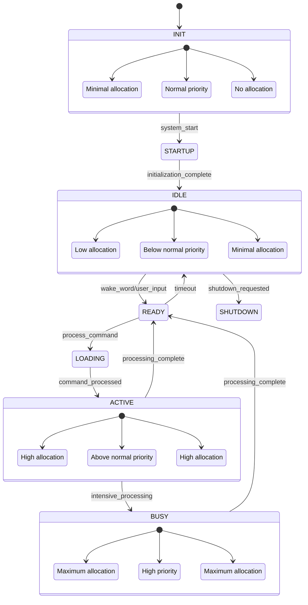

This state diagram illustrates how resource allocation changes throughout the application lifecycle, with each state having its own resource policy.

#### Resource Optimization for Specific Hardware

The resource management system includes specialized optimizations for the AMD Ryzen 9 5900X and NVIDIA RTX 3080 hardware platform:

1. **Ryzen 9 5900X Optimization**:
```python
def optimize_for_ryzen_9_5900x(self) -> Dict[str, Any]:
    optimizations = {'applied': False, 'settings': {}}
    
    try:
        cpu_info = self.hardware_info.get('cpu', {})
        if not cpu_info.get('is_ryzen_9_5900x', False):
            return optimizations
        
        if platform.system() == 'Windows':
            try:
                import psutil
                process = psutil.Process()
                
                process.nice(psutil.HIGH_PRIORITY_CLASS)
                optimizations['settings']['process_priority'] = 'high'
                
                affinity = list(range(12))
                process.cpu_affinity(affinity)
                optimizations['settings']['cpu_affinity'] = affinity
            except ImportError:
                pass
            except Exception:
                pass
            
            try:
                import subprocess
                subprocess.run(
                    ['powercfg', '/s', '8c5e7fda-e8bf-4a96-9a85-a6e23a8c635c'],
                    check=False,
                    stdout=subprocess.DEVNULL,
                    stderr=subprocess.DEVNULL
                )
                optimizations['settings']['power_plan'] = 'high_performance'
            except Exception:
                pass
        else:
            try:
                os.nice(-10)
                optimizations['settings']['nice_level'] = -10
                
                try:
                    if os.geteuid() == 0:
                        os.system(
                            'echo performance | tee /sys/devices/system/cpu/cpu*/cpufreq/scaling_governor > /dev/null'
                        )
                        optimizations['settings']['cpu_governor'] = 'performance'
                except:
                    pass
            except Exception:
                pass
        
        optimizations['settings']['num_threads'] = 10
        optimizations['settings']['thread_priority'] = 'high'
        optimizations['settings']['memory_first_policy'] = True
        optimizations['settings']['smt_enabled'] = True
        optimizations['settings']['numa_aware'] = True
        optimizations['applied'] = True
        
        return optimizations
    except Exception:
        return optimizations
```

This method implements Ryzen 9 5900X-specific optimizations:
- Process priority adjustment for Windows and Linux
- CPU affinity configuration for optimal core utilization
- Power plan configuration for maximum performance
- Thread count optimization based on core configuration
- SMT (Simultaneous Multi-Threading) enablement
- NUMA (Non-Uniform Memory Access) awareness for optimal memory access

2. **RTX 3080 Optimization**:
```python
def optimize_for_rtx_3080(self) -> Dict[str, Any]:
    optimizations = {'applied': False, 'settings': {}}
    
    try:
        import torch
        if torch.cuda.is_available() and '3080' in torch.cuda.get_device_name(0):
            optimizations['settings']['amp_enabled'] = True
            
            if hasattr(torch.cuda, 'memory_stats'):
                optimizations['settings']['memory_stats_enabled'] = True
            
            torch.backends.cudnn.benchmark = True
            optimizations['settings']['cudnn_benchmark'] = True
            
            torch.backends.cuda.matmul.allow_tf32 = True
            torch.backends.cudnn.allow_tf32 = True
            optimizations['settings']['tf32_enabled'] = True
            
            os.environ['PYTORCH_CUDA_ALLOC_CONF'] = 'max_split_size_mb:512'
            optimizations['settings']['max_split_size_mb'] = 512
            
            optimizations['settings']['cuda_graphs_enabled'] = True
            optimizations['settings']['optimization_level'] = 'maximum'
            optimizations['settings']['memory_efficient_optimizer'] = True
            optimizations['settings']['channels_last_memory_format'] = True
            
            try:
                import xformers
                optimizations['settings']['xformers_available'] = True
                optimizations['settings']['flash_attention_enabled'] = True
            except ImportError:
                optimizations['settings']['xformers_available'] = False
            
            optimizations['applied'] = True
        
        return optimizations
    except ImportError:
        return optimizations
    except Exception:
        return optimizations
```

This method implements RTX 3080-specific optimizations:
- Automatic Mixed Precision (AMP) enablement for efficient computation
- CUDA memory statistics for monitoring
- cuDNN benchmark enablement for optimal kernel selection
- Tensor Float 32 (TF32) enablement for improved performance
- Memory allocation configuration for reduced fragmentation
- CUDA graphs enablement for operation caching
- Memory format optimization for tensor operations
- Flash attention enablement for improved transformer model performance

#### Advanced Usage Patterns

The resource management system enables several advanced usage patterns:

1. **State-Specific Optimization**:
```python
def _prepare_for_active_state(self) -> None:
    if self.model is None:
        self._optimize_for_rtx_3080()
        self._load_model()

def _prepare_for_busy_state(self) -> None:
    if self.resource_manager:
        self.resource_manager.clear_gpu_memory()
    
    if self.config.get('gpu', {}).get('rtx_3080_optimized', False):
        try:
            import torch
            if torch.cuda.is_available():
                torch.backends.cudnn.benchmark = True
                
                if hasattr(torch.backends.cuda, 'matmul'):
                    torch.backends.cuda.matmul.allow_tf32 = True
                
                if hasattr(torch.backends, 'cudnn'):
                    torch.backends.cudnn.allow_tf32 = True
        except ImportError:
            pass

def _optimize_for_busy_state(self) -> None:
    try:
        if os.name == 'nt':
            import psutil
            psutil.Process().nice(psutil.HIGH_PRIORITY_CLASS)
            self.logger.debug('Set process priority to HIGH for BUSY state')
    except Exception as e:
        self.logger.debug(f"Could not set process priority: {e}")
```

This pattern demonstrates state-specific optimization where different resource configurations are applied based on the current application state, enabling optimal resource utilization for each state's requirements.

2. **Hardware-Specific Configuration**:
```python
def _adjust_gpu_layers_for_hardware(self) -> None:
    if self.config.get('gpu', {}).get('rtx_3080_optimized', False):
        self.gpu_layers = self.config.get('llm', {}).get('gpu_layers', 32)
        self.logger.info(f"Using {self.gpu_layers} GPU layers from configuration")

def _optimize_for_rtx_3080(self) -> None:
    if self.config.get('gpu', {}).get('rtx_3080_optimized', False):
        self.logger.info('Applying RTX 3080 optimizations from configuration')
```

This pattern demonstrates hardware-specific configuration where different settings are applied based on the detected hardware platform, enabling optimal performance on the target hardware.

3. **Resource Monitoring and Adaptation**:
```python
def _handle_low_memory(self, event_data: Dict[str, Any]) -> None:
    memory_percent = event_data.get('percent', 0)
    available_gb = event_data.get('available_gb', 0)
    self.logger.warning(f"Low memory warning: {memory_percent:.1f}% used, "
                       f"{available_gb:.1f} GB available")
    
    current_state = self.state_manager.get_current_state() if self.state_manager else None
    
    if current_state in [State.IDLE, State.READY, State.CLEANUP]:
        self.unload_model()
    elif current_state in [State.LOADING, State.ACTIVE, State.BUSY]:
        self.logger.warning('Low memory during active processing, '
                          'consider completing operations')
        
        if self.gpu_layer_auto_adjust:
            self.reduce_gpu_layers()

def _handle_gpu_memory_warning(self, event_data: Dict[str, Any]) -> None:
    gpu_percent = event_data.get('percent', 0)
    allocated_gb = event_data.get('allocated_gb', 0)
    self.logger.warning(f"GPU memory warning: {gpu_percent:.1f}% used, "
                       f"{allocated_gb:.1f} GB allocated")
    
    current_state = self.state_manager.get_current_state() if self.state_manager else None
    
    if current_state in [State.IDLE, State.READY, State.CLEANUP]:
        self.unload_model()
    elif current_state in [State.LOADING, State.ACTIVE, State.BUSY]:
        if self.gpu_layer_auto_adjust:
            self.reduce_gpu_layers()
```

This pattern demonstrates resource monitoring and adaptation where resource usage is monitored and the system adapts its behavior based on resource availability, enabling graceful degradation under resource constraints.

4. **Resource Requirement Specification**:
```python
def get_resource_requirements_for_state(self, state) -> Dict[str, Any]:
    from maggie.core.state import State
    
    base_requirements = {
        'memory_mb': 512,
        'cpu_cores': 1,
        'gpu_memory_mb': 0,
        'disk_mb': 100,
        'priority': 'normal'
    }
    
    state_requirements = {
        State.INIT: {'memory_mb': 1024, 'cpu_cores': 2, 'gpu_memory_mb': 0, 
                    'priority': 'normal'},
        State.STARTUP: {'memory_mb': 2048, 'cpu_cores': 4, 'gpu_memory_mb': 1024, 
                       'priority': 'high'},
        State.IDLE: {'memory_mb': 1024, 'cpu_cores': 1, 'gpu_memory_mb': 256, 
                    'priority': 'low'},
        State.LOADING: {'memory_mb': 4096, 'cpu_cores': 6, 'gpu_memory_mb': 4096, 
                       'priority': 'high'},
        State.READY: {'memory_mb': 2048, 'cpu_cores': 2, 'gpu_memory_mb': 2048, 
                     'priority': 'normal'},
        State.ACTIVE: {'memory_mb': 4096, 'cpu_cores': 4, 'gpu_memory_mb': 6144, 
                      'priority': 'high'},
        State.BUSY: {'memory_mb': 8192, 'cpu_cores': 8, 'gpu_memory_mb': 8192, 
                    'priority': 'high'},
        State.CLEANUP: {'memory_mb': 2048, 'cpu_cores': 4, 'gpu_memory_mb': 1024, 
                       'priority': 'normal'},
        State.SHUTDOWN: {'memory_mb': 1024, 'cpu_cores': 2, 'gpu_memory_mb': 0, 
                        'priority': 'normal'}
    }
    
    requirements = state_requirements.get(state, base_requirements).copy()
    system_info = self.detect_system()
    
    if system_info['cpu'].get('is_ryzen_9_5900x', False):
        if state in [State.LOADING, State.ACTIVE, State.BUSY]:
            requirements['cpu_cores'] = min(requirements['cpu_cores'] + 2, 10)
        requirements['cpu_affinity'] = list(range(requirements['cpu_cores']))
    
    if system_info['gpu'].get('is_rtx_3080', False):
        if state in [State.ACTIVE, State.BUSY]:
            requirements['gpu_memory_mb'] = min(requirements['gpu_memory_mb'] * 1.2, 8192)
        requirements['gpu_precision'] = 'float16'
        requirements['use_tensor_cores'] = True
    
    if system_info['memory'].get('is_32gb', False) and system_info['memory'].get('is_xpg_d10', False):
        requirements['memory_mb'] = min(requirements['memory_mb'] * 1.5, 16384)
        requirements['use_large_pages'] = True
    
    return requirements
```

This pattern demonstrates resource requirement specification where each state's resource requirements are explicitly defined and then adjusted based on the available hardware, enabling optimal resource allocation for each state.

The resource management system provides a comprehensive foundation for efficient hardware utilization, with state-based resource allocation, hardware-specific optimization, and dynamic adaptation to resource constraints. This system ensures optimal performance on the target hardware platform while maintaining flexibility for other configurations.

## GUI Implementation

### Application Concepts

The GUI implementation in `maggie/utils/gui.py` provides a user interface for the Maggie AI Assistant using Qt-based components via PySide6. The GUI is designed to reflect the application's state, display system events, and allow user interaction. Key features include:

1. **State-Aware Visual Elements**: UI components that update based on the current application state
2. **Event Logging Display**: Real-time display of system events, errors, and chat interactions
3. **Voice Input Field**: Combined voice/text input with visual feedback
4. **Extension Activation**: User interface for launching extensions
5. **State Visualization**: Clear visual indicators of the current system state
6. **Interactive Controls**: Buttons and shortcuts for common actions

The GUI implementation follows the [Model-View-Controller (MVC)](https://en.wikipedia.org/wiki/Model%E2%80%93view%E2%80%93controller) architectural pattern, with the view components defined in the GUI module, the model represented by the application state, and the controller functionality provided by event handlers.

### Implementation Analysis

The `gui.py` file defines several classes that work together to create the user interface:

1. **InputField Class**: Combined text/voice input field with state awareness
```python
class InputField(QLineEdit):
    state_change_requested = Signal(State)
    
    def __init__(self, parent=None, submit_callback=None):
        super().__init__(parent)
        self.logger = ComponentLogger('InputField')
        self.stt_mode = True
        self.submit_callback = submit_callback
        self.setPlaceholderText('Speak or type your message here...')
        self.intermediate_text = ''
        self.returnPressed.connect(self.on_return_pressed)
        self.animation = QPropertyAnimation(self, b'styleSheet')
        self.animation.setDuration(300)
    
    def focusInEvent(self, event: QFocusEvent) -> None:
        super().focusInEvent(event)
        self.stt_mode = False
        self.setStyleSheet('background-color: white; color: black;')
        self.state_change_requested.emit(State.ACTIVE)
        self._pause_transcription()
    
    def focusOutEvent(self, event: QFocusEvent) -> None:
        super().focusOutEvent(event)
        self.stt_mode = True
        self.update_appearance_for_state(State.IDLE)
        
        if not self.text().strip():
            self._resume_transcription()
    
    def on_return_pressed(self) -> None:
        if self.submit_callback and self.text().strip():
            self.submit_callback(self.text())
            self.clear()
            self.intermediate_text = ''
```

This class implements a specialized text input field that can operate in both manual text entry mode and speech-to-text (STT) mode, with visual transitions between modes and automatic state management.

2. **MainWindow Class**: Primary application window with state awareness
```python
class MainWindow(QMainWindow, StateAwareComponent, EventListener):
    def __init__(self, maggie_ai):
        super(QMainWindow, self).__init__()
        self.maggie_ai = maggie_ai
        self.state_manager = maggie_ai.state_manager
        StateAwareComponent.__init__(self, self.state_manager)
        EventListener.__init__(self, maggie_ai.event_bus)
        self.logger = ComponentLogger('MainWindow')
        
        self.setWindowTitle('Maggie AI Assistant')
        self.setMinimumSize(900, 700)
        self.is_shutting_down = False
        
        self.central_widget = QWidget()
        self.setCentralWidget(self.central_widget)
        self.main_layout = QVBoxLayout(self.central_widget)
        
        self.status_bar = QStatusBar()
        self.setStatusBar(self.status_bar)
        self.status_label = QLabel('Status: IDLE')
        self.status_label.setStyleSheet('font-weight: bold;')
        self.status_bar.addPermanentWidget(self.status_label)
        
        self._create_main_layout()
        self._register_event_handlers()
        self.setup_shortcuts()
        self.update_ui_for_state(State.IDLE)
        self.log_event('Maggie AI Assistant UI initialized...')
```

The `MainWindow` class extends Qt's `QMainWindow` and also implements the application's `StateAwareComponent` and `EventListener` interfaces, allowing it to respond to application state changes and system events.

3. **Layout Creation Methods**: Organized UI component creation
```python
def _create_main_layout(self) -> None:
    self.content_splitter = QSplitter(Qt.Orientation.Horizontal)
    self.main_layout.addWidget(self.content_splitter)
    
    self.left_panel = QWidget()
    self.left_layout = QVBoxLayout(self.left_panel)
    self.content_splitter.addWidget(self.left_panel)
    
    self.right_panel = QWidget()
    self.right_layout = QVBoxLayout(self.right_panel)
    self.content_splitter.addWidget(self.right_panel)
    
    self.content_splitter.setSizes([700, 200])
    
    self._create_log_sections()
    self._create_right_panel()
    self._create_control_panel()

def _create_log_sections(self) -> None:
    self.logs_splitter = QSplitter(Qt.Orientation.Vertical)
    self.left_layout.addWidget(self.logs_splitter)
    
    self._create_chat_section()
    
    self.event_group = QGroupBox('Event Log')
    self.event_group_layout = QVBoxLayout(self.event_group)
    self.event_log = QTextEdit()
    self.event_log.setReadOnly(True)
    self.event_group_layout.addWidget(self.event_log)
    
    self.error_group = QGroupBox('Error Log')
    self.error_group_layout = QVBoxLayout(self.error_group)
    self.error_log = QTextEdit()
    self.error_log.setReadOnly(True)
    self.error_group_layout.addWidget(self.error_log)
    
    self.logs_splitter.addWidget(self.chat_section)
    self.logs_splitter.addWidget(self.event_group)
    self.logs_splitter.addWidget(self.error_group)
    self.logs_splitter.setSizes([400, 150, 150])
```

These methods demonstrate a modular approach to UI construction, with distinct methods for different sections of the interface, promoting maintainability and readability.

4. **State-Based UI Updating**:
```python
def update_ui_for_state(self, state: State) -> None:
    style = state.get_style()
    bg_color = style.get('background', 'white')
    font_color = style.get('color', 'black')
    
    self.state_display.setText(state.display_name)
    self.status_label.setText(f"Status: {state.display_name}")
    self.state_display.setStyleSheet(
        f"font-size: 18px; font-weight: bold; "
        f"background-color: {bg_color}; color: {font_color}; "
        f"padding: 5px; border-radius: 4px;"
    )
    
    self.input_field.update_appearance_for_state(state)
    self.logger.debug(f"UI updated for state: {state.name}")
```

This method updates the UI based on the current application state, changing colors, text, and other visual properties to reflect the state's characteristics.

5. **Event Handling**:
```python
def _register_event_handlers(self) -> None:
    events = [
        ('state_changed', self._on_state_changed, EventPriority.NORMAL),
        ('extension_completed', self._on_extension_completed, EventPriority.NORMAL),
        ('extension_error', self._on_extension_error, EventPriority.NORMAL),
        ('error_logged', self._on_error_logged, EventPriority.NORMAL),
        ('intermediate_transcription', self._on_intermediate_transcription, 
         EventPriority.NORMAL),
        ('final_transcription', self._on_final_transcription, EventPriority.NORMAL),
        ('download_progress', self.show_download_progress, EventPriority.LOW)
    ]
    
    for (event_type, handler, priority) in events:
        self.listen(event_type, handler, priority=priority)
    
    self.logger.debug(f"Registered {len(events)} event handlers")
```

This method registers handlers for various system events, allowing the UI to respond to state changes, errors, transcription updates, and other events from the application core.

### GUI Layout and Component Structure

The user interface layout can be visualized as follows:

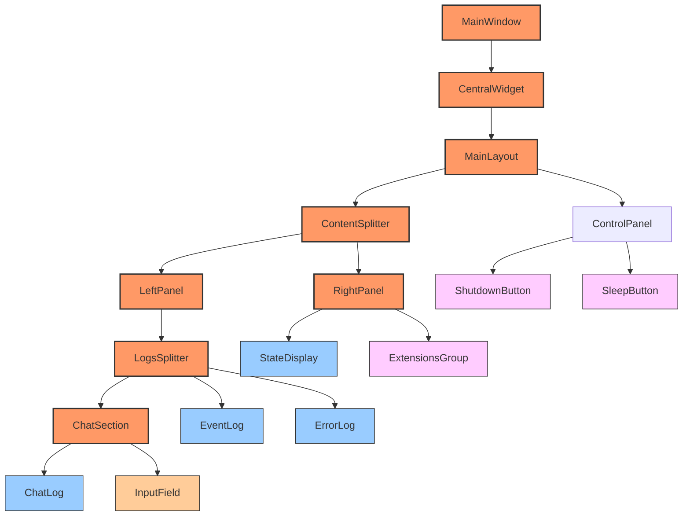

This diagram shows the hierarchical structure of the GUI components, with containers, displays, inputs, and controls all organized into a cohesive interface.

The layout consists of several main sections:
1. **Left Panel**: Contains the chat section and log displays
   - Chat section with message display and input field
   - Event log for system events
   - Error log for system errors
2. **Right Panel**: Contains state information and extension controls
   - Current state display with visual styling
   - Extension buttons for activating different extensions
3. **Control Panel**: Contains global control buttons
   - Shutdown button for terminating the application
   - Sleep button for putting the application into idle mode

This layout provides a clear separation between different functional areas while maintaining a cohesive user experience.

### Advanced UI Features

The GUI implementation includes several advanced features:

1. **Animated State Transitions**:
```python
def _animate_transition(self, transition: StateTransition) -> None:
    try:
        anim_props = transition.get_animation_properties()
        animation = QPropertyAnimation(self.state_display, b'geometry')
        animation.setDuration(anim_props['duration'])
        animation.setEasingCurve(QEasingCurve.Type.OutCubic)
        current_geometry = self.state_display.geometry()
        
        if anim_props['type'] == 'fade':
            self.state_display.setStyleSheet(
                f"{self.state_display.styleSheet()}; color: rgba(0, 0, 0, 100%);"
            )
            animation = QPropertyAnimation(self.state_display, b'styleSheet')
            animation.setDuration(anim_props['duration'])
            animation.setStartValue(
                f"{self.state_display.styleSheet()}; color: rgba(0, 0, 0, 100%);"
            )
            animation.setEndValue(
                f"{self.state_display.styleSheet()}; color: rgba(0, 0, 0, 0%);"
            )
        elif anim_props['type'] == 'bounce':
            animation.setStartValue(current_geometry)
            bounce_geometry = QRect(
                current_geometry.x(), 
                current_geometry.y() - 10,
                current_geometry.width(), 
                current_geometry.height()
            )
            animation.setEndValue(bounce_geometry)
            animation.setEasingCurve(QEasingCurve.Type.OutBounce)
        else:
            animation.setStartValue(QRect(
                current_geometry.x() + 50,
                current_geometry.y(),
                current_geometry.width(),
                current_geometry.height()
            ))
            animation.setEndValue(current_geometry)
            
        animation.start()
    except Exception as e:
        self.logger.warning(f"Error animating transition: {e}")
```

This method creates animated transitions between states, with different animation types based on the transition characteristics, enhancing the user experience with visual feedback.

2. **Dynamic Extension Buttons**:
```python
def _create_extension_buttons(self) -> None:
    try:
        self._cleanup_extension_buttons()
        self.extension_buttons = {}
        
        for extension_name in self.maggie_ai.extensions:
            display_name = extension_name.replace('_', ' ').title()
            extension_button = QPushButton(display_name)
            extension_button.clicked.connect(
                lambda checked=False, name=extension_name: 
                self.on_extension_clicked(name)
            )
            self.extensions_layout.addWidget(extension_button)
            self.extension_buttons[extension_name] = extension_button
            
            if extension_name == 'recipe_creator':
                try:
                    recipe_shortcut = QShortcut(QKeySequence('Alt+R'), self)
                    recipe_shortcut.activated.connect(
                        lambda: self.on_extension_clicked('recipe_creator')
                    )
                except Exception as e:
                    self.logger.error(f"Error setting up recipe shortcut: {e}")
    except Exception as e:
        self.logger.error(f"Error creating extension buttons: {e}")
```

This method dynamically creates buttons for available extensions, with special handling for certain extensions like adding keyboard shortcuts, demonstrating adaptability to the application's configuration.

3. **Real-Time Transcription Display**:
```python
def update_intermediate_text(self, text: str) -> None:
    if self.stt_mode and not self.hasFocus():
        self.intermediate_text = text
        self.setText(text)
        self.animation.setStartValue('background-color: white; color: gray;')
        self.animation.setEndValue(
            'background-color: white; color: gray; border: 1px solid #CCCCCC;'
        )
        self.animation.start()

def set_final_text(self, text: str) -> None:
    if self.stt_mode and not self.hasFocus():
        self.setText(text)
        self.animation.setStartValue('background-color: white; color: gray;')
        self.animation.setEndValue(
            'background-color: white; color: black; border: 1px solid #000000;'
        )
        self.animation.start()
        
        stt_processor = ServiceLocator.get('stt_processor')
        if (stt_processor and 
            hasattr(stt_processor, 'config') and
            stt_processor.config.get('whisper_streaming', {}).get('auto_submit', False) and
            self.submit_callback and text.strip()):
            self.submit_callback(text)
            self.clear()
            self.intermediate_text = ''
```

These methods provide real-time visual feedback during speech recognition, showing intermediate transcription results with visual styling to indicate their provisional nature, and then finalizing the text when recognition is complete.

4. **Keyboard Shortcuts**:
```python
def setup_shortcuts(self) -> None:
    try:
        shortcut_config = {
            'sleep': 'Alt+S',
            'shutdown': 'Alt+Q',
            'focus_input': 'Alt+I'
        }
        
        sleep_shortcut = QShortcut(QKeySequence(shortcut_config['sleep']), self)
        sleep_shortcut.activated.connect(self.on_sleep_clicked)
        
        shutdown_shortcut = QShortcut(QKeySequence(shortcut_config['shutdown']), self)
        shutdown_shortcut.activated.connect(self.on_shutdown_clicked)
        
        input_shortcut = QShortcut(QKeySequence(shortcut_config['focus_input']), self)
        input_shortcut.activated.connect(lambda: self.input_field.setFocus())
        
        self.logger.debug('Keyboard shortcuts configured')
    except Exception as e:
        self.logger.error(f"Error setting up shortcuts: {e}")
```

This method sets up keyboard shortcuts for common actions, enhancing usability by providing quick access to key functions.

5. **Error Highlighting**:
```python
def _apply_state_specific_error_styling(self, error_data: Dict[str, Any]) -> None:
    if 'state' in error_data and isinstance(error_data['state'], dict):
        state_info = error_data['state']
        if 'style' in state_info:
            style = state_info['style']
            border_color = style.get('background', '#FF0000')
            current_style = self.error_group.styleSheet()
            highlight_style = f"QGroupBox {{ border: 2px solid {border_color}; }}"
            self.error_group.setStyleSheet(highlight_style)
            QTimer.singleShot(2000, 
                lambda: self.error_group.setStyleSheet(current_style))
```

This method applies visual styling to error logs based on the application state, with temporary highlighting to draw attention to new errors.

### GUI and Application Integration

The GUI integrates with the application through several mechanisms:

1. **Event-Based Communication**:
```python
def _on_state_changed(self, transition) -> None:
    try:
        if (not transition or 
            not hasattr(transition, 'to_state') or 
            not hasattr(transition, 'from_state')):
            self.logger.error('Invalid state transition object received')
            return
            
        to_state = getattr(transition, 'to_state', None)
        from_state = getattr(transition, 'from_state', None)
        
        if to_state is None or from_state is None:
            self.logger.error('Invalid state transition object: states missing')
            return
            
        to_state_name = to_state.name
        from_state_name = from_state.name
        trigger = getattr(transition, 'trigger', 'UNKNOWN')
        
        self.log_event(
            f"State changed: {from_state_name} -> {to_state_name} "
            f"(trigger: {trigger})"
        )
        self.update_ui_for_state(to_state)
        self.input_field.update_appearance_for_state(to_state)
        self._animate_transition(transition)
    except Exception as e:
        self.logger.error(f"Error handling state transition: {e}")
```

This handler responds to state change events from the application core, updating the UI to reflect the new state and animating the transition.

2. **User Input Handling**:
```python
def _on_input_submitted(self, text: str) -> None:
    if not text.strip():
        return
        
    self.log_chat(text, is_user=True)
    current_state = self.state_manager.get_current_state()
    
    if current_state == State.IDLE:
        self.state_manager.transition_to(State.READY, 'user_input')
        
    self.maggie_ai.event_bus.publish('command_detected', text)
    self.logger.debug(f"User input submitted: {text}")
```

This method handles user input from the text/voice input field, logging the input, transitioning the application state if needed, and publishing the input as a command event.

3. **Extension Activation**:
```python
def on_extension_clicked(self, extension_name: str) -> None:
    self.log_event(f"Extension requested: {extension_name}")
    
    if extension_name in self.maggie_ai.extensions:
        extension = self.maggie_ai.extensions[extension_name]
        self.maggie_ai.process_command(extension=extension)
        self.logger.info(f"Extension '{extension_name}' activated from GUI")
```

This method activates application extensions in response to button clicks, demonstrating integration between the GUI and the extension system.

4. **Threaded Event Handling**:
```python
@Slot(str)
def update_intermediate_text(self, text: str) -> None:
    self.input_field.update_intermediate_text(text)

@Slot(str)
def update_final_text(self, text: str) -> None:
    self.input_field.set_final_text(text)

def _on_intermediate_transcription(self, text: str) -> None:
    if QThread.currentThread() == self.thread():
        self.update_intermediate_text(text)
    else:
        QMetaObject.invokeMethod(self, 'update_intermediate_text', 
                                Qt.ConnectionType.QueuedConnection, 
                                Q_ARG(str, text))

def _on_final_transcription(self, text: str) -> None:
    if QThread.currentThread() == self.thread():
        self.update_final_text(text)
    else:
        QMetaObject.invokeMethod(self, 'update_final_text', 
                                Qt.ConnectionType.QueuedConnection, 
                                Q_ARG(str, text))
```

These methods handle threaded event processing, ensuring that UI updates happen on the main thread regardless of which thread generated the event.

5. **Lifecycle Management**:
```python
def closeEvent(self, event) -> None:
    self.log_event('Window close requested, shutting down')
    self.is_shutting_down = True
    self.maggie_ai.shutdown()
    QTimer.singleShot(2000, lambda: event.accept())
    self.logger.info('GUI window closed, shutdown initiated')
```

This method handles application shutdown when the window is closed, ensuring proper cleanup and termination.

The GUI implementation provides a comprehensive user interface that reflects the application's state, displays system events, and allows user interaction through both text and voice input. It demonstrates advanced techniques for state visualization, component organization, and event handling.

For more information on PySide6 and Qt development in Python, refer to:
- [PySide6 Documentation](https://doc.qt.io/qtforpython-6/)
- [Qt Widgets Overview](https://doc.qt.io/qt-6/widget-classes.html)
- [Qt Animation Framework](https://doc.qt.io/qt-6/animation-overview.html)
- [Qt Style Sheets Reference](https://doc.qt.io/qt-6/stylesheet-reference.html)

## Hardware Optimization Strategies

### Target Hardware Specifications

The Maggie AI Assistant is specifically optimized for high-performance hardware, particularly:

1. **CPU**: AMD Ryzen 9 5900X
   - 12 cores / 24 threads
   - 3.7 GHz base clock, 4.8 GHz boost
   - 64 MB L3 cache
   - PCIe 4.0 support

2. **GPU**: NVIDIA RTX 3080
   - 8704 CUDA cores
   - 272 Tensor cores
   - 10GB GDDR6X memory
   - 320-bit memory interface

3. **Memory**: ADATA XPG D10 32GB DDR4-3200
   - 32GB capacity
   - 3200MHz frequency
   - Dual channel configuration

These hardware specifications enable powerful AI processing capabilities, with the application leveraging the specific strengths of each component through targeted optimization strategies.

### CPU Optimization Strategies

The application implements several optimization strategies for the Ryzen 9 5900X CPU:

1. **Thread Affinity**: Assigns threads to specific CPU cores based on workload
   ```python
   def optimize_for_ryzen_9_5900x(self) -> Dict[str, Any]:
       # ... code omitted for brevity
       process.cpu_affinity(list(range(12)))
       # ... code omitted for brevity
       return optimizations
   ```

2. **Core Allocation**: Separates performance-critical tasks from background operations
   ```python
   'performance_cores': [0, 1, 2, 3, 4, 5, 6, 7],
   'background_cores': [8, 9, 10, 11],
   ```

3. **Priority Management**: Sets appropriate process and thread priorities
   ```python
   process.nice(psutil.HIGH_PRIORITY_CLASS)
   ```

4. **Power Plan Configuration**: Sets optimal power management for performance
   ```python
   subprocess.run(
       ['powercfg', '/s', '8c5e7fda-e8bf-4a96-9a85-a6e23a8c635c'],
       check=False,
       stdout=subprocess.DEVNULL,
       stderr=subprocess.DEVNULL
   )
   ```

5. **Thread Count Optimization**: Limits thread count to avoid oversubscription
   ```python
   optimizations['settings']['num_threads'] = 10
   ```

6. **SMT Management**: Ensures proper use of Simultaneous Multi-Threading (SMT)
   ```python
   optimizations['settings']['smt_enabled'] = True
   ```

7. **NUMA Awareness**: Optimizes for Non-Uniform Memory Access architecture
   ```python
   optimizations['settings']['numa_aware'] = True
   ```

These CPU optimizations ensure efficient utilization of the Ryzen 9 5900X's 12 cores and 24 threads, with dedicated cores for performance-critical tasks and appropriate priority settings for different workloads.

### GPU Optimization Strategies

The application implements several optimization strategies for the RTX 3080 GPU:

1. **Tensor Core Utilization**: Enables TF32 precision for tensor operations
   ```python
   torch.backends.cuda.matmul.allow_tf32 = True
   torch.backends.cudnn.allow_tf32 = True
   ```

2. **Memory Management**: Configures memory allocation for efficiency
   ```python
   os.environ['PYTORCH_CUDA_ALLOC_CONF'] = 'max_split_size_mb:512'
   ```

3. **CUDA Optimization**: Enables performance features specific to CUDA
   ```python
   torch.backends.cudnn.benchmark = True
   ```

4. **Mixed Precision**: Uses appropriate precision for different operations
   ```python
   optimizations['settings']['amp_enabled'] = True
   ```

5. **CUDA Graphs**: Optimizes repetitive operations
   ```python
   optimizations['settings']['cuda_graphs_enabled'] = True
   ```

6. **Memory-Efficient Operations**: Configures operations for memory efficiency
   ```python
   optimizations['settings']['memory_efficient_optimizer'] = True
   ```

7. **Channel Optimization**: Uses memory-efficient layout
   ```python
   optimizations['settings']['channels_last_memory_format'] = True
   ```

8. **Attention Mechanisms**: Implements optimized attention for transformers
   ```python
   try:
       import xformers
       optimizations['settings']['xformers_available'] = True
       optimizations['settings']['flash_attention_enabled'] = True
   except ImportError:
       optimizations['settings']['xformers_available'] = False
   ```

These GPU optimizations leverage the RTX 3080's tensor cores and CUDA capabilities for efficient AI processing, with appropriate memory management and precision settings for different operations.

### Memory Optimization Strategies

The application implements several optimization strategies for memory usage:

1. **Large Pages**: Utilizes large memory pages for reduced TLB misses
   ```python
   self.config['memory']['large_pages_enabled'] = True
   ```

2. **NUMA Awareness**: Optimizes memory access for multi-socket systems
   ```python
   self.config['memory']['numa_aware'] = True
   ```

3. **Caching Strategy**: Implements appropriate caching for performance
   ```python
   self.config['memory']['cache_size_mb'] = 6144
   ```

4. **Memory Cleanup**: Implements efficient memory reclamation
   ```python
   def reduce_memory_usage(self) -> bool:
       # ... code omitted for brevity
       import gc
       gc.collect()
       # ... code omitted for brevity
       return success
   ```

5. **Memory Monitoring**: Monitors memory usage for potential issues
   ```python
   def _handle_low_memory(self, event_data: Dict[str, Any]) -> None:
       memory_percent = event_data.get('percent', 0)
       available_gb = event_data.get('available_gb', 0)
       self.logger.warning(f"Low memory warning: {memory_percent:.1f}% used, "
                         f"{available_gb:.1f} GB available")
       
       if memory_percent > 80:
           self.clear_cache()
   ```

6. **Memory Limits**: Sets appropriate memory limits for different operations
   ```python
   self.memory_max_percent = self.memory_config.get('max_percent', 75)
   self.memory_unload_threshold = self.memory_config.get('model_unload_threshold', 85)
   ```

7. **Memory Pool Management**: Implements efficient memory pooling
   ```python
   if memory_info.get('is_32gb', False) and memory_info.get('is_xpg_d10', False):
       return {
           'max_percent': 80,
           'unload_threshold': 85,
           'cache_size_mb': 6144,
           'preloading': True,
           'large_pages': True,
           'numa_aware': True,
           'memory_pool': True,
           # Additional settings...
       }
   ```

These memory optimizations ensure efficient use of the 32GB XPG D10 DDR4-3200 memory, with appropriate caching, monitoring, and cleanup strategies for different operations.

### State-Specific Optimization

A key aspect of the application's performance strategy is the application of different optimization profiles based on the current application state:

```python
self._state_resource_policies = {
    State.INIT: {
        'memory_allocation': 'minimal',
        'gpu_memory_allocation': 'none',
        'cpu_priority': 'normal',
        'preload_models': False,
        'clear_cache': True
    },
    # ... additional states omitted for brevity
    State.BUSY: {
        'memory_allocation': 'maximum',
        'gpu_memory_allocation': 'maximum',
        'cpu_priority': 'high',
        'preload_models': True,
        'clear_cache': False
    },
    # ... additional states omitted for brevity
}
```

These state-specific policies are implemented by the `ResourceManager` class:

```python
def _apply_state_resource_policy(self, state: State) -> None:
    policy = self._state_resource_policies.get(state, {})
    self._apply_cpu_priority(policy.get('cpu_priority', 'normal'))
    
    memory_allocation = policy.get('memory_allocation', 'normal')
    if memory_allocation in ['minimal', 'low']:
        self.reduce_memory_usage()
        
    gpu_allocation = policy.get('gpu_memory_allocation', 'normal')
    if gpu_allocation in ['none', 'minimal', 'low']:
        self.clear_gpu_memory()
        
    if policy.get('clear_cache', False):
        self.clear_caches()
        
    self._state_resource_allocations[state] = {
        'applied_at': time.time(),
        'policy': policy
    }
```

The state-specific optimization approach ensures that resources are allocated appropriately for the current task, providing maximum performance when needed while conserving resources during idle periods.

The state transitions and corresponding resource allocations can be visualized as follows:

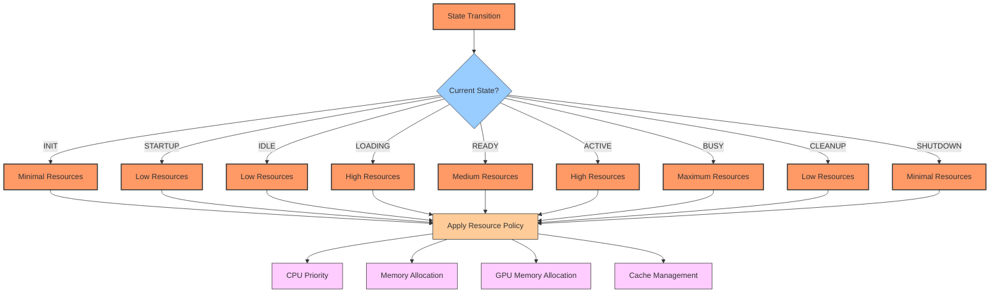

This diagram illustrates how resource allocation is determined based on the current application state, with different resources being allocated depending on the state's requirements.

### Hardware Detection and Adaptation

The application automatically detects the available hardware and adapts its configuration accordingly:

```python
def detect_system(self) -> Dict[str, Any]:
    if self._cached_system_info is not None:
        return self._cached_system_info
        
    system_info = {
        'os': self._detect_os(),
        'cpu': self.detect_cpu(),
        'memory': self.detect_memory(),
        'gpu': self.detect_gpu(),
        'disk': self.detect_disk()
    }
    
    self._cached_system_info = system_info
    return system_info
```

The detection process includes specialized identification of the target hardware:

```python
def detect_cpu(self) -> Dict[str, Any]:
    cpu_info = {
        'physical_cores': psutil.cpu_count(logical=False) or 0,
        'logical_cores': psutil.cpu_count(logical=True) or 0,
        'model': platform.processor() or 'Unknown',
        'is_ryzen_9_5900x': False,
        'frequency_mhz': {'current': 0, 'min': 0, 'max': 0}
    }
    
    model_lower = cpu_info['model'].lower()
    if 'ryzen 9' in model_lower and '5900x' in model_lower:
        cpu_info['is_ryzen_9_5900x'] = True
        
    # Additional detection code...
    
    return cpu_info
```

```python
def detect_gpu(self) -> Dict[str, Any]:
    gpu_info = {
        'available': False,
        'name': None,
        'memory_gb': None,
        'cuda_version': None,
        'is_rtx_3080': False,
        'driver_version': None,
        'architectures': []
    }
    
    try:
        import torch
        if torch.cuda.is_available():
            gpu_info['available'] = True
            gpu_info['name'] = torch.cuda.get_device_name(0)
            gpu_info['memory_gb'] = torch.cuda.get_device_properties(0).total_memory / 1024**3
            gpu_info['cuda_version'] = torch.version.cuda
            
            if '3080' in gpu_info['name']:
                gpu_info['is_rtx_3080'] = True
                gpu_info['compute_capability'] = torch.cuda.get_device_capability(0)
                gpu_info['tensor_cores'] = True
                # Additional RTX 3080 specific information...
    except ImportError:
        pass
    except Exception:
        pass
        
    return gpu_info
```

This detection mechanism allows the application to apply specialized optimizations for the target hardware when available, while still functioning correctly on other hardware configurations.

The hardware detection and adaptation flow can be visualized as follows:

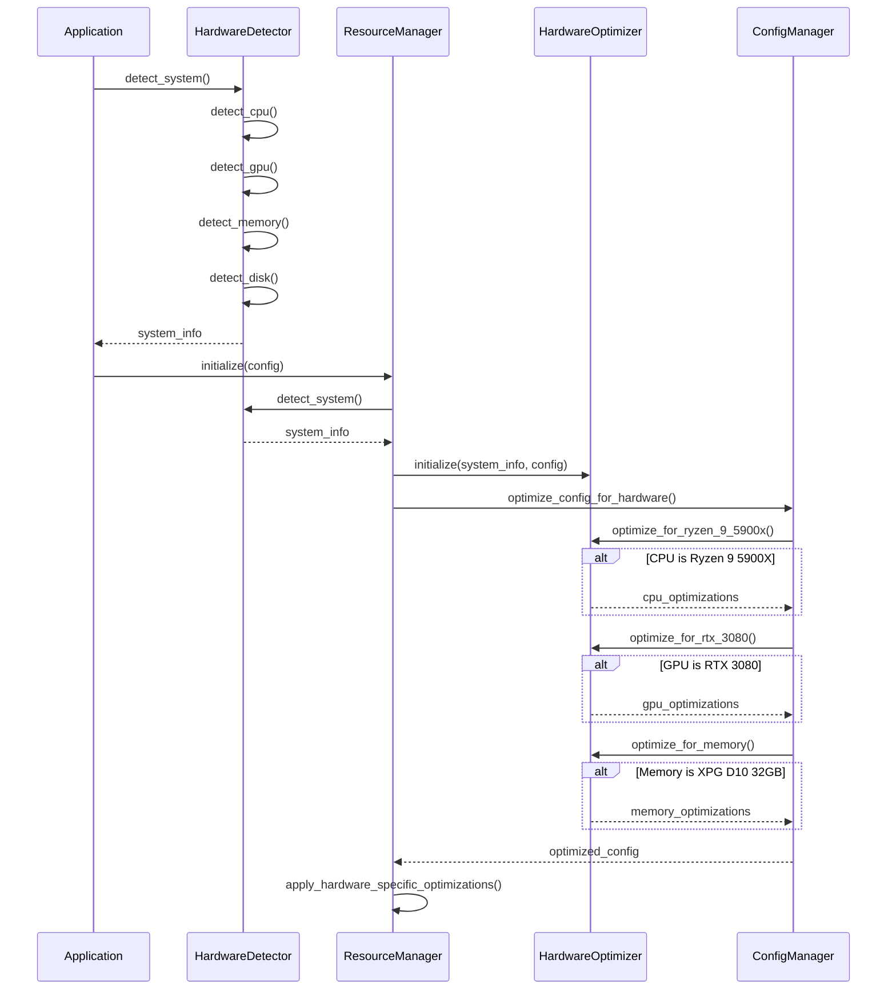

This diagram illustrates the process of detecting hardware capabilities and applying appropriate optimizations based on the detected hardware.

The hardware detection and adaptation system provides a robust mechanism for tailoring the application's behavior to the specific capabilities of the available hardware, ensuring optimal performance across different configurations while providing specialized optimizations for the target hardware.

For more information on hardware optimization in Python applications, refer to:
- [CPU Optimization in Python](https://pythonspeed.com/articles/optimizing-python-docker/)
- [GPU Programming with PyTorch](https://pytorch.org/tutorials/beginner/basics/optimization_tutorial.html)
- [Memory Profiling in Python](https://pythonspeed.com/articles/memory-profiling-large-datasets/)
- [Python Concurrency Guide](https://realpython.com/python-concurrency/)


## Reference Section for Future Development

This section provides detailed reference information for developers and students who want to extend or modify the Maggie AI Assistant. It covers key aspects of the application architecture and provides practical guidance for common development tasks.

### Extending the State Machine

The state machine is a central component of the application architecture, controlling the application's behavior and resource allocation. To extend the state machine:

1. **Adding a New State**:
   ```python
   # In maggie/core/state.py
   class State(Enum):
       INIT = auto()
       STARTUP = auto()
       IDLE = auto()
       LOADING = auto()
       READY = auto()
       ACTIVE = auto()
       BUSY = auto()
       CLEANUP = auto()
       SHUTDOWN = auto()
       # Add your new state
       CUSTOM_STATE = auto()
       
       # Update style properties for the new state
       @property
       def bg_color(self) -> str:
           colors = {
               # Existing states...
               State.CUSTOM_STATE: '#YOUR_COLOR_HERE',
           }
           return colors.get(self, '#FFFFFF')
   ```

2. **Defining Valid Transitions**:
   ```python
   # In StateManager.__init__
   self.valid_transitions = {
       # Existing transitions...
       State.READY: [State.LOADING, State.ACTIVE, State.BUSY, State.CLEANUP, 
                    State.CUSTOM_STATE, State.SHUTDOWN],
       State.CUSTOM_STATE: [State.READY, State.IDLE, State.SHUTDOWN],
   }
   ```

3. **Implementing State Handlers**:
   ```python
   # In your component that extends StateAwareComponent
   def on_enter_custom_state(self, transition: StateTransition) -> None:
       """
       Handler for entering the custom state.
       
       Parameters
       ----------
       transition : StateTransition
           The transition object containing source state, destination state, 
           and metadata
           
       Returns
       -------
       None
       """
       self.logger.info("Entering custom state")
       # Your state-specific logic here
       
   def on_exit_custom_state(self, transition: StateTransition) -> None:
       """
       Handler for exiting the custom state.
       
       Parameters
       ----------
       transition : StateTransition
           The transition object containing source state, destination state, 
           and metadata
           
       Returns
       -------
       None
       """
       self.logger.info("Exiting custom state")
       # Your cleanup logic here
   ```

4. **Defining Resource Policies**:
   ```python
   # In ResourceManager._init_state_resource_policies
   self._state_resource_policies = {
       # Existing policies...
       State.CUSTOM_STATE: {
           'memory_allocation': 'medium',
           'gpu_memory_allocation': 'medium',
           'cpu_priority': 'normal',
           'preload_models': True,
           'clear_cache': False
       },
   }
   ```

5. **Triggering State Transitions**:
   ```python
   # In your code where you need to transition to the new state
   self.state_manager.transition_to(State.CUSTOM_STATE, "custom_trigger")
   ```

6. **Integration with UI Elements**:
   ```python
   # In MainWindow.update_ui_for_state method or similar
   def update_ui_for_state(self, state: State) -> None:
       # Existing states...
       if state == State.CUSTOM_STATE:
           self.status_label.setText("Status: Custom Operation")
           self.state_display.setStyleSheet(
               f"background-color: {state.bg_color}; color: {state.font_color};"
           )
   ```

### Adding Custom Events

The event system allows components to communicate without direct dependencies. To add custom events:

1. **Defining Event Constants**:
   ```python
   # In your module
   CUSTOM_EVENT = 'custom_event'
   CUSTOM_NOTIFICATION = 'custom_notification'
   ```

2. **Publishing Events**:
   ```python
   # In a class that extends EventEmitter
   def trigger_custom_event(self, data: Dict[str, Any]) -> None:
       """
       Trigger a custom event with the provided data.
       
       Parameters
       ----------
       data : Dict[str, Any]
           The data to include with the event
           
       Returns
       -------
       None
       """
       self.emit(CUSTOM_EVENT, {
           'timestamp': time.time(),
           'data': data,
           'source': self.__class__.__name__
       })
   ```

3. **Subscribing to Events**:
   ```python
   # In a class that extends EventListener
   def __init__(self, event_bus: EventBus):
       super().__init__(event_bus)
       self.listen(CUSTOM_EVENT, self._handle_custom_event, 
                  EventPriority.NORMAL)
       
   def _handle_custom_event(self, event_data: Dict[str, Any]) -> None:
       """
       Handle custom events.
       
       Parameters
       ----------
       event_data : Dict[str, Any]
           The data associated with the event
           
       Returns
       -------
       None
       """
       timestamp = event_data.get('timestamp', time.time())
       source = event_data.get('source', 'unknown')
       data = event_data.get('data', {})
       
       self.logger.info(f"Received custom event from {source} at {timestamp}")
       # Your event handling logic here
   ```

4. **Using Event Filtering**:
   ```python
   # In a class that extends EventListener
   def __init__(self, event_bus: EventBus):
       super().__init__(event_bus)
       
       # Add a filter that only accepts events with specific characteristics
       self.add_filter(CUSTOM_EVENT, 
                      lambda data: data.get('source') == 'YourComponent')
       
       # Listen to events that pass the filter
       self.listen(CUSTOM_EVENT, self._handle_filtered_event)
   ```

5. **Using Correlation IDs for Related Events**:
   ```python
   # In a class that extends EventEmitter and EventListener
   def process_request(self, request_id: str, data: Dict[str, Any]) -> None:
       """
       Process a request with correlated events.
       
       Parameters
       ----------
       request_id : str
           Unique identifier for this request, used as correlation ID
       data : Dict[str, Any]
           The data to process
           
       Returns
       -------
       None
       """
       # Set correlation ID for all related events
       self.set_correlation_id(request_id)
       
       try:
           # Emit event indicating start of processing
           self.emit(CUSTOM_EVENT_START, {
               'request_id': request_id,
               'data': data
           })
           
           # Process the request
           result = self._process_data(data)
           
           # Emit event with processing result
           self.emit(CUSTOM_EVENT_COMPLETE, {
               'request_id': request_id,
               'result': result
           })
       finally:
           # Clear correlation ID when done
           self.set_correlation_id(None)
   ```

6. **Event Priority Customization**:
   ```python
   # Define custom priorities
   class MyEventPriorities:
       CRITICAL = EventPriority.HIGH - 5  # Even higher than standard HIGH
       STANDARD = EventPriority.NORMAL
       DELAYED = EventPriority.LOW + 10   # Lower than standard LOW
       
   # Use custom priorities
   self.listen('error_event', self._handle_error, MyEventPriorities.CRITICAL)
   self.listen('routine_event', self._handle_routine, MyEventPriorities.STANDARD)
   self.listen('logging_event', self._handle_logging, MyEventPriorities.DELAYED)
   ```

### Creating New Extensions

The extension system allows the application to be extended with new capabilities without modifying the core code. To create a new extension:

1. **Creating an Extension Class**:
   ```python
   # In maggie/extensions/your_extension.py
   from typing import Dict, Any, Optional
   from maggie.core.event import EventEmitter, EventListener, EventBus
   from maggie.utils.logging import ComponentLogger
   
   class YourExtension(EventEmitter, EventListener):
       """
       Custom extension providing new functionality to Maggie.
       
       This extension demonstrates how to implement new capabilities
       that integrate with the core event system.
       
       Attributes
       ----------
       config : Dict[str, Any]
           Configuration options for this extension
       logger : ComponentLogger
           Logger instance for this extension
       """
       
       def __init__(self, event_bus: EventBus, config: Dict[str, Any]):
           """
           Initialize the extension with event bus and configuration.
           
           Parameters
           ----------
           event_bus : EventBus
               The system event bus for publishing and subscribing to events
           config : Dict[str, Any]
               Configuration options for this extension
           """
           EventEmitter.__init__(self, event_bus)
           EventListener.__init__(self, event_bus)
           self.config = config
           self.logger = ComponentLogger('YourExtension')
           
           # Register event handlers
           self.listen('command_detected', self._handle_command)
           
       def _handle_command(self, command: str) -> None:
           """
           Handle commands that might be relevant to this extension.
           
           Parameters
           ----------
           command : str
               The command text to process
               
           Returns
           -------
           None
           """
           if not isinstance(command, str):
               return
               
           # Check if the command is relevant to this extension
           if 'your_keyword' in command.lower():
               self._process_command(command)
               
       def _process_command(self, command: str) -> None:
           """
           Process a command specific to this extension.
           
           Parameters
           ----------
           command : str
               The command text to process
               
           Returns
           -------
           None
           """
           self.logger.info(f"Processing command: {command}")
           
           try:
               # Your command processing logic here
               result = "Processing complete"
               
               # Emit completion event
               self.emit('extension_completed', 'your_extension')
           except Exception as e:
               self.logger.error(f"Error processing command: {e}")
               
               # Emit error event
               self.emit('extension_error', 'your_extension')
   ```

2. **Registering the Extension**:
   ```python
   # In maggie/extensions/registry.py
   from typing import Dict, Any, Optional
   from maggie.core.event import EventBus
   from maggie.extensions.your_extension import YourExtension
   
   class ExtensionRegistry:
       """
       Registry for discovering and instantiating available extensions.
       """
       
       def discover_extensions(self) -> Dict[str, Any]:
           """
           Discover available extensions.
           
           Returns
           -------
           Dict[str, Any]
               Dictionary mapping extension names to extension classes
           """
           extensions = {
               # Existing extensions...
               'your_extension': YourExtension
           }
           return extensions
           
       def instantiate_extension(self, extension_name: str, 
                               event_bus: EventBus, 
                               config: Dict[str, Any]) -> Optional[Any]:
           """
           Instantiate an extension by name.
           
           Parameters
           ----------
           extension_name : str
               The name of the extension to instantiate
           event_bus : EventBus
               The event bus to pass to the extension
           config : Dict[str, Any]
               Configuration for the extension
               
           Returns
           -------
           Optional[Any]
               The instantiated extension or None if not found/initialization failed
           """
           extensions = self.discover_extensions()
           
           if extension_name not in extensions:
               return None
               
           extension_class = extensions[extension_name]
           
           try:
               return extension_class(event_bus, config)
           except Exception as e:
               # Handle exception
               return None
   ```

3. **Configuring the Extension**:
   ```yaml
   # In config.yaml
   extensions:
     your_extension:
       enabled: true
       # Your extension-specific configuration
       option1: value1
       option2: value2
   ```

4. **Accessing Extension Services**:
   ```python
   # In your extension
   def initialize(self) -> bool:
       """
       Initialize extension services.
       
       Returns
       -------
       bool
           True if initialization successful, False otherwise
       """
       try:
           from maggie.service.locator import ServiceLocator
           
           # Get existing services
           self.state_manager = ServiceLocator.get('state_manager')
           self.llm_processor = ServiceLocator.get('llm_processor')
           
           # Register your own services if needed
           ServiceLocator.register('your_service', YourService())
           
           return True
       except Exception as e:
           self.logger.error(f"Error initializing extension: {e}")
           return False
   ```

5. **Implementing Extension GUI Elements**:
   ```python
   # In MainWindow._create_extension_buttons method
   def _create_extension_buttons(self) -> None:
       try:
           # Configure your extension's button
           if 'your_extension' in self.maggie_ai.extensions:
               your_button = QPushButton("Your Extension")
               your_button.clicked.connect(
                   lambda: self.on_extension_clicked('your_extension'))
               self.extensions_layout.addWidget(your_button)
               
               # Add custom shortcut for your extension
               shortcut = QShortcut(QKeySequence('Alt+Y'), self)
               shortcut.activated.connect(
                   lambda: self.on_extension_clicked('your_extension'))
       except Exception as e:
           self.logger.error(f"Error creating extension button: {e}")
   ```

### Hardware-Specific Optimizations

To add optimizations for specific hardware:

1. **Adding Hardware Detection**:
   ```python
   # In HardwareDetector
   def detect_gpu(self) -> Dict[str, Any]:
       """
       Detect GPU hardware capabilities.
       
       Returns
       -------
       Dict[str, Any]
           Information about detected GPU hardware
       """
       gpu_info = {
           'available': False,
           'name': None,
           'memory_gb': None,
           'cuda_version': None,
           'is_rtx_3080': False,
           # Add your GPU model detection
           'is_rtx_4090': False,
           'driver_version': None,
           'architectures': []
       }
       
       try:
           import torch
           if torch.cuda.is_available():
               gpu_info['available'] = True
               gpu_info['name'] = torch.cuda.get_device_name(0)
               gpu_info['memory_gb'] = torch.cuda.get_device_properties(0).total_memory / 1024**3
               gpu_info['cuda_version'] = torch.version.cuda
               
               # Detect RTX 3080
               if '3080' in gpu_info['name']:
                   gpu_info['is_rtx_3080'] = True
                   gpu_info['compute_capability'] = torch.cuda.get_device_capability(0)
                   gpu_info['architectures'] = ['Ampere']
                   gpu_info['tensor_cores'] = True
                   
               # Detect your GPU model
               if '4090' in gpu_info['name']:
                   gpu_info['is_rtx_4090'] = True
                   gpu_info['compute_capability'] = torch.cuda.get_device_capability(0)
                   gpu_info['architectures'] = ['Ada Lovelace']
                   gpu_info['tensor_cores'] = True
                   gpu_info['ray_tracing_cores'] = True
                   
                   # Add detailed capabilities for RTX 4090
                   if hasattr(torch.cuda, 'get_device_properties'):
                       props = torch.cuda.get_device_properties(0)
                       if hasattr(props, 'total_memory'):
                           gpu_info['memory_gb'] = props.total_memory / 1024**3
                       if hasattr(props, 'multi_processor_count'):
                           gpu_info['sm_count'] = props.multi_processor_count
       except ImportError:
           pass
       except Exception:
           pass
           
       return gpu_info
   ```

2. **Adding Optimization Methods**:
   ```python
   # In HardwareOptimizer
   def optimize_for_rtx_4090(self) -> Dict[str, Any]:
       """
       Apply optimizations specific to RTX 4090 GPU.
       
       Returns
       -------
       Dict[str, Any]
           Dictionary containing optimization settings
       """
       optimizations = {'applied': False, 'settings': {}}
       
       try:
           import torch
           if torch.cuda.is_available() and \
              self.hardware_info['gpu'].get('is_rtx_4090', False):
               
               # Configure PyTorch settings
               torch.backends.cudnn.benchmark = True
               optimizations['settings']['cudnn_benchmark'] = True
               
               torch.backends.cuda.matmul.allow_tf32 = True
               torch.backends.cudnn.allow_tf32 = True
               optimizations['settings']['tf32_enabled'] = True
               
               # Configure RTX 4090 specific optimizations
               optimizations['settings']['amp_enabled'] = True
               optimizations['settings']['bfloat16_enabled'] = True
               
               # Set memory allocation strategy
               os.environ['PYTORCH_CUDA_ALLOC_CONF'] = 'max_split_size_mb:1024'
               optimizations['settings']['max_split_size_mb'] = 1024
               
               # Set 4090-specific parameters
               optimizations['settings']['cuda_streams'] = 4
               optimizations['settings']['max_batch_size'] = 32
               optimizations['settings']['memory_fraction'] = 0.95
               
               # Enable CUDA graph optimizations
               optimizations['settings']['cuda_graphs_enabled'] = True
               
               # Try to enable flash attention if available
               try:
                   import flash_attn
                   optimizations['settings']['flash_attention_available'] = True
                   optimizations['settings']['flash_attention_enabled'] = True
               except ImportError:
                   optimizations['settings']['flash_attention_available'] = False
               
               optimizations['applied'] = True
               
           return optimizations
       except ImportError:
           return optimizations
       except Exception:
           return optimizations
   ```

3. **Applying Hardware-Specific Optimizations**:
   ```python
   # In ResourceManager.apply_hardware_specific_optimizations
   def apply_hardware_specific_optimizations(self) -> Dict[str, Any]:
       """
       Apply hardware-specific optimizations based on detected hardware.
       
       Returns
       -------
       Dict[str, Any]
           Dictionary containing applied optimizations
       """
       optimizations = {'cpu': {}, 'gpu': {}, 'memory': {}}
       
       # CPU optimizations
       cpu_info = self.hardware_info.get('cpu', {})
       if cpu_info.get('is_ryzen_9_5900x', False):
           cpu_opts = self.optimizer.optimize_for_ryzen_9_5900x()
           if cpu_opts['applied']:
               optimizations['cpu'] = cpu_opts['settings']
               
               if self.config_manager and hasattr(self.config_manager, 'config'):
                   self.config_manager.config.setdefault('cpu', {}).update(
                       cpu_opts['settings']
                   )
       
       # GPU optimizations
       gpu_info = self.hardware_info.get('gpu', {})
       if gpu_info.get('is_rtx_3080', False):
           gpu_opts = self.optimizer.optimize_for_rtx_3080()
           if gpu_opts['applied']:
               optimizations['gpu'] = gpu_opts['settings']
               
               if self.config_manager and hasattr(self.config_manager, 'config'):
                   self.config_manager.config.setdefault('gpu', {}).update(
                       gpu_opts['settings']
                   )
       
       # Add RTX 4090 optimizations
       elif gpu_info.get('is_rtx_4090', False):
           gpu_opts = self.optimizer.optimize_for_rtx_4090()
           if gpu_opts['applied']:
               optimizations['gpu'] = gpu_opts['settings']
               
               if self.config_manager and hasattr(self.config_manager, 'config'):
                   self.config_manager.config.setdefault('gpu', {}).update(
                       gpu_opts['settings']
                   )
       
       # Memory optimizations
       memory_info = self.hardware_info.get('memory', {})
       if memory_info.get('is_xpg_d10', False) and memory_info.get('is_32gb', False):
           memory_settings = {
               'large_pages_enabled': True,
               'numa_aware': True,
               'cache_size_mb': 6144,
               'min_free_gb': 4
           }
           optimizations['memory'] = memory_settings
           
           if self.config_manager and hasattr(self.config_manager, 'config'):
               self.config_manager.config.setdefault('memory', {}).update(memory_settings)
       
       # Save configuration updates if needed
       if self.config_manager and hasattr(self.config_manager, 'save') and (
           optimizations['cpu'] or optimizations['gpu'] or optimizations['memory']
       ):
           try:
               self.config_manager.save()
           except Exception:
               pass
               
       return optimizations
   ```

4. **Customizing LLM Settings for Specific Hardware**:
   ```python
   # In LLMProcessor
   def _optimize_for_hardware(self) -> None:
       """
       Apply optimizations based on detected hardware.
       
       Returns
       -------
       None
       """
       if self.resource_manager:
           hardware_info = self.resource_manager.hardware_info
           
           # Optimize for Ryzen 9 5900X
           if hardware_info.get('cpu', {}).get('is_ryzen_9_5900x', False):
               self.config.setdefault('threading', {}).update({
                   'num_threads': 10,
                   'thread_affinity': True,
                   'performance_cores': [0, 1, 2, 3, 4, 5, 6, 7],
                   'background_cores': [8, 9, 10, 11]
               })
           
           # Optimize for RTX 3080
           if hardware_info.get('gpu', {}).get('is_rtx_3080', False):
               # For Mistral models
               if self.model_type == 'mistral':
                   self.gpu_layers = 32
                   self.config.setdefault('gpu', {}).update({
                       'tensor_cores_enabled': True,
                       'cuda_streams': 3,
                       'kv_cache_optimization': True
                   })
               # For LLaMA models
               elif self.model_type == 'llama':
                   self.gpu_layers = 28
                   self.config.setdefault('gpu', {}).update({
                       'tensor_cores_enabled': True,
                       'cuda_streams': 2,
                       'kv_cache_optimization': True
                   })
           
           # Optimize for RTX 4090
           elif hardware_info.get('gpu', {}).get('is_rtx_4090', False):
               # Can fit larger models entirely on GPU
               self.gpu_layers = 60
               self.config.setdefault('gpu', {}).update({
                   'tensor_cores_enabled': True,
                   'bfloat16_enabled': True,
                   'cuda_streams': 4,
                   'kv_cache_optimization': True,
                   'max_batch_size': 32
               })
   ```

5. **Ryzen 5900X-Specific Thread Affinity Settings**:
   ```python
   # In STTProcessor
   def _apply_ryzen_5900x_optimizations(self) -> None:
       """
       Apply Ryzen 5900X specific thread affinity optimizations.
       
       This function sets thread affinity for optimal performance on the 
       Ryzen 9 5900X CPU, allocating different cores for different processing
       tasks based on the CPU's core layout and the CCX topology.
       
       Returns
       -------
       None
       """
       try:
           import psutil
           process = psutil.Process()
           
           # Define core allocations based on CCX topology of 5900X
           # CCX0: Cores 0-5, CCX1: Cores 6-11
           # We'll use primary CCX for compute, secondary for I/O
           
           # For general processing
           if self.current_task == 'general':
               # Use all cores of CCX0 plus some from CCX1
               process.cpu_affinity([0, 1, 2, 3, 4, 5, 6, 7])
           
           # For intensive processing
           elif self.current_task == 'transcription':
               # Use primarily CCX0 for consistent L3 cache access
               process.cpu_affinity([0, 1, 2, 3, 4, 5])
           
           # For background task
           elif self.current_task == 'background':
               # Use CCX1 to avoid interfering with main tasks
               process.cpu_affinity([6, 7, 8, 9, 10, 11])
           
           # For wake word detection (low latency needed)
           elif self.current_task == 'wake_word':
               # Dedicate a specific core with real-time priority
               process.cpu_affinity([0])  # Use core 0 for lowest latency
               
               # Set high priority for wake word detection
               if os.name == 'nt':
                   process.nice(psutil.HIGH_PRIORITY_CLASS)
                   
           self.logger.debug(f"Applied Ryzen 5900X thread affinity for {self.current_task}")
       except Exception as e:
           self.logger.warning(f"Failed to apply Ryzen thread affinity: {e}")
   ```

### Performance Tuning Guidelines

These guidelines provide practical advice for optimizing the performance of the Maggie AI Assistant:

1. **CPU Optimization**:
   - **Thread Affinity for Ryzen 9 5900X**: When working with the Ryzen 9 5900X, leverage its 12-core/24-thread architecture by setting appropriate thread affinity:
     ```python
     # Example of setting thread affinity for different workloads
     import psutil
     process = psutil.Process()
     
     # For CPU-intensive tasks like LLM inference
     process.cpu_affinity([0, 1, 2, 3, 4, 5, 6, 7])  # Use first 8 cores
     
     # For background I/O operations
     process.cpu_affinity([8, 9, 10, 11])  # Use remaining 4 cores
     ```

   - **Worker Thread Pools**: Configure thread pools based on your system's capabilities:
     ```python
     # For CPU-bound tasks, limit threads to physical core count
     physical_cores = psutil.cpu_count(logical=False)  # 12 on 5900X
     cpu_thread_pool = ThreadPoolExecutor(max_workers=physical_cores)
     
     # For I/O-bound tasks, you can use more threads
     io_thread_pool = ThreadPoolExecutor(max_workers=physical_cores * 2)
     ```

   - **Asyncio for I/O**: Use asyncio for I/O-bound operations to maximize efficiency:
     ```python
     import asyncio
     
     async def process_audio_files(file_paths):
         """Process multiple audio files concurrently using asyncio."""
         tasks = [process_file(file_path) for file_path in file_paths]
         return await asyncio.gather(*tasks)
     
     async def process_file(file_path):
         """Process a single audio file."""
         # This function contains I/O operations that benefit from asyncio
         pass
     ```

   - **Profile CPU Usage**: Use cProfile to identify performance bottlenecks:
     ```python
     import cProfile
     import pstats
     
     def profile_function(func, *args, **kwargs):
         profiler = cProfile.Profile()
         profiler.enable()
         result = func(*args, **kwargs)
         profiler.disable()
         stats = pstats.Stats(profiler).sort_stats('cumtime')
         stats.print_stats(20)  # Print top 20 time-consuming functions
         return result
     ```

2. **GPU Optimization for RTX 3080**:
   - **Mixed Precision**: Use mixed precision to accelerate computations:
     ```python
     import torch
     
     # Enable automatic mixed precision
     scaler = torch.cuda.amp.GradScaler()
     
     # In your processing loop
     with torch.cuda.amp.autocast():
         # Your CUDA tensor operations here
         output = model(input_tensor)
     ```

   - **TF32 Precision**: Enable TF32 precision on Ampere architecture for faster compute:
     ```python
     # Enable TF32 for matrix multiplications
     torch.backends.cuda.matmul.allow_tf32 = True
     
     # Enable TF32 for cuDNN
     torch.backends.cudnn.allow_tf32 = True
     ```

   - **Batch Processing**: Process data in appropriately sized batches:
     ```python
     def process_audio_batches(audio_chunks, batch_size=16):
         """Process audio in batches for efficient GPU utilization."""
         results = []
         for i in range(0, len(audio_chunks), batch_size):
             batch = audio_chunks[i:i+batch_size]
             batch_tensor = prepare_batch(batch).to('cuda')
             with torch.no_grad():
                 batch_results = model(batch_tensor)
             results.extend(batch_results)
         return results
     ```

   - **Memory Management**: Monitor and manage GPU memory carefully:
     ```python
     def check_gpu_memory():
         """Monitor GPU memory usage."""
         if torch.cuda.is_available():
             allocated = torch.cuda.memory_allocated() / 1024**3
             reserved = torch.cuda.memory_reserved() / 1024**3
             print(f"GPU Memory: {allocated:.2f} GB allocated, {reserved:.2f} GB reserved")
     
     def clear_gpu_cache():
         """Clear GPU cache when needed."""
         if torch.cuda.is_available():
             torch.cuda.empty_cache()
     ```

   - **CUDA Graphs**: Use CUDA graphs for repetitive operations:
     ```python
     # Define static input sizes for your model
     static_input = torch.zeros(1, 16000, device='cuda')
     
     # Capture the graph
     g = torch.cuda.CUDAGraph()
     with torch.cuda.graph(g):
         static_output = model(static_input)
     
     # Reuse the graph multiple times
     def process_with_graph(input_data):
         static_input.copy_(input_data)
         g.replay()
         return static_output.clone()
     ```

3. **Memory Optimization**:
   - **Numpy Arrays**: Use NumPy arrays instead of Python lists for large datasets:
     ```python
     # Inefficient
     audio_data = [sample for sample in process_audio(file_path)]
     
     # Efficient
     audio_data = np.array(process_audio(file_path), dtype=np.float32)
     ```

   - **Memory Mapping**: Use memory mapping for large files:
     ```python
     import numpy as np
     
     # Memory-map the file (doesn't load the entire file into RAM)
     audio_data = np.memmap('large_audio_file.raw', dtype=np.float32, mode='r')
     
     # Process chunks
     chunk_size = 16000  # 1 second of audio at 16kHz
     for i in range(0, len(audio_data), chunk_size):
         process_chunk(audio_data[i:i+chunk_size])
     ```

   - **Resource Cleanup**: Implement proper cleanup for scarce resources:
     ```python
     class AudioProcessor:
         def __init__(self):
             self.resources = []
         
         def allocate_resource(self, resource):
             self.resources.append(resource)
         
         def __enter__(self):
             return self
         
         def __exit__(self, exc_type, exc_val, exc_tb):
             for resource in self.resources:
                 try:
                     resource.close()
                 except Exception as e:
                     print(f"Error closing resource: {e}")
             self.resources.clear()
     ```

   - **Caching**: Implement efficient caching for frequently used data:
     ```python
     from functools import lru_cache
     
     @lru_cache(maxsize=100)
     def process_audio_segment(segment_id):
         # Expensive processing
         return result
     ```

4. **State Management**:
   - **Optimized State Transitions**: Define resource-efficient state transitions:
     ```python
     def on_enter_idle(self, transition: StateTransition) -> None:
         """Handler for entering IDLE state - minimize resource usage."""
         # Release GPU resources
         self.clear_gpu_memory()
         
         # Lower CPU priority
         self._set_process_priority('below_normal')
         
         # Reduce memory footprint
         self.unload_models()
         
         # Set minimal polling intervals
         self.set_polling_interval(10.0)  # seconds
     ```

   - **State-Specific Resource Allocation**:
     ```python
     def on_enter_active(self, transition: StateTransition) -> None:
         """Handler for entering ACTIVE state - optimize for responsiveness."""
         # Allocate GPU resources
         self._load_model_to_gpu()
         
         # Raise CPU priority
         self._set_process_priority('above_normal')
         
         # Set optimal thread affinity for Ryzen 9 5900X
         self._set_thread_affinity([0, 1, 2, 3, 4, 5, 6, 7])
         
         # Use fast polling interval
         self.set_polling_interval(0.1)  # seconds
     ```

5. **Event System Optimization**:
   - **Event Batching**: Process related events in batches:
     ```python
     def _process_events(self) -> None:
         while self.running:
             # Collect batches of events
             events_batch = []
             try:
                 priority, event = self.queue.get(timeout=0.05)
                 events_batch.append((priority, event))
                 
                 # Try to get more events without blocking
                 while len(events_batch) < 10:
                     try:
                         priority, event = self.queue.get(block=False)
                         events_batch.append((priority, event))
                     except queue.Empty:
                         break
             except queue.Empty:
                 time.sleep(0.001)
                 continue
             
             # Process the batch
             for priority, event in events_batch:
                 self._dispatch_event(*event)
     ```

   - **Prioritize Critical Events**:
     ```python
     # Define event priorities
     HIGH_PRIORITY = 0
     NORMAL_PRIORITY = 10
     LOW_PRIORITY = 20
     
     # Publishing with priority
     self.event_bus.publish('critical_event', data, priority=HIGH_PRIORITY)
     self.event_bus.publish('regular_event', data, priority=NORMAL_PRIORITY)
     self.event_bus.publish('background_event', data, priority=LOW_PRIORITY)
     ```

   - **Lightweight Event Handlers**:
     ```python
     def _handle_event(self, event_data):
         # Keep handlers lightweight to avoid blocking the event thread
         # For heavy processing, dispatch to a worker thread
         if is_heavy_processing_needed(event_data):
             self.thread_pool.submit(self._process_event_data, event_data)
         else:
             # Light processing can happen directly
             self._light_processing(event_data)
     ```

6. **Extension Performance**:
   - **Lazy Loading**: Load extension resources on demand:
     ```python
     class LazyLoadingExtension(EventEmitter, EventListener):
         def __init__(self, event_bus, config):
             EventEmitter.__init__(self, event_bus)
             EventListener.__init__(self, event_bus)
             self.config = config
             self._resources_loaded = False
             self._model = None
             
             # Listen only for activation events initially
             self.listen('extension_requested', self._handle_activation)
         
         def _handle_activation(self, data):
             # Load resources when actually needed
             if not self._resources_loaded:
                 self._load_resources()
                 
         def _load_resources(self):
             self._model = self._initialize_model()
             self._resources_loaded = True
             # Register additional event handlers now that we're initialized
             self.listen('command_detected', self._handle_command)
     ```

   - **Resource Sharing**: Share resources between extensions when appropriate:
     ```python
     # In your extension
     def initialize(self):
         from maggie.service.locator import ServiceLocator
         
         # Check if resource already exists
         shared_model = ServiceLocator.get('shared_model')
         if shared_model:
             self.model = shared_model
         else:
             # Create and register for other extensions to use
             self.model = self._create_model()
             ServiceLocator.register('shared_model', self.model)
     ```

7. **GUI Performance**:
   - **Throttled Updates**: Limit update frequency for UI elements:
     ```python
     class ThrottledUpdater:
         def __init__(self, update_func, min_interval=0.1):
             self.update_func = update_func
             self.min_interval = min_interval
             self.last_update = 0
             self.pending_update = None
             self.timer = None
             
         def update(self, data):
             now = time.time()
             if now - self.last_update >= self.min_interval:
                 # Update immediately
                 self.update_func(data)
                 self.last_update = now
                 if self.timer:
                     self.timer.cancel()
                     self.timer = None
                 self.pending_update = None
             else:
                 # Schedule update
                 self.pending_update = data
                 if not self.timer:
                     delay = self.min_interval - (now - self.last_update)
                     self.timer = threading.Timer(delay, self._do_update)
                     self.timer.start()
                     
         def _do_update(self):
             if self.pending_update is not None:
                 self.update_func(self.pending_update)
                 self.last_update = time.time()
                 self.pending_update = None
                 self.timer = None
     
     # Usage
     throttled_update = ThrottledUpdater(self.update_status_display)
     # Call this as often as needed without bogging down the UI
     throttled_update.update(status_data)
     ```

   - **Efficient UI Updates**:
     ```python
     def update_transcription(self, text):
         # Only update if text changed
         if text != self.current_text:
             self.current_text = text
             
             # Update in main thread
             if QThread.currentThread() == self.thread():
                 self.transcription_display.setText(text)
             else:
                 # Use Qt's cross-thread signaling
                 QMetaObject.invokeMethod(
                     self, 
                     "updateTranscriptionDisplay",
                     Qt.ConnectionType.QueuedConnection,
                     Q_ARG(str, text)
                 )
     ```

8. **Audio Processing**:
   - **Optimized Buffer Sizes**: Use appropriate buffer sizes for real-time processing:
     ```python
     def optimize_buffer_size(self):
         """Optimize audio buffer size based on system capabilities."""
         if self.hardware_info['cpu'].get('is_ryzen_9_5900x', False):
             # Ryzen 9 5900X can handle smaller buffers for lower latency
             return 512  # samples (32ms at 16kHz)
         else:
             # Default to larger buffer for stability on other CPUs
             return 1024  # samples (64ms at 16kHz)
     ```

   - **SIMD Acceleration**: Use SIMD-optimized libraries for audio processing:
     ```python
     def process_audio_chunk(self, chunk):
         """Process audio chunk with SIMD optimization."""
         # Use numpy's vectorized operations instead of loops
         normalized = chunk / 32768.0  # Normalize to [-1, 1]
         
         # Apply gain with vectorized operation
         amplified = normalized * self.gain
         
         # Apply filter with vectorized operation
         from scipy import signal
         filtered = signal.lfilter(self.filter_b, self.filter_a, amplified)
         
         return filtered
     ```

9. **Whisper Model Optimization for RTX 3080**:
   - **Optimized Model Loading**:
     ```python
     def load_whisper_model(self):
         """Load Whisper model with RTX 3080 optimizations."""
         from faster_whisper import WhisperModel
         
         # RTX 3080 optimizations
         device = "cuda"
         compute_type = "float16"  # Use FP16 for RTX 3080
         
         # Enable flash attention if available
         if self._is_flash_attention_available():
             os.environ["ATTN_IMPLEMENTATION"] = "flash_attention"
         
         # Load model with optimized settings
         model = WhisperModel(
             self.model_size,
             device=device,
             compute_type=compute_type,
             download_root=self.model_cache_dir
         )
         
         return model
     ```

   - **Efficient Transcription Settings**:
     ```python
     def transcribe_audio(self, audio):
         """Transcribe audio with optimized settings for RTX 3080."""
         # Optimize beam size based on available VRAM
         beam_size = 5  # Good balance for RTX 3080's 10GB VRAM
         
         # Use efficient VAD settings
         vad_filter = True
         vad_parameters = {"threshold": 0.5, "min_speech_duration_ms": 250}
         
         # Apply RTX 3080 optimizations
         segments, info = self.model.transcribe(
             audio,
             language=self.language,
             beam_size=beam_size,
             word_timestamps=True,
             vad_filter=vad_filter,
             vad_parameters=vad_parameters,
             condition_on_previous_text=True
         )
         
         return list(segments)
     ```

10. **TTS Optimization for Ryzen 9 5900X and RTX 3080**:
    - **Voice Synthesis Optimization**:
      ```python
      def synthesize_speech(self, text):
          """Synthesize speech with hardware optimizations."""
          # Prepare text batches for efficient processing
          batches = self._prepare_text_batches(text)
          
          # RTX 3080 optimizations
          if self.hardware_info['gpu'].get('is_rtx_3080', False):
              # Configure for tensor core usage
              options = {
                  "use_cuda": True,
                  "precision": "float16",
                  "batch_size": 16,  # Good for RTX 3080's memory
                  "use_tensor_cores": True,
                  "cuda_graphs": True
              }
          else:
              options = {"use_cuda": False}
          
          # Process batches efficiently
          audio_segments = []
          for batch in batches:
              segment = self.tts_model.synthesize(batch, **options)
              audio_segments.append(segment)
          
          # Combine segments
          import numpy as np
          combined_audio = np.concatenate(audio_segments)
          
          return combined_audio
      ```

These optimizations and guidelines will help maximize the performance of the Maggie AI Assistant on the specified hardware configuration, particularly leveraging the capabilities of the AMD Ryzen 9 5900X CPU and NVIDIA RTX 3080 GPU.


## Critical Analysis and Improvement Opportunities

This section provides a comprehensive analysis of potential areas for improvement in the Maggie AI Assistant architecture, implementation, performance, and maintenance aspects. Each category is analyzed to identify specific concerns, followed by a prioritized list of recommendations to address these issues. This analysis is intended to guide future development efforts and enhance the overall quality, maintainability, and performance of the application.

### Architectural Concerns

The Maggie AI Assistant implements a sophisticated architecture with several patterns and approaches that, while functional, introduce some concerns that may impact long-term maintainability and flexibility:

1. **Service Locator Pattern Limitations**: The application relies heavily on the Service Locator pattern for dependency management:
   ```python
   def _initialize_llm_processor(self) -> bool:
       try:
           from maggie.service.llm.processor import LLMProcessor
           from maggie.service.locator import ServiceLocator
           llm_config = self.config.get('llm', {})
           self.llm_processor = LLMProcessor(llm_config)
           ServiceLocator.register('llm_processor', self.llm_processor)
           self.logger.debug('LLM processor initialized')
           return True
       except Exception as e:
           self.logger.error(f"Error initializing LLM processor: {e}")
           return False
   ```
   While this provides flexibility, it obscures dependencies and makes the component graph less explicit. Components can access any registered service without declaring dependencies upfront, leading to hidden coupling that is difficult to track and maintain.

2. **Circular Dependency Resolution**: The application attempts to solve circular dependencies through lazy loading and deferred imports:
   ```python
   # Use lazy imports for modules that may create circular dependencies
   def get_resource_manager():
       from maggie.utils.resource.manager import ResourceManager
       return ResourceManager
   ```
   While this approach works, it obscures the dependency graph and relies on runtime resolution rather than a clean architectural solution. This makes the system harder to understand and can lead to subtle initialization bugs.

3. **Mixed Responsibility Components**: Several components handle multiple responsibilities, such as the `MaggieAI` class which serves as both component coordinator and event handler:
   ```python
   class MaggieAI(EventEmitter, EventListener):
       # Initialization, event handling, component management, etc.
   ```
   This violates the Single Responsibility Principle and makes testing and maintenance more challenging as components grow in complexity.

4. **Tight Coupling to Hardware Specifics**: The architecture has hardware-specific optimizations embedded across multiple components:
   ```python
   if self.hardware_info['cpu'].get('is_ryzen_9_5900x', False):
       cpu_opts = self.hardware_optimizer.optimize_for_ryzen_9_5900x()
   ```
   While providing performance benefits, this approach spreads hardware concerns throughout the codebase rather than isolating them within dedicated adapters or strategy implementations.

5. **Inconsistent Error Model**: The application uses a mix of return codes, exceptions, and event-based error reporting:
   ```python
   # Return code-based error handling
   if not success:
       self.logger.error('Failed to initialize components')
       return False
       
   # Exception-based error handling
   try:
       result = self.asr.transcribe(audio)
   except AssertionError as e:
       logger.error(f"Assertion error: {repr(e)}")
       
   # Event-based error reporting
   self.event_bus.publish('error_logged', {'message': error_msg, ...})
   ```
   This inconsistency complicates error handling and can lead to missed error conditions or inconsistent recovery strategies.

### Implementation Issues

The implementation reveals several issues that could lead to bugs, reduced maintainability, or suboptimal performance:

1. **Broad Exception Handling**: Many critical components use overly broad exception catching:
   ```python
   try:
       # Complex initialization sequence
   except Exception as e:
       self.logger.error(f"Error initializing components: {e}")
       return {}
   ```
   This approach catches all exception types, including those that should cause immediate termination (like `KeyboardInterrupt`). It can mask serious errors and make debugging more difficult.

2. **Insufficient Resource Cleanup**: Some components implement resource cleanup without adequate guarantees that it will be executed:
   ```python
   def stop_listening(self) -> bool:
       with self.lock:
           if not self.listening:
               self.logger.debug('Not listening')
               return True
           try:
               self._stop_event.set()
               self._cleanup_audio_resources()
               self.listening = False
               self.logger.info('Audio listening stopped')
               return True
           except Exception as e:
               self.logger.error(f"Error stopping audio listening: {e}")
               raise STTError(f"Could not stop listening: {e}")
   ```
   Without proper context managers or finalizers, resources may not be cleaned up if exceptions occur during shutdown sequences.

3. **Inconsistent Thread Safety**: While many components use locking for thread safety, the approach is not consistent throughout the codebase:
   ```python
   # Thread-safe implementation with locking
   def transition_to(self, new_state: State, trigger: str, metadata: Dict[str, Any] = None) -> bool:
       with self._lock:
           # Transition logic...
   
   # Non-thread-safe implementation
   def _handle_command(self, command: str) -> None:
       # Direct state manipulation without locking
       current_state = self.state_manager.get_current_state()
   ```
   This inconsistency can lead to subtle concurrency bugs that are difficult to diagnose and reproduce.

4. **Insufficient Input Validation**: Many methods assume valid inputs without explicit validation:
   ```python
   def generate_text(self, prompt: str, max_tokens: int = 512, temperature: float = .7, top_p: float = .95, repetition_penalty: float = 1.1) -> str:
       # No validation of inputs
       # Does not check if prompt is empty, temperature is in valid range, etc.
   ```
   This leaves the application vulnerable to unexpected behavior with invalid inputs and makes defensive programming more difficult.

5. **Brittle Configuration Handling**: The configuration handling lacks robust validation and fallback strategies:
   ```python
   memory_threshold = self.memory_config.get('max_percent', 75)
   gpu_threshold = self.gpu_config.get('max_percent', 90)
   ```
   While default values are provided, there is no validation that retrieved values are within acceptable ranges or of the correct types, potentially leading to runtime errors with invalid configurations.

6. **Global State Reliance**: The application frequently relies on global state through the ServiceLocator:
   ```python
   resource_manager = ServiceLocator.get('resource_manager')
   ```
   This makes testing more difficult as global state must be carefully managed between tests, and it obscures component dependencies.

7. **String-Based APIs**: Many critical interfaces rely on string-based identifiers:
   ```python
   ServiceLocator.register('llm_processor', self.llm_processor)
   event_bus.publish('state_changed', transition)
   ```
   This approach is error-prone as string typos are not caught at compile time and can lead to subtle bugs.

### Performance Considerations

While the application includes considerable optimization efforts, several performance concerns remain:

1. **Startup Latency**: The application initializes many components during startup:
   ```python
   def initialize_components(self) -> bool:
       # Initialize wake word detector, TTS, STT, LLM processors sequentially
   ```
   This sequential initialization contributes to a significant cold-start delay before the application is ready for user interaction.

2. **Memory Usage with Large Models**: The application can consume significant memory, especially with large language models:
   ```python
   if model_dir is not None:
       logger.debug(f"Loading whisper model from model_dir {model_dir}...")
       model_size_or_path = model_dir
   ```
   Without more sophisticated memory management strategies like model quantization or partial loading, memory usage remains high.

3. **Polling-Based Monitoring**: Some components use polling rather than event-driven approaches:
   ```python
   while self._monitoring_enabled:
       try:
           interval = self._get_current_sampling_interval()
           cpu_percent = psutil.cpu_percent(percpu=True)
           # Check thresholds and take action
           time.sleep(interval)
       except Exception:
           time.sleep(5.)
   ```
   This can lead to inefficient CPU usage and reduced responsiveness, especially with short polling intervals.

4. **Python GIL Limitations**: The application's extensive use of threading is limited by Python's Global Interpreter Lock:
   ```python
   self._monitoring_thread = threading.Thread(
       target=self._monitor_resources,
       name='ResourceMonitorThread',
       daemon=True
   )
   ```
   For CPU-bound tasks, threads will not provide true parallelism due to the GIL, limiting potential performance gains.

5. **Inefficient Event Batching**: While the event system implements batching, the approach may not be optimal:
   ```python
   batch_size = 10
   while len(events_batch) < batch_size:
       try:
           priority, event = self.queue.get(block=False)
           # Process event
       except queue.Empty:
           break
   ```
   The fixed batch size does not adapt to system load or event frequency, potentially leading to inefficient processing during high-load scenarios.

6. **Blocking Operations in Event Handling**: Event handlers can contain blocking operations:
   ```python
   def _handle_command(self, command: str) -> None:
       # Direct processing in event handler
       self._process_command(command)
   ```
   Without proper offloading to worker threads or async processing, this can block the event loop and reduce system responsiveness.

7. **GPU Memory Fragmentation**: While the application clears GPU memory, it does not address fragmentation:
   ```python
   def clear_gpu_memory(self) -> bool:
       try:
           import torch
           if torch.cuda.is_available():
               torch.cuda.empty_cache()
               return True
           return False
       except ImportError:
           return False
   ```
   Over time, this can lead to reduced GPU memory availability even with explicit clearing operations.

### Maintenance and Evolution Challenges

The codebase presents several challenges for ongoing maintenance and future evolution:

1. **Documentation Gaps**: While the code has some comments, comprehensive documentation is lacking:
   ```python
   def _apply_state_resource_policy(self, state: State) -> None:
       policy = self._state_resource_policies.get(state, {})
       self._apply_cpu_priority(policy.get('cpu_priority', 'normal'))
       
       memory_allocation = policy.get('memory_allocation', 'normal')
       # Complex logic with minimal documentation
   ```
   Without detailed explanations of architecture decisions and component interactions, new developers will struggle to understand and maintain the system.

2. **Limited Automated Testing**: The codebase appears to lack comprehensive automated tests:
   ```python
   # No visible test fixtures or test helpers
   # No explicit separation of production and test code
   ```
   This absence makes refactoring risky and complicates the verification of bug fixes and new features.

3. **Complex Dependency Graph**: The application has numerous interdependent components:
   ```python
   def __init__(self, config: Dict[str, Any]):
       # Dependencies on state_manager, event_bus, config_manager, etc.
   ```
   This complex dependency graph makes it difficult to understand component relationships and increases the risk of breaking changes.

4. **Inconsistent API Design**: The codebase exhibits inconsistent API design patterns:
   ```python
   # Method returning success/failure as boolean
   def start_listening(self) -> bool:
       # Implementation
       
   # Method returning tuple of status and data
   def recognize_speech(self, timeout: float = 10.0) -> Tuple[bool, str]:
       # Implementation
       
   # Method raising exceptions on failure
   def transcribe(self, audio, init_prompt=''):
       # Implementation that may raise exceptions
   ```
   These inconsistencies complicate usage and increase the learning curve for developers working with the codebase.

5. **Monolithic Component Structures**: Some components have grown into monolithic structures with many responsibilities:
   ```python
   class ResourceManager(StateAwareComponent, EventListener):
       # 1000+ lines of code with multiple responsibilities
   ```
   This violates the Single Responsibility Principle and makes future enhancements and maintenance more difficult.

6. **Tight Coupling to GUI Framework**: The application logic has dependencies on PySide6/Qt:
   ```python
   def _animate_transition(self, transition: StateTransition) -> None:
       try:
           anim_props = transition.get_animation_properties()
           animation = QPropertyAnimation(self.state_display, b'geometry')
           # Qt-specific animation code
       except Exception as e:
           self.logger.warning(f"Error animating transition: {e}")
   ```
   This tight coupling makes it difficult to change UI frameworks or support headless operation.

7. **Hardcoded Configurations**: Despite a comprehensive configuration system, some values remain hardcoded:
   ```python
   def _apply_rtx_3080_optimizations(self) -> None:
       try:
           import torch
           if torch.cuda.is_available():
               if self.config.get('tts', {}).get('tensor_cores_enabled', False):
                   if hasattr(torch.backends.cuda, 'matmul'):
                       torch.backends.cuda.matmul.allow_tf32 = True
                   # More hardcoded optimizations
       except ImportError:
           self.logger.debug('PyTorch not available for RTX 3080 optimizations')
   ```
   These hardcoded values reduce flexibility and complicate configuration changes.

### Prioritized Improvement Recommendations

Based on the analysis above, here are the most critical improvements needed, ordered by priority:

1. **Implement Comprehensive Automated Testing**: Develop a robust testing framework including:
   - Unit tests for core components with high coverage
   - Integration tests for component interactions
   - Performance benchmarks for critical paths
   - Stress tests for concurrency handling
   
   This foundation will ensure stability during subsequent refactoring and feature development.

2. **Refactor Dependency Management**: Replace the Service Locator pattern with explicit dependency injection:
   - Create factories for component creation
   - Define clear component interfaces
   - Implement constructor injection for required dependencies
   - Develop a lightweight DI container if needed
   
   This will make dependencies explicit, improve testability, and reduce hidden coupling.

3. **Standardize Error Handling**: Implement a consistent error management strategy:
   - Define clear error categories and severities
   - Standardize exception usage vs. return codes
   - Implement proper error propagation patterns
   - Add detailed contextual information to error reports
   
   This consistency will improve reliability and simplify debugging.

4. **Enhance Resource Management**: Improve resource lifecycle management:
   - Implement context managers for all resource-owning components
   - Add finalizers for critical resources
   - Centralize cleanup coordination
   - Implement resource tracking for leak detection
   
   These enhancements will prevent resource leaks and ensure proper cleanup.

5. **Improve Thread Safety**: Ensure consistent thread-safety practices:
   - Audit all shared state for proper synchronization
   - Implement read-write locks where appropriate
   - Document thread-safety guarantees for all public APIs
   - Add runtime verification for thread-safety in debug mode
   
   This will address potential race conditions and improve reliability.

6. **Optimize Startup Performance**: Reduce cold-start latency:
   - Implement lazy initialization for non-critical components
   - Add parallel initialization where possible
   - Create a startup progress reporting mechanism
   - Consider a staged startup process with increasing capability
   
   These changes will improve the initial user experience.

7. **Simplify Configuration Structure**: Streamline the configuration system:
   - Flatten nested configuration structure where possible
   - Implement strong validation with clear error messages
   - Add configuration migration for backward compatibility
   - Create a configuration wizard for common setups
   
   This will make configuration more accessible and less error-prone.

8. **Reduce Component Coupling**: Decrease dependencies between components:
   - Implement mediator pattern for complex interactions
   - Extract shared code into utility libraries
   - Define clear component boundaries
   - Use interface-based composition over inheritance
   
   These changes will improve modularity and maintainability.

9. **Enhance Documentation**: Improve developer documentation:
   - Add comprehensive docstrings to all public APIs
   - Create architectural diagrams showing component relationships
   - Document design decisions and trade-offs
   - Develop onboarding guides for new developers
   
   Better documentation will facilitate maintenance and knowledge transfer.

10. **Implement Hardware Abstraction Layer**: Isolate hardware-specific code:
    - Create abstraction interfaces for hardware capabilities
    - Implement strategy patterns for hardware-specific optimizations
    - Separate hardware detection from optimization logic
    - Add simulation capabilities for testing
    
    This abstraction will simplify hardware support and testing.

### Application Simplification Recommendations

In addition to the prioritized improvements above, several specific changes would significantly enhance the application's simplicity:

1. **Reduced State Complexity**: The current state machine implements nine distinct states, which may be excessive:
   ```python
   class State(Enum):
       INIT = auto()
       STARTUP = auto()
       IDLE = auto()
       LOADING = auto()
       READY = auto()
       ACTIVE = auto()
       BUSY = auto()
       CLEANUP = auto()
       SHUTDOWN = auto()
   ```
   Simplifying to 4-5 core states (e.g., INITIALIZING, IDLE, READY, ACTIVE, SHUTDOWN) would reduce complexity while maintaining necessary functionality. 

2. **Unified Resource Management**: Currently, resource management is spread across multiple components:
   ```python
   # In ResourceManager
   def reduce_memory_usage(self) -> bool:
       # Memory cleanup logic
       
   # In LLMProcessor
   def unload_model(self) -> bool:
       # Model unloading logic
   ```
   Consolidating all resource management into a cohesive subsystem with clear interfaces would simplify resource coordination.

3. **Minimized Event Types**: The application uses numerous specific event types:
   ```python
   STATE_CHANGED_EVENT = 'state_changed'
   STATE_ENTRY_EVENT = 'state_entry'
   STATE_EXIT_EVENT = 'state_exit'
   TRANSITION_COMPLETED_EVENT = 'transition_completed'
   # Many more event types
   ```
   Reducing event granularity and implementing a hierarchical event system would simplify event handling while maintaining flexibility.

4. **Streamlined Configuration**: The nested configuration structure is complex:
   ```python
   self.config.get('stt', {}).get('whisper_streaming', {}).get('enabled', True)
   ```
   A flatter configuration model with namespaced keys (e.g., `stt.whisper_streaming.enabled`) would maintain organization while reducing nesting.

5. **Simplified Component Base Classes**: Multiple inheritance complicates the component model:
   ```python
   class TTSProcessor(StateAwareComponent, EventListener):
       # Implementation
   ```
   Moving to a composition-based approach with clear delegation would reduce inheritance complexity and improve maintainability.

6. **Centralized Error Handling**: The distributed error handling approach is complex:
   ```python
   # In various locations
   try:
       # Operation
   except Exception as e:
       self.logger.error(f"Error: {e}")
       if self.event_bus:
           self.event_bus.publish('error_logged', {'message': str(e), ...})
   ```
   Implementing a central error handling service with standardized reporting would simplify error management across the application.

7. **Facade Services**: Replace complex interactions with simpler facade services:
   ```python
   # Instead of direct component interaction
   self.llm_processor.generate_text(prompt)
   
   # Provide a simple facade
   self.assistant_service.get_response(user_input)
   ```
   These high-level services would encapsulate complex interaction patterns behind simple interfaces.

8. **Reduced Hardware-Specific Code**: Remove direct hardware optimizations from component logic:
   ```python
   # Instead of inline hardware optimization
   if gpu_info.get('is_rtx_3080', False):
       # RTX 3080 specific optimizations
       
   # Use capability-based abstraction
   hardware.use_tensor_cores_if_available()
   ```
   This abstraction would simplify component code and improve hardware compatibility.

By implementing these simplification recommendations alongside the prioritized improvements, the Maggie AI Assistant would become significantly more maintainable, with clearer architecture, more consistent patterns, and reduced complexity across all subsystems.

